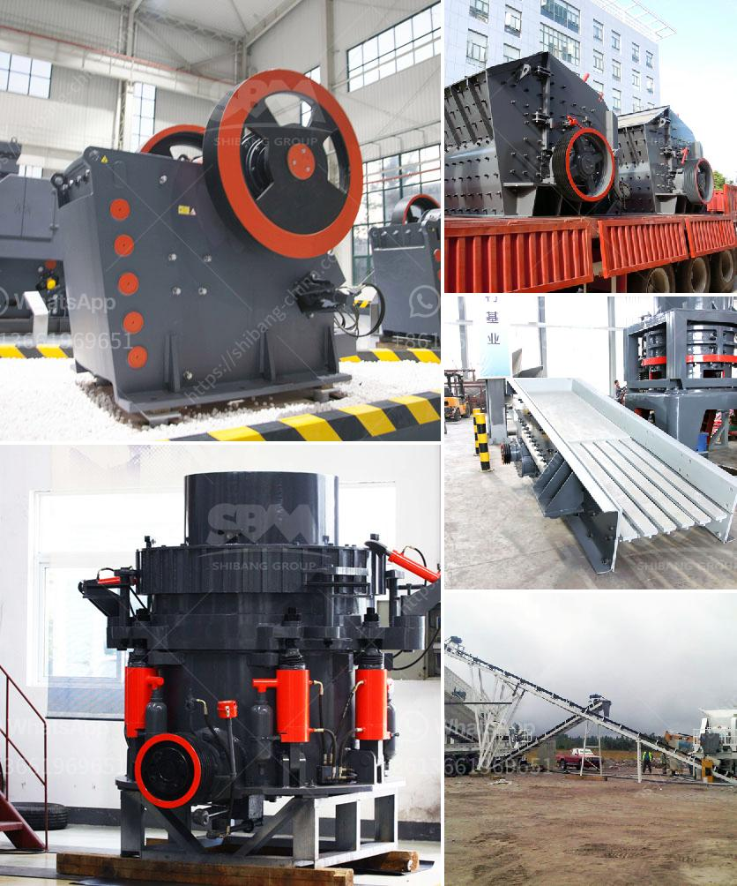

<h3>مطحنة الأسطوانة الرأسية</h3>
تعتبر مطحنة الأسطوانة الرأسية أحد أنواع المطاحن المستخدمة في صناعة التعدين والمعادن. تم تصميم هذا النوع من المطاحن لطحن المواد الخام مثل الفحم والحجر الجيري والكلنكر والغيرها من المواد لإنتاج مسحوق ناعم يستخدم في عمليات تصنيع المواد الإنشائية مثل الإسمنت والخرسانة.

تتكون مطحنة الأسطوانة الرأسية من عدة أجزاء أساسية. يوجد جسم الطحن العلوي الذي يحتوي على أسطوانة الطحن ويعمل على طحن المواد الخام أثناء دورانه بفضل القوة المركزية التي تتولد بفعل الجاذبية. يحتوي الجسم السفلي على محرك يسهم في تحريك جسم الطحن العلوي ويعمل على تحقيق سرعة الدوران المطلوبة.

تعمل مطحنة الأسطوانة الرأسية بطريقة فعالة للغاية. يتم إدخال المواد الخام من الجزء العلوي من الأسطوانة الرأسية، وتتم طحنها بين الأسطح الداخلية والخارجية للأسطوانة أثناء دورانها. يتم توجيه المسحوق الذي ينتج إلى فتحة التفريغ في الجزء السفلي من الأسطوانة الرأسية.

تتميز مطاحن الأسطوانة الرأسية بعدة مزايا. أولاً، توفر الأداء العالي والكفاءة العالية في عملية الطحن. يمكن لهذا النوع من المطاحن طحن المواد الخام بكميات كبيرة في وقت قصير، مما يؤدي إلى زيادة إنتاجية عملية الإنتاج بشكل عام. ثانيًا، تسمح المطاحن الرأسية بتنظيم حجم الجسيمات المطلوب للمواد النهائية بشكل دقيق، مما يسهم في تحقيق الجودة المطلوبة للمنتج النهائي. وأخيرًا، توفر مطاحن الأسطوانة الرأسية توفيرًا جيدًا للطاقة، حيث أنها تستخدم قوة الجاذبية الطبيعية للدوران، مما يقلل من استهلاك الطاقة اللازمة لعملية الطحن.

باختصار، تُعد مطاحن الأسطوانة الرأسية أداة رئيسية لطحن المواد الخام في صناعة التعدين والمعادن. توفر هذه المطاحن أداءً وكفاءة عاليين في عملية الطحن، مع القدرة على تحقيق حجم جسيمات مطلوب وتوفير الطاقة.
<h3>Contact us</h3><ul><li><strong>Whatsapp:&nbsp;<a href="https://wa.me/8613661969651">+8613661969651</a></strong></li><li><a href="https://swt.shibang-china.com/?git&amp;zhl&amp;مطحنة الأسطوانة الرأسية"><strong>Online Service(chat now)</strong></a></li></ul><h3>Related</h3><ul><li><a href='مشروع محجر للبيع في نيجيريا.md'>مشروع محجر للبيع في نيجيريا</a></li><li><a href='كسارة الصخور بوسطن.md'>كسارة الصخور بوسطن</a></li><li><a href='قائمة مصنع الكسارة.md'>قائمة مصنع الكسارة</a></li><li><a href='سعر محطم محمول.md'>سعر محطم محمول</a></li><li><a href='معلومات عن مصنع كسارة الحجر.md'>معلومات عن مصنع كسارة الحجر</a></li></ul>