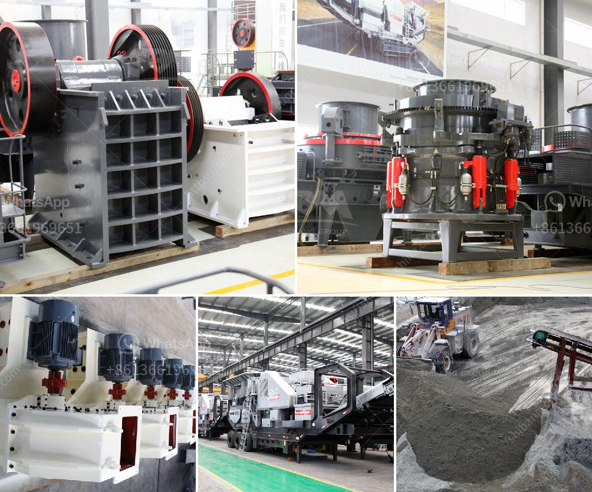

<h3>مطحنة الأسطوانة العمودية في الهند</h3>
تُعتبر مطحنة الأسطوانة العمودية إحدى التكنولوجيات المتقدمة في صناعة الطحن في الهند. تعمل مطحنة الأسطوانة العمودية على طحن المواد الخام بواسطة طحن قوة الاحتكاك بين الأسطوانات الرأسية والأفقية. وبفضل تصميمها المبتكر وتقنيتها الفريدة، توفر هذه المطاحن أداءً متفوقًا وجودةً عالية للمنتج النهائي.

تستخدم مطاحن الأسطوانة العمودية على نطاق واسع في صناعات مختلفة في الهند، مثل صناعة الأسمنت وصناعة المعادن وصناعة الفحم. توفر هذه المطاحن كفاءة عالية في الطحن وكذلك قدرة عالية على تجفيف المواد الخام. وبالتالي، تساهم في زيادة إنتاجية العملية وتحسين جودة المنتج.

تحظى مطاحن الأسطوانة العمودية بشعبية كبيرة في الهند بسبب عدة عوامل. فعلى سبيل المثال، فإن هذه المطاحن سهلة الصيانة وتوفر تكلفة تشغيل منخفضة، مما يجعلها اختيارًا مثاليًا للشركات الصغيرة والمتوسطة الحجم. كما أنها قادرة على التعامل مع المواد الخام ذات الغليان العالي والنسبة العالية من الرطوبة، مما يوسع نطاق استخدامها في صناعات مختلفة.

وتعتبر العملية البيئية النظيفة أحد العوائق الهامة التي تواجهها صناعة الطحن في الهند. ومن هنا، يأتي دور مطاحن الأسطوانة العمودية في مساعدة الصناعة على تحقيق الاستدامة البيئية. فهذه المطاحن تستخدم تقنية التجفيف الحراري والتبريد الهوائي، مما يقلل من استهلاك الطاقة والانبعاثات الضارة للهواء. وبالتالي، تحسن جودة البيئة المحيطة وتدعم الهدف العالمي للتنمية المستدامة.

وفي النهاية، تُعد مطاحن الأسطوانة العمودية في الهند خيارًا مثاليًا للشركات التي تسعى لتعزيز إنتاجيتها وتحسين جودة منتجاتها. كما أنها تساهم في تعزيز الاستدامة البيئية وتحقيق أهداف التنمية المستدامة. لذا، يمكن القول بأن هذه التكنولوجيا المتقدمة تلعب دورًا حاسمًا في تحسين الصناعة في الهند وتعزيز التنمية الاقتصادية والبيئية.
<h3>Contact us</h3><ul><li><strong>Whatsapp:&nbsp;<a href="https://wa.me/8613661969651">+8613661969651</a></strong></li><li><a href="https://swt.shibang-china.com/?git&amp;zhl&amp;مطحنة الأسطوانة العمودية في الهند"><strong>Online Service(chat now)</strong></a></li></ul><h3>Related</h3><ul><li><a href='كسارات الحجر الرئيسية.md'>كسارات الحجر الرئيسية</a></li><li><a href='كيماويات تعويم تحسين الفحم في الهند.md'>كيماويات تعويم تحسين الفحم في الهند</a></li><li><a href='كسارة مخروطية في المملكة العربية السعودية.md'>كسارة مخروطية في المملكة العربية السعودية</a></li><li><a href='مطحنة الأسطوانة للحجر.md'>مطحنة الأسطوانة للحجر</a></li><li><a href='كسارة الحجر للبيع في سريلانكا.md'>كسارة الحجر للبيع في سريلانكا</a></li></ul>