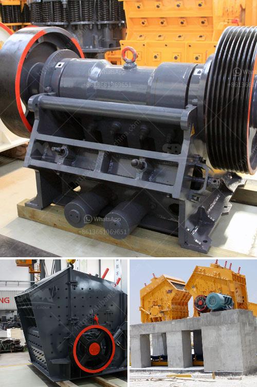

<h3>مطحنة الأسطوانة العمودية للإسمنت</h3>
تعتبر مطحنة الأسطوانة العمودية واحدة من أهم الأجهزة المستخدمة في صناعة الإسمنت. تستخدم هذه المطاحن لطحن وتجفيف وتصنيف المواد الخام في عملية الإنتاج.

تتكون مطاحن الأسطوانة العمودية من مجموعة من الأسطوانات التي توضع عمودياً في ترتيب حلزوني داخل الجهاز. وتتميز هذه الأسطوانات بسطح داخلي مغلف بمواد مقاومة للتآكل وذلك لتجنب تلفها أثناء عملية الطحن. توجد أيضاً أجهزة تبريد وسخانات موجودة في أجزاء مختلفة من المطحنة للسماح بتحكم دقيق في درجة الحرارة خلال العملية.

تتم عملية الطحن في مطاحن الأسطوانة العمودية عن طريق الحبيبات المندفعة باتجاه الجدران الداخلية للأسطوانات. تتمتع هذه الأسطوانات بالقدرة على توجيه وتدوير الحبيبات وفصلها حسب حجمها والفصل بين الحبيبات الخشنة والدقيقة، مما يسهل عملية التكسير والطحن.

تعمل معظم مطاحن الأسطوانة العمودية بوجود ضغط عالٍ لتطحين المواد المستخدمة. يتم إزاحة الهواء من الأسطوانة العمودية وفصل الجسيمات الدقيقة عن غيرها من خلال نظام تصنيف الهواء الموجود في المطحنة. ومن ثم، يتم تجميع المواد الناعمة في مرشح حقيبة لاحتوائها على السائل والغبار الناتج عن عملية الطحن.

توفر مطاحن الأسطوانة العمودية العديد من المزايا لصناعة الإسمنت. فهي تعمل بكفاءة عالية وقادرة على تجفيف المواد المستخدمة بشكل جيد وتقديم منتج نهائي عالي الجودة. تساهم هذه المطاحن أيضاً في تقليل استهلاك الطاقة والحد من الانبعاثات الضارة للبيئة، مما يجعلها الخيار المثالي لصناعة الإسمنت.

باختصار، تعتبر مطاحن الأسطوانة العمودية الآلة المثلى في صناعة الإسمنت. توفر كفاءة اقتصادية عالية وتحقق جودة المنتج النهائي، وتلبي الاحتياجات المتنوعة للعملاء. تتطلب المطاحن دراسة وتحليل دقيق للمتطلبات الأساسية والتقنية للعملية، بهدف ضمان الأداء المثلى وتحقيق العوائد الممتازة.
<h3>Contact us</h3><ul><li><strong>Whatsapp:&nbsp;<a href="https://wa.me/8613661969651">+8613661969651</a></strong></li><li><a href="https://swt.shibang-china.com/?git&amp;zhl&amp;مطحنة الأسطوانة العمودية للإسمنت"><strong>Online Service(chat now)</strong></a></li></ul><h3>Related</h3><ul><li><a href='سعر كسارة الحجر المحمول في باكستان.md'>سعر كسارة الحجر المحمول في باكستان</a></li><li><a href='مطاحن فائقة الدقة في الصين.md'>مطاحن فائقة الدقة في الصين</a></li><li><a href='مصنع كامل لكسارة الحجر الجرانيت.md'>مصنع كامل لكسارة الحجر الجرانيت</a></li><li><a href='شركات مصنعي مطاحن الأسطوانات في الهند.md'>شركات مصنعي مطاحن الأسطوانات في الهند</a></li><li><a href='مصنع تكسير الكلنكر الاسمنتي.md'>مصنع تكسير الكلنكر الاسمنتي</a></li></ul>