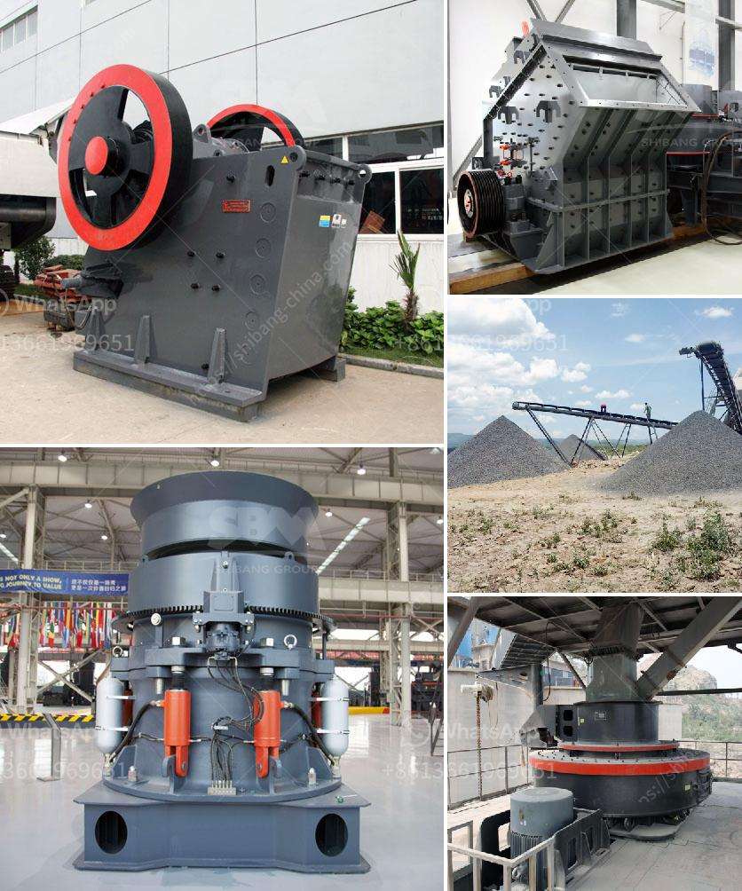

<h3>مطحنة الأسطوانة بيرينج</h3>
تُعتبر مطحنة الأسطوانة بيرينج واحدة من أهم الأدوات المستخدمة في صناعة الطحن. تتكون مطحنة الأسطوانة بيرينج من مجموعة من الأسطوانات المتواجدة على نفس المحور ، حيث يتم فصل الحبوب الخام إلى جزئين ويتم طحنها بالضغط بين هذه الأسطوانات. وقد تم تجهيز معظم مطاحن الأسطوانة بيرينج بنظام تبريد الماء لضمان عدم ارتفاع حرارة الطحن وحفظ الجودة العالية للمنتج.

تتميز مطاحن الأسطوانة بيرينج بالعديد من المزايا. أولاً وقبل كل شيء ، فإنها تسمح بطحن الحبوب بشكل أكثر اتساقًا ودقة. بفضل تصميمها المحسن ، لا يقوم الأسطوانات بإعطاء ضربة قوية على الحبوب ، بل يتم طحنها بلطف وتدريجيًا. هذا يؤدي إلى الحصول على نتيجة نهائية أكثر اتساقًا ، وبالتالي تحسين جودة المنتج.

ثانيًا ، فإن الأسطوانات المستخدمة في مطاحن الأسطوانة بيرينج مزودة بمحامل بيرينج ، وهي نوع من المحامل المصممة للتحمل العالي والسرعات العالية. وبفضل هذا التصميم ، تستطيع مطاحن الأسطوانة بيرينج التعامل مع تحميلات ثقيلة والعمل لفترات طويلة دون الخضوع للتلف.

وأخيرًا ، تتميز مطاحن الأسطوانة بيرينج بكفاءة عالية في عملية الطحن. تتمكن من طحن كميات كبيرة من الحبوب في وقت قصير ، مما يساهم في زيادة إنتاجية العمل وتقليل التكلفة.

بالإضافة إلى ذلك ، فإن استخدام مطاحن الأسطوانة بيرينج يساهم في الحفاظ على جودة المنتجات الغذائية. عندما يتم طحن الحبوب بواسطة مطحنة الأسطوانة بيرينج ، فإنها تحافظ على النكهة والقيمة الغذائية للمنتجات النهائية دون فقدان أي مواد غذائية هامة.

وفي الختام ، تُعد مطحنة الأسطوانة بيرينج عنصرًا أساسيًا في عملية الطحن الصناعية. تحسن من جودة المنتجات النهائية ، وتحافظ على القيمة الغذائية للحبوب ، وتقلل التكاليف ، مما يعزز من رضا العملاء ويعزز من تجربة العمل. بفضل مزاياها المتعددة ، لا يمكن للصناعيين الاستغناء عن مطحنة الأسطوانة بيرينج في عمليات الطحن الصناعية.
<h3>Contact us</h3><ul><li><strong>Whatsapp:&nbsp;<a href="https://wa.me/8613661969651">+8613661969651</a></strong></li><li><a href="https://swt.shibang-china.com/?git&amp;zhl&amp;مطحنة الأسطوانة بيرينج"><strong>Online Service(chat now)</strong></a></li></ul><h3>Related</h3><ul><li><a href='معدات مطحنة الكرة.md'>معدات مطحنة الكرة</a></li><li><a href='كسارات تأثير للبيع في الولايات المتحدة.md'>كسارات تأثير للبيع في الولايات المتحدة</a></li><li><a href='مواصفات كسارة الفك 250x400.md'>مواصفات كسارة الفك 250x400</a></li><li><a href='مصنع إنتاج كربونات الكالسيوم.md'>مصنع إنتاج كربونات الكالسيوم</a></li><li><a href='معدات كسارة الفك للبيع في الفلبين.md'>معدات كسارة الفك للبيع في الفلبين</a></li></ul>