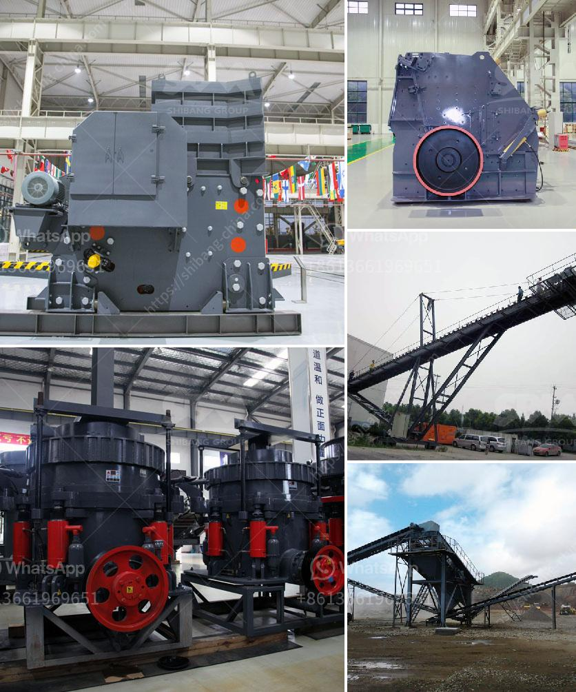

<h3>مطحنة الأسطوانة في الهند</h3>
مطحنة الأسطوانة في الهند هي واحدة من أهم وسائل التكنولوجيا المستخدمة في صناعة الحبوب في الهند. تُستخدم هذه المطاحن لطحن الحبوب وتحويلها إلى دقيق عالي الجودة يستخدم في صنع المنتجات الغذائية مثل الخبز والبسكويت والمخبوزات الأخرى.

تعتبر مطاحن الأسطوانة من أحدث التكنولوجيا المستخدمة في صناعة الطحين في الهند. يتم استخدامها لتحسين جودة الدقيق وتعزيز عملية الطحن. وتعتمد هذه المطاحن على الأسطوانات المعدنية المتدحرجة لضغط وتكسير الحبوب. تعمل المطاحن بنظام عمل متطور يضمن استخراج أقصى قدر ممكن من الدقيق من الحبوب، مع الحفاظ على الجودة والتركيب الغذائي للمنتج النهائي.

تتميز مطاحن الأسطوانة بعدة مزايا. فهي قادرة على طحن الحبوب بسرعة أعلى وكفاءة أكبر من المطاحن التقليدية. كما أنها توفر دقيقًا أكثر انتظامًا في الحجم والجودة، مما يجعلها مفضلة لدى معظم الشركات المصنعة للمنتجات الغذائية. وهي تعمل على تقليل نسبة الخسائر وتقليل تكاليف التشغيل. قد تتطلب استثمارًا أكبر في البداية، ولكنها تعتبر استثمارًا مستدامًا على المدى البعيد.

تستخدم مطاحن الأسطوانة في الهند على نطاق واسع في مختلف الصناعات مثل صناعة الخبز والكعك والبسكويت. هذه المطاحن توفر منتجًا نهائيًا فريدًا من نوعه يلبي احتياجات المستهلكين في الهند وفي العديد من الدول الأخرى. وتسهم هذه الصناعة في توفير فرص العمل وتحسين الاقتصاد في الهند.

على الرغم من الفوائد العديدة التي توفرها مطاحن الأسطوانة، إلا أن هناك تحديات تواجه هذه الصناعة في الهند. من أهم التحديات هو تكاليف الاستثمار العالية والحاجة إلى تدريب مهارات العمالة المختصة في تشغيل هذه المطاحن. كما يتطلب صيانة دورية للمطاحن لضمان عملها بالكفاءة القصوى.

بشكل عام، تعد مطاحن الأسطوانة في الهند تكنولوجيا مبتكرة وحديثة تسهم في تطوير صناعة الحبوب والغذاء في البلاد. تعزز هذه المطاحن جودة المنتجات وتحسن العملية الإنتاجية في الصناعة الغذائية، وتعتبر عاملاً رئيسيًا في تلبية احتياجات السكان المتزايدة في الهند وفي الأسواق العالمية.
<h3>Contact us</h3><ul><li><strong>Whatsapp:&nbsp;<a href="https://wa.me/8613661969651">+8613661969651</a></strong></li><li><a href="https://swt.shibang-china.com/?git&amp;zhl&amp;مطحنة الأسطوانة في الهند"><strong>Online Service(chat now)</strong></a></li></ul><h3>Related</h3><ul><li><a href='كسارات البلارست في Alibaba.md'>كسارات البلارست في Alibaba</a></li><li><a href='معدات صنع مسحوق كربونات الكالسيوم في ألمانيا.md'>معدات صنع مسحوق كربونات الكالسيوم في ألمانيا</a></li><li><a href='طحن الرمل السيليكا.md'>طحن الرمل السيليكا</a></li><li><a href='شركة تصنيع آلات كسارة الرخام.md'>شركة تصنيع آلات كسارة الرخام</a></li><li><a href='سعر آلة طحن الرخام.md'>سعر آلة طحن الرخام</a></li></ul>