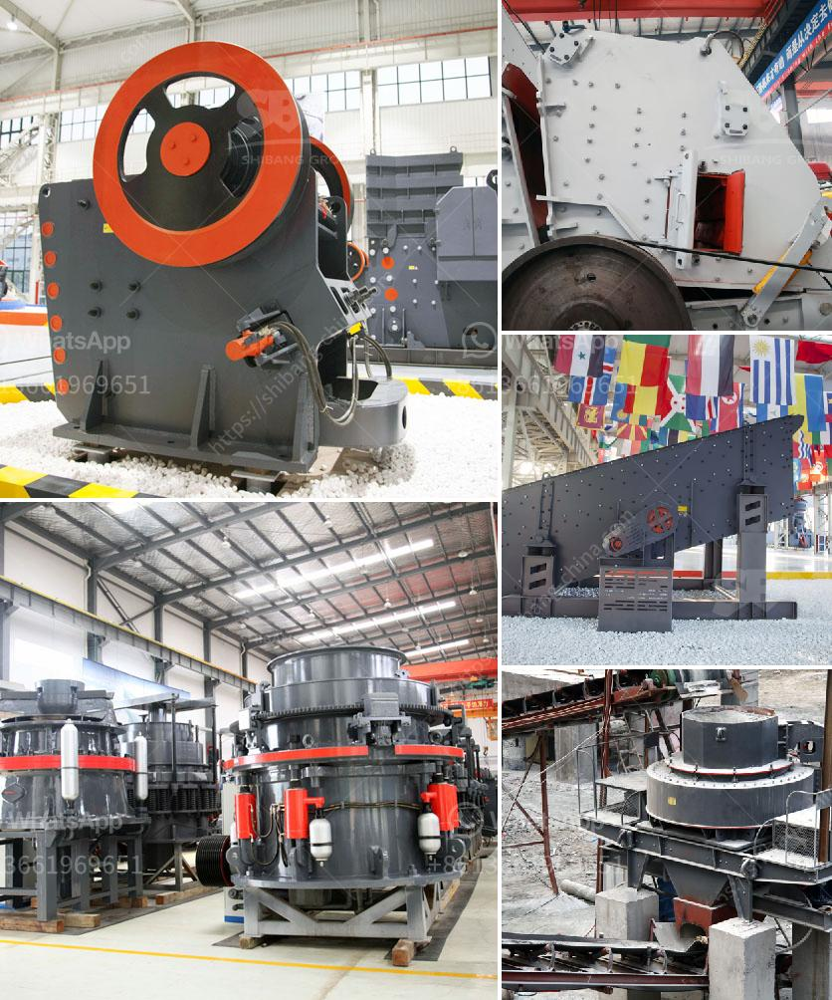

<h3>مطحنة الأسطوانة في نيجيريا</h3>
تعتبر مطحنة الأسطوانة واحدة من أهم الآلات المستخدمة في صناعة الطحين في نيجيريا. تستخدم هذه المطاحن لطحن الحبوب مثل القمح والذرة والأرز والشعير، وتقدم طحينًا عالي الجودة يستخدم في إعداد الخبز والمعجنات والحلويات وغيرها من المنتجات الغذائية.

تتألف مطاحن الأسطوانة الحديثة من سلسلة من الأسطوانات الملساء المعدنية تدور ببطء متزايد. يتم إدخال الحبوب في فتحة التغذية، ثم تمر عبر سلسلة من الأسطوانات حيث يتم سحقها وطحنها بواسطة الضغط والاحتكاك المتزايد. وهذا يساعد على فصل القش وغيرها من الشوائب عن الطحين النقي.

توفر مطاحن الأسطوانة العديد من المزايا عند مقارنتها مع طرق التحضير التقليدية. فعلى سبيل المثال، يتم ضمان توزيع الحبوب المطحونة بالتساوي في جميع أنحاء الطحين، مما يضمن جودة أفضل ونتائج أحسن في العجائن والمخبوزات. كما أن استخدام المطاحن الحديثة يقلل من تكاليف الإنتاج والعمالة ويزيد من كفاءة الطحن والإنتاجية. بالإضافة إلى ذلك، فإن توفر مطاحن الأسطوانة المحلية يحسن الاكتفاء الذاتي لنيجيريا ويقلل من الاعتماد على الواردات.

في السنوات الأخيرة، شهد قطاع الطحين في نيجيريا نموًا كبيرًا، وهذا يعود إلى الطلب المتنامي على المنتجات الخبزية والمعجنات في البلاد. وبالتالي، زاد الطلب على مطاحن الأسطوانة المتطورة والمستدامة. بالإضافة إلى ذلك، شهدت الحكومة النيجيرية تطورًا في قطاع الزراعة وتوفير الدعم والتشجيع للمزارعين والمصانع المحلية، مما ساهم في تعزيز صناعة الطحين وتحسين نوعية المنتجات المحلية.

بشكل عام، تعتبر مطاحن الأسطوانة أحد العوامل الرئيسية في تطوير صناعة الطحين في نيجيريا. توفر هذه المطاحن جودة عالية للطحين وتحسن الكفاءة والإنتاجية. بالإضافة إلى ذلك، فإن توفر المطاحن المحلية يزيد من الاكتفاء الذاتي للبلاد ويعزز الاقتصاد المحلي وتوفير فرص العمل. لذلك، يجب دعم وتشجيع تطوير وتحديث صناعة الطحين وتعزيز استخدام مطاحن الأسطوانة في نيجيريا.
<h3>Contact us</h3><ul><li><strong>Whatsapp:&nbsp;<a href="https://wa.me/8613661969651">+8613661969651</a></strong></li><li><a href="https://swt.shibang-china.com/?git&amp;zhl&amp;مطحنة الأسطوانة في نيجيريا"><strong>Online Service(chat now)</strong></a></li></ul><h3>Related</h3><ul><li><a href='تكلفة مصنع الإسمنت الصغير بسعة 2000 طن يوميًا.md'>تكلفة مصنع الإسمنت الصغير بسعة 2000 طن يوميًا</a></li><li><a href='مصنع تكسير وطحن الكالسايت في أودايبور.md'>مصنع تكسير وطحن الكالسايت في أودايبور</a></li><li><a href='آلات الطحن بالكرات الكوارتز.md'>آلات الطحن بالكرات الكوارتز</a></li><li><a href='الفارق بين الرمل ومسحوق الحجر المكسر.md'>الفارق بين الرمل ومسحوق الحجر المكسر</a></li><li><a href='مصنع تكسير صغير من الصين.md'>مصنع تكسير صغير من الصين</a></li></ul>