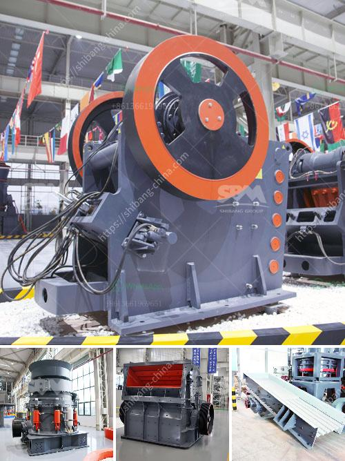

<h3>مطحنة الأسطوانة للحجر</h3>
تعتبر مطحنة الأسطوانة للحجر أحد الأجهزة الهامة في صناعة الحجر والمعادن. تستخدم هذه التقنية المتطورة في عملية سحق الصخور ، وطحن المعادن ، وتصنيع الأسمنت والمواد الكيميائية.

تعمل مطحنة الأسطوانة للحجر عن طريق طحن الصخور أو المواد المعدنية بين اسطوانتين متجاورتين تدوران في اتجاه معاكس. ويتم ضغط الصخرة أو المعدن بين الأسطوانتين حيث يتم تقليل حجم الجسيمات وتحسين قوة الاتصال بينها.

تعتبر مطاحن الأسطوانة للحجر فعالة وموثوقة في إنتاج الحبيبات الدقيقة والمواد الخام المصنعة. إنها تستخدم عادة في صناعة الأسمنت والطلاء والسيراميك والتعدين ومعالجة المعادن والكيمياء وصناعة البناء.

تحتوي مطاحن الأسطوانة على تصميم قوي ومتين وآلية دقيقة تساعد على طحن المواد بكفاءة. تحتوي الأسطوانتان على طبقات معدنية خاصة بها تسهل عملية الطحن وتقلل من التآكل. يتم الاعتماد على قوة الضغط والاحتكاك بين الصخور وبين الأسطوانتين لسحق المواد بشكل مستمر ودقيق.

تتميز مطاحن الأسطوانة للحجر بسرعات عالية للأسطوانتين ، مما يساعد على زيادة القوة التصادمية وتحسين كفاءة الطحن. تعمل بنظام تشحيم متطور يساعد في تقليل الاحتكاك والتآكل بين المكونات وتلبية احتياجات التشغيل المطلوبة.

من المهم أن نلاحظ أن مطاحن الأسطوانة للحجر توفر مرونة في الإعداد والتغييرات السريعة للمنتج المطلوب. يمكن للمشغل ضبط فجوة الطحن بين الأسطوانتين بسهولة لتحقيق الحجم المناسب للحبيبات. يمكن أيضًا تعديل الضغط بين الأسطوانتين لتحقيق النتائج المثلى.

في الختام ، تعتبر مطاحن الأسطوانة للحجر أدوات حيوية في صناعة الحجر والمعادن. توفر هذه التقنية الفعالة والموثوقة عملية سحق وطحن دقيقة للصخور والمواد المعدنية ، وتلبي احتياجات العديد من الصناعات مثل الأسمنت والكيمياء والبناء والتعدين.
<h3>Contact us</h3><ul><li><strong>Whatsapp:&nbsp;<a href="https://wa.me/8613661969651">+8613661969651</a></strong></li><li><a href="https://swt.shibang-china.com/?git&amp;zhl&amp;مطحنة الأسطوانة للحجر"><strong>Online Service(chat now)</strong></a></li></ul><h3>Related</h3><ul><li><a href='كسارة الحجر للبيع في سريلانكا.md'>كسارة الحجر للبيع في سريلانكا</a></li><li><a href='مصنع كسارة حجر البازلت.md'>مصنع كسارة حجر البازلت</a></li><li><a href='قائمة أسعار مصنع التكسير.md'>قائمة أسعار مصنع التكسير</a></li><li><a href='سعر الكسارة بمقدار الطن في الساعة.md'>سعر الكسارة بمقدار الطن في الساعة</a></li><li><a href='تكلفة مصنع الأسمنت 200 طن في اليوم.md'>تكلفة مصنع الأسمنت 200 طن في اليوم</a></li></ul>