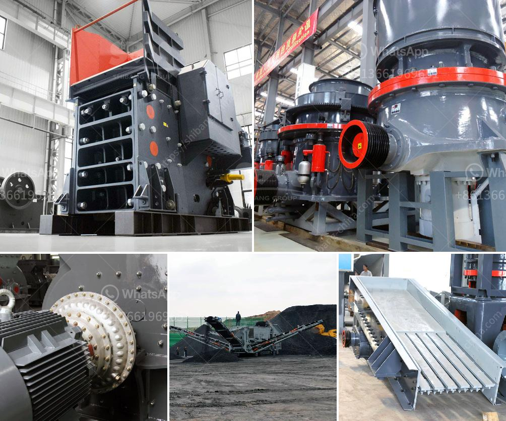

<h3>مطحنة الأسطوانة للسائل</h3>
تعتبر مطحنة الأسطوانة للسائل أحد الأجهزة الهندسية المستخدمة في عمليات تحويل وتكسير المواد السائلة. تعمل هذه المطاحن على تقليل حجم الجسيمات السائلة إلى أحجام أصغر، مما يزيد من سطح المواد ويسهل عملية المزج والتفاعلات الكيميائية.

تتكون مطاحن الأسطوانة للسائل من اثنين أو ثلاثة أسطوانات معدنية موازية لبعضها البعض، حيث يمر السائل بين الأسطوانات. يوجد فجوة صغيرة بين الأسطوانات تسمى فجوة الأسطوانة، وهذا يسمح للسائل بالمرور عبرها. يتم توجيه السائل إلى المطحنة من خلال فتحة الإدخال، ثم يمر السائل بين الأسطوانات حيث يتم تحطمه وتكسيره قبل الخروج من خلال فتحة الخروج.

تستخدم مطاحن الأسطوانة للسائل في العديد من الصناعات مثل صناعة الأغذية والمشروبات، وصناعات البتروكيماويات، وصناعة الدهانات والأصباغ. تساهم هذه المطاحن في تحسين جودة المنتجات وتقليل حجم الجسيمات الضارة. على سبيل المثال، في صناعة الأغذية والمشروبات، تستخدم مطاحن الأسطوانة للسائل لتكسير المكونات الصلبة مثل الحبوب والفواكه والخضروات لإنتاج العصائر والصلصات والمربى.

تتميز مطاحن الأسطوانة للسائل بعدة مزايا. أولاً، تساعد في زيادة كفاءة العمليات الصناعية بسبب تحسين التوزيع الجيد للجسيمات. ثانياً، تقلل من استخدام الطاقة، حيث يتم تحويل الطاقة الكهربائية إلى عملية ضغط واحتكاك بين الأسطوانات لتحويل السائل إلى جزيئات صغيرة. ثالثاً، توفر مطاحن الأسطوانة للسائل نتائج دقيقة ومتسقة، مما يسهل مراقبة وتحكم في جودة المنتجات النهائية.

في الختام، تعتبر مطاحن الأسطوانة للسائل أداة أساسية في العديد من الصناعات التي تحتاج إلى تحويل وتكسير المواد السائلة. تساهم هذه المطاحن في تحسين جودة المنتجات وتقليل حجم الجسيمات الضارة. كما توفر مطاحن الأسطوانة للسائل نتائج دقيقة ومتسقة، مما يجعلها اختيارًا مناسبًا للعديد من الصناعات المختلفة.
<h3>Contact us</h3><ul><li><strong>Whatsapp:&nbsp;<a href="https://wa.me/8613661969651">+8613661969651</a></strong></li><li><a href="https://swt.shibang-china.com/?git&amp;zhl&amp;مطحنة الأسطوانة للسائل"><strong>Online Service(chat now)</strong></a></li></ul><h3>Related</h3><ul><li><a href='كسارات جنوب أفريقيا.md'>كسارات جنوب أفريقيا</a></li><li><a href='شاشة تهتز الفحم المصنعين في جنوب أفريقيا.md'>شاشة تهتز الفحم المصنعين في جنوب أفريقيا</a></li><li><a href='مصنع إعادة تدوير الخرسانة للبيع.md'>مصنع إعادة تدوير الخرسانة للبيع</a></li><li><a href='كسارة في الفلبين.md'>كسارة في الفلبين</a></li><li><a href='خطة عمل لكربونات الكالسيوم.md'>خطة عمل لكربونات الكالسيوم</a></li></ul>