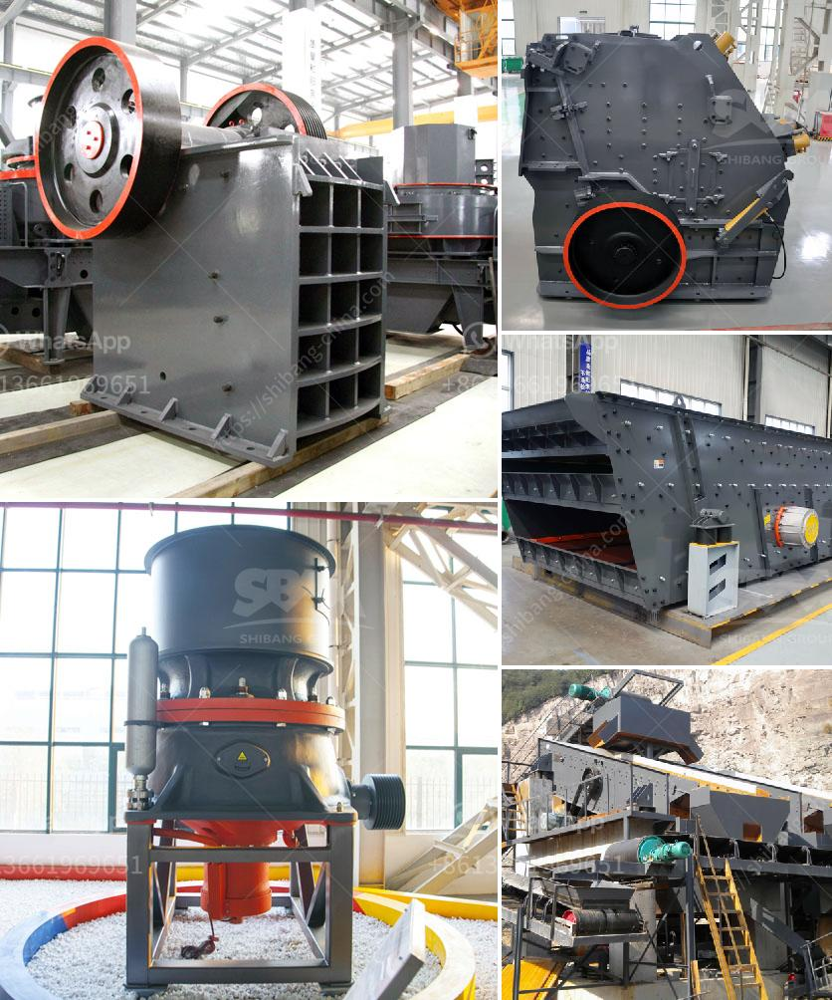

<h3>مطحنة الأسطوانة للطحن</h3>
تعتبر مطحنة الأسطوانة واحدة من أهم الآلات المستخدمة في عملية الطحن في صناعة الأغذية والمنتجات الزراعية والكيماوية. تتميز هذه المطحنة بقدرتها العالية على تحقيق درجة عالية من الدقة والكفاءة في الطحن.

تعمل مطحنة الأسطوانة عن طريق تحويل الحبوب أو المواد الخام الأخرى إلى مسحوق ناعم من خلال عملية الطحن. تتكون المطحنة من مجموعة من الأسطوانات الدوارة الممتدة على طول المطحنة، ويتم تعديل المسافة بين الأسطوانات حسب نوع المادة التي يتم طحنها وحجم الجسيمات المطلوبة.

تأتي مطاحن الأسطوانة بعدة أحجام وأشكال مختلفة، ولكن جميعها تستخدم نفس المكونات الأساسية وتعتمد على نفس العملية. يتم تغذية المواد الخام إلى المطحنة من خلال فتحة الطحن، وتتحرك الأسطوانة الدوارة بسرعة عالية مما يؤدي إلى ضغط قوي على المواد وتفتيتها.

يتم ضبط المسافة بين الأسطوانات في المطحنة لتحقيق الحجم المطلوب للجسيمات المطحونة. إذا تم ضبط المسافة على مسافة صغيرة، سيتم تحقيق جسيمات مطحونة أدق، بينما إذا تم ضبط المسافة على مسافة كبيرة، ستكون الجسيمات أكثر خشونة.

من المزايا الرئيسية لمطحنة الأسطوانة هي قدرتها على تحقيق درجة عالية من الدقة. يتم ضبط المسافة بدقة لتحقيق حجم جسيمات دقيق، وذلك يعزز تجانس المنتج النهائي. كما أن هذه المطاحن تعمل بكفاءة عالية، مما يقلل من تكلفة الإنتاج.

مطاحن الأسطوانة تستخدم في مجموعة واسعة من الصناعات، بما في ذلك صناعة الدقيق، ومعالجة الحبوب، وصناعة الحيوانات الأليفة، وصناعة الطلاء، ومعالجة البلاستيك، وغيرها. تستخدم أيضًا لطحن المواد الخام غير الغذائية مثل المعادن والفحم.

وفي الختام، تُعتبر مطاحن الأسطوانة أدوات حيوية في عملية الطحن في مختلف الصناعات. تعمل هذه المطاحن على تحقيق درجة عالية من الدقة والكفاءة في الطحن، مما يعزز جودة المنتج النهائي ويقلل من تكلفة الإنتاج. إن استخدام مطحنة الأسطوانة يعتبر خيارًا اقتصاديًا وموثوقًا لتحقيق الطحن الفعال والدقيق.
<h3>Contact us</h3><ul><li><strong>Whatsapp:&nbsp;<a href="https://wa.me/8613661969651">+8613661969651</a></strong></li><li><a href="https://swt.shibang-china.com/?git&amp;zhl&amp;مطحنة الأسطوانة للطحن"><strong>Online Service(chat now)</strong></a></li></ul><h3>Related</h3><ul><li><a href='مطحنة ريموند للرخام.md'>مطحنة ريموند للرخام</a></li><li><a href='معدات التعدين في جنوب أفريقيا.md'>معدات التعدين في جنوب أفريقيا</a></li><li><a href='كسارات الحجر الرخيصة.md'>كسارات الحجر الرخيصة</a></li><li><a href='مغذي اهتزازي لخام السنتر.md'>مغذي اهتزازي لخام السنتر</a></li><li><a href='صيانة مطحنة ريموند.md'>صيانة مطحنة ريموند</a></li></ul>