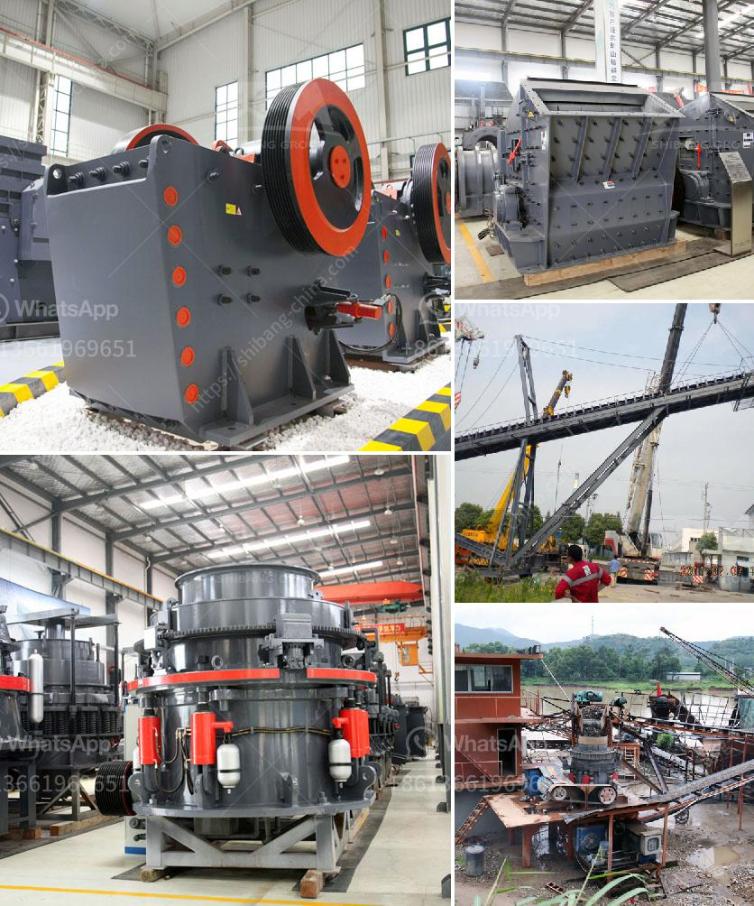

<h3>مطحنة الأسطوانة مطحنة السميكة</h3>
مطحنة الأسطوانة أو ما يعرف أيضًا بمطحنة السميكة هي أداة أساسية في صناعة الطحن وتستخدم لطحن المواد الخام وتحويلها إلى مسحوق أو رقائق ناعمة. تعتبر مطحنة الأسطوانة من الأدوات الأكثر شيوعًا في هذه الصناعة بسبب كفاءتها العالية وقدرتها على العمل على نطاق واسع مع مختلف أنواع المواد الخام.

تتكون مطحنة الأسطوانة من طاحونة تتألف من اسطوانتين طويلتين ومخروطيتين في الجزء العلوي والسفلي. يتم ترتيب الأسطوانتين موازيتين لبعضهما البعض وتدور باستمرار. يتم وضع المواد الخام بين الأسطوانتين حيث يتم طحنها وضغطها بفضل الضغط الناتج عن الدوران المتكرر للأسطوانة.

تعتبر مطحنة الأسطوانة مثالية لطحن المواد الخام الصلبة مثل القمح والذرة والشوفان والفحم والفوسفات والأسمنت وغيرها من المواد. يتم تعديل الضغط بين الأسطوانتين وسرعة الدوران وفقًا لنوعية المادة الخام المراد طحنها، هذا يسمح للمطحنة بتحقيق أقصى كفاءة في العملية.

عند طحن المادة الخام، يتم تآكلها تدريجيًا بسبب الاحتكاك القوي بين الأسطوانتين. هذا التآكل يؤدي إلى تقليل حجم الجسيمات وزيادة نعومة المسحوق. كما يؤدي أيضًا إلى توزيع أفضل للمواد وزيادة كفاءة استخدامها في العمليات الصناعية اللاحقة.

تتميز مطحنة الأسطوانة أيضًا بقدرتها على ضبط حجم الجسيمات المطحونة، حيث يمكن تغيير المسافة بين الأسطوانتين للتحكم في حجم الجسيمات النهائي. هذا يوفر مرونة كبيرة للصناعات التي تحتاج إلى مسحوق بحجم محدد.

بالإضافة إلى ذلك، توفر مطحنة الأسطوانة كفاءة عالية في استهلاك الطاقة وتقليل الفاقد، مما يقلل من تكاليف الإنتاج ويجعلها اقتصادية وفعالة. كما أنها تتميز بسهولة التشغيل والصيانة والتنظيف، مما يسهل على العاملين في الصناعة استخدامها بكفاءة عالية.

في النهاية، تعتبر مطحنة الأسطوانة أداة ضرورية في صناعة الطحن وتلبي احتياجات مختلفة للمواد الخام المختلفة. تعزز كفاءة الإنتاج وتحسن نوعية المنتج النهائي. باستخدام التكنولوجيا المناسبة والعناية التامة، يمكن للمطاحن أن تلعب دورًا حاسمًا في تحويل المواد الخام إلى منتجات ذات قيمة مضافة عالية.
<h3>Contact us</h3><ul><li><strong>Whatsapp:&nbsp;<a href="https://wa.me/8613661969651">+8613661969651</a></strong></li><li><a href="https://swt.shibang-china.com/?git&amp;zhl&amp;مطحنة الأسطوانة مطحنة السميكة"><strong>Online Service(chat now)</strong></a></li></ul><h3>Related</h3><ul><li><a href='كسارة محمولة كليمان.md'>كسارة محمولة كليمان.</a></li><li><a href='مصنع غسيل الذهب بسعة ١٠٠ طن في الساعة.md'>مصنع غسيل الذهب بسعة ١٠٠ طن في الساعة</a></li><li><a href='كسارة الصدم PF لآلة تكسير الحجر للبيع.md'>كسارة الصدم PF لآلة تكسير الحجر للبيع</a></li><li><a href='طواحين الطوابع الذهبية في زيمبابوي.md'>طواحين الطوابع الذهبية في زيمبابوي</a></li><li><a href='استخدام كسارة فكية صغيرة للخرسانة.md'>استخدام كسارة فكية صغيرة للخرسانة</a></li></ul>