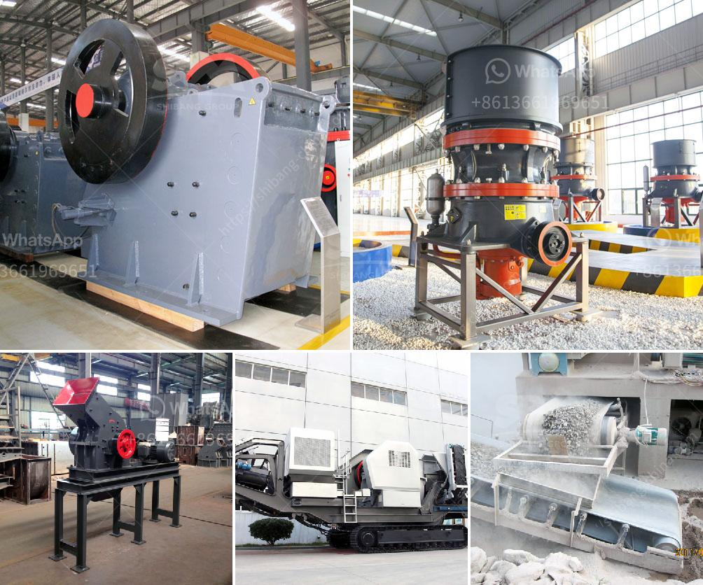

<h3>مطحنة الاسمنت الرأسية الثانية للبيع</h3>
يعد الاسمنت من المواد الأساسية التي تستخدم في بناء المباني والمنشآت. ومن المعروف أنه لا يمكن الاستغناء عنه في أي عملية بناء تحتاج إلى قوة ومتانة. ومن أهم مكونات الإنتاج الخاصة بالأسمنت هي المطاحن الرأسية التي تستخدم لطحن المواد الخام.

ومن بين هذه المطاحن الرأسية المستخدمة في صناعة الأسمنت، يوجد مطحنة الاسمنت الرأسية الثانية التي تعتبر من الأدوات الأساسية لعملية طحن المواد الخام التي تستخدم في إنتاج الأسمنت. تحظى هذه المطاحن بشهرة كبيرة في صناعة البناء ومشاريع البنية التحتية.

تتميز مطاحن الاسمنت الرأسية الثانية بعدة مزايا. فهي طراز حديث ومطور يستخدم أحدث التقنيات في عملية الطحن والتكسير. كما أنها تتميز بكفاءة عالية في الأداء وتقديم نتائج ممتازة في عملية الطحن. تعمل هذه المطاحن بنظام متكامل يضمن استخدام الطاقة بكفاءة عالية وتقليل تكاليف الإنتاج.

تعتبر مطاحن الاسمنت الرأسية الثانية منتجات قابلة للتخصيص والتعديل حسب الاحتياجات الخاصة بالعميل. فمن خلال تطوير التكنولوجيا والهندسة، يمكن تصميم المطاحن لتلبية احتياجات العملاء بشكل دقيق. وبذلك، يمكن تحسين كفاءة العمل وتحقيق أعلى إنتاجية وجودة في الأسمنت.

بالإضافة إلى ذلك، تعمل مطاحن الاسمنت الرأسية الثانية بصورة آمنة ومستدامة. فهي مزودة بنظام متقدم للتحكم والحماية يضمن سلامة العمال وسلامة المعدات. كما أنها تعتمد على نظام قائم على البيئة يحافظ على البيئة ويحد من الانبعاثات الضارة التي تحدث عادةً في عمليات الطحن.

وفي الختام، تُعَدُّ مطاحن الاسمنت الرأسية الثانية خيارًا ممتازًا للعملاء الذين يبحثون عن آلات طحن عالية الجودة والكفاءة في صناعة الأسمنت. تتميز هذه المطاحن بتصميمات فريدة وحديثة، وتوفر نتائج ممتازة في عملية الطحن. كما تعمل بكفاءة عالية وبأمان، مع الالتزام بالمعايير البيئية الصارمة. لذا، إذا كنت تبحث عن مطحنة أسمنت ذات جودة عالية للبيع، فقد تكون مطاحن الاسمنت الرأسية الثانية الخيار المثالي لك.
<h3>Contact us</h3><ul><li><strong>Whatsapp:&nbsp;<a href="https://wa.me/8613661969651">+8613661969651</a></strong></li><li><a href="https://swt.shibang-china.com/?git&amp;zhl&amp;مطحنة الاسمنت الرأسية الثانية للبيع"><strong>Online Service(chat now)</strong></a></li></ul><h3>Related</h3><ul><li><a href='تكلفة الحزام الناقل لكل متر.md'>تكلفة الحزام الناقل لكل متر</a></li><li><a href='سعر مصنع كسارة محمولة في نيجيريا.md'>سعر مصنع كسارة محمولة في نيجيريا</a></li><li><a href='مطاحن الكرة للكالسيوم.md'>مطاحن الكرة للكالسيوم</a></li><li><a href='جهاز كسر الصخور في جنوب أفريقيا.md'>جهاز كسر الصخور في جنوب أفريقيا</a></li><li><a href='محطم متنقل لسحق الفحم.md'>محطم متنقل لسحق الفحم</a></li></ul>