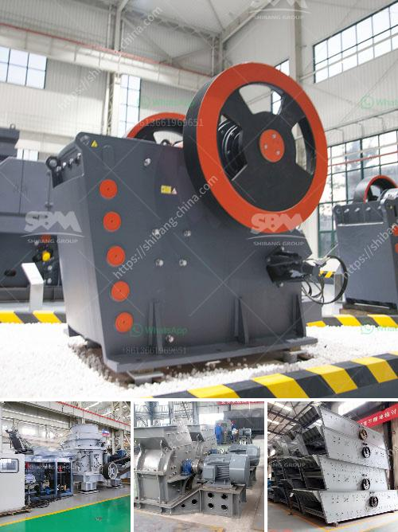

<h3>مطحنة السيليكا المطحونة للبيع</h3>
تُعدّ مطحنة السيليكا المطحونة أحد المنتجات الهامة في صناعة المواد الخام، وتستخدم على نطاق واسع في العديد من الصناعات مثل صناعة الزجاج، الأسمنت، صناعة الألومنيوم، وصناعة الكيماويات.

تعد السيليكا من المعادن الهامة التي تُستخرج من الرمال العالية النقاء، وتتميز بقدرتها العالية على الاحتمال الحراري والتوصيل الحراري الجيد. تُعتبر السيليكا غير قابلة للذوبان في الماء وقابلة للذوبان في الحموض، مما يجعلها مناسبة للعديد من التطبيقات الصناعية.

توفر مطحنة السيليكا المطحونة المواد الخام ذات النقاء العالي وبأحجام حبيبات موحدة ومنتظمة. تعمل المطحنة على سحق السيليكا الخام إلى مسحوق ناعم يستخدم في العديد من العمليات الصناعية.

تمتاز مطحنة السيليكا المطحونة بالعديد من المزايا. تساعد في تحسين جودة المنتج النهائي وزيادة كفاءة العملية الإنتاجية. بفضل حجم الحبيبات المنتظمة، يتم تقليل فقدان المواد الخام وتحسين استخدام المواد بشكل عام.

بالإضافة إلى ذلك، تُستخدم مطاحن السيليكا المطحونة في تصنيع المواد الخام للزجاج العازل، حيث تُضاف السيليكا المطحونة للخلطة لتحسين قوة وجودة الزجاج. كما تستخدم في صناعة الألومنيوم للمساعدة في تحسين الصلابة والمتانة للمنتج النهائي.

وفي الختام، تعتبر مطحنة السيليكا المطحونة منتجًا أساسيًا في صناعة المواد الخام. تلعب دورًا هامًا في تحسين جودة المنتجات النهائية وزيادة الكفاءة الإنتاجية. توفر هذه المطاحن السيليكا المطحونة مادة أساسية ومهمة للعديد من الصناعات، وتساهم في تطوير الصناعات وتحسين أداء المنتجات في الأسواق العالمية.
<h3>Contact us</h3><ul><li><strong>Whatsapp:&nbsp;<a href="https://wa.me/8613661969651">+8613661969651</a></strong></li><li><a href="https://swt.shibang-china.com/?git&amp;zhl&amp;مطحنة السيليكا المطحونة للبيع"><strong>Online Service(chat now)</strong></a></li></ul><h3>Related</h3><ul><li><a href='مطحنة رطبة في الصين.md'>مطحنة رطبة في الصين</a></li><li><a href='صناعة الحجر الجيري في الفلبين.md'>صناعة الحجر الجيري في الفلبين</a></li><li><a href='تكلفة مشروع وحدة طحن الكلنكر.md'>تكلفة مشروع وحدة طحن الكلنكر</a></li><li><a href='سعر كسارة الحجر في الساعة.md'>سعر كسارة الحجر في الساعة</a></li><li><a href='موردي خط إنتاج الحبر.md'>موردي خط إنتاج الحبر</a></li></ul>