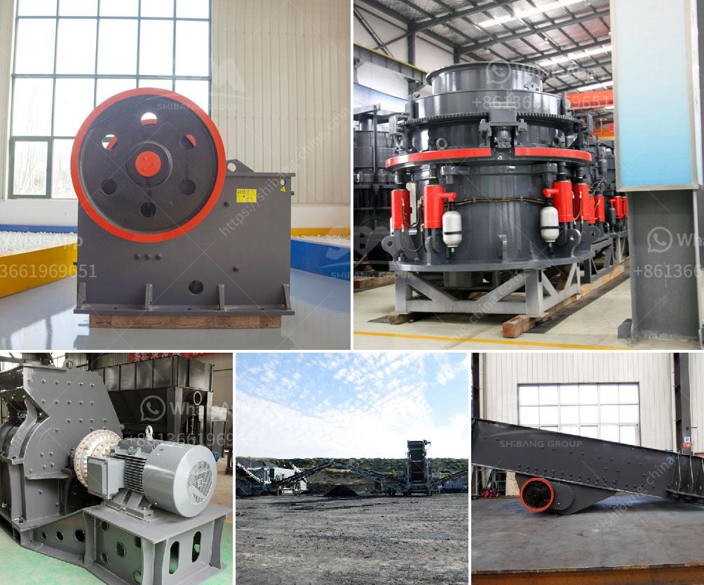

<h3>مطحنة الضغط العالي</h3>
مطحنة الضغط العالي هي واحدة من الأجهزة الحديثة والتكنولوجية التي تستخدم في صناعات مختلفة مثل صناعة الأسمنت، والطاقة، والكيماويات، والطعام، وغيرها. تلعب هذه الأجهزة دوراً هاماً في تحطيم وسحق المواد الخام لتحويلها إلى حجم صغير أو مسحوق.

تتميز مطحنة الضغط العالي بالعديد من المزايا والفوائد. أحد أهم هذه المزايا هو قدرتها على تحطيم المواد الخام حتى حجم صغير جداً. فعندما تمر المادة الخام عبر مدخل المطحنة، يتم تطبيق ضغط عالٍ جداً على المادة. يؤدي هذا الضغط العالي إلى تحطيم المادة وتفتيتها إلى جسيمات صغيرة. هذا يسمح بزيادة تسريع عملية الاحتراق للمواد الكيميائية أو التحلل الحراري للمواد العضوية لتوليد الطاقة.

تعتبر مطحنة الضغط العالي أيضاً أكثر كفاءة من الطرق التقليدية للطحن، مثل المطاحن الكروية والطواحين العمودية. وهذا يعود إلى حجم الجسيمات الدقيقة التي يتم تحقيقها باستخدام هذه الأجهزة، والتي تتيح تحسين أداء العمليات الصناعية بشكل عام. بالإضافة إلى ذلك، فإن المطاحن ذات الضغط العالي تستهلك كمية أقل من الطاقة مقارنة بالمطاحن التقليدية، مما يقلل من التكاليف ويحسن الكفاءة العامة للمصنع.

علاوة على ذلك،، تساهم مطاحن الضغط العالي في تجاوز بعض التحديات الصناعية الحديثة مثل تخزين الطاقة وحماية البيئة. فبفضل الحجم الصغير للجسيمات التي يتم تحقيقها، يمكن أن يتفاعل المواد الكيميائية بشكل أفضل مع طبقات البطارية أو الأجهزة الإلكترونية المستخدمة في تخزين وتوزيع الطاقة. يمكن أيضاً استخدامها في صناعة المواد النانوية والتكنولوجيا الحديثة.

ومع ذلك، ينبغي أيضاً الانتباه إلى أن مطاحن الضغط العالي تتطلب صيانة دورية واهتمامًا دقيقًا. قد تتعرض قطع الغيار الحساسة للتآكل بسبب الضغط والاحتكاك العاليين. لذلك، يجب توظيف فريق فني مهرة لصيانة وإصلاح هذه الأجهزة بانتظام.

في النهاية، تعتبر مطاحن الضغط العالي إضافة حديثة وفعالة للصناعة الحديثة. ومن المتوقع أن يرتفع الطلب على هذه الأجهزة في المستقبل، حيث تلعب دورًا أساسيًا في تعزيز الإنتاجية وتحسين الجودة في عدة صناعات.
<h3>Contact us</h3><ul><li><strong>Whatsapp:&nbsp;<a href="https://wa.me/8613661969651">+8613661969651</a></strong></li><li><a href="https://swt.shibang-china.com/?git&amp;zhl&amp;مطحنة الضغط العالي"><strong>Online Service(chat now)</strong></a></li></ul><h3>Related</h3><ul><li><a href='مطحنة عمودية للبيع في الولايات المتحدة.md'>مطحنة عمودية للبيع في الولايات المتحدة</a></li><li><a href='كسارة أولية للبيع.md'>كسارة أولية للبيع</a></li><li><a href='معدات تنظيف الرمال في الصغيرة.md'>معدات تنظيف الرمال في الصغيرة</a></li><li><a href='شركة تصنيع الكسارات في الصين.md'>شركة تصنيع الكسارات في الصين</a></li><li><a href='كسارة محمولة في المملكة العربية السعودية.md'>كسارة محمولة في المملكة العربية السعودية</a></li></ul>