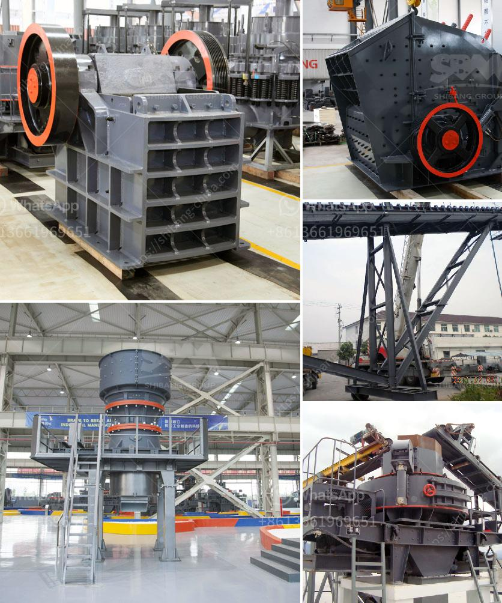

<h3>مطحنة الطحن الصينية</h3>
تعد مطحنة الطحن الصينية واحدة من الأدوات التي يستخدمها الناس في الصين منذ قرون عديدة لطحن الحبوب ومنتجات الحبوب الأخرى. تتميز هذه المطاحن بتصميمها الفريد والمتقن، وقد أثبتت فعاليتها على مر الزمان في تلبية احتياجات المزارعين والمطاحن والأسر المحلية.

تتكون مطاحن الطحن الصينية من زوجين من الأحجار الرحمية، وهي أحجار خشنة وخشبية، حيث يتم وضع الحبوب بينهما وطحنها بطريقة دائرية. تمتاز هذه المطاحن بقوتها وثباتها وقدرتها على طحن الحبوب بشكل متجانس وسريع. كما أنها سهلة الاستخدام والصيانة، وتنتج طحينًا ذو نوعية جيدة ويتميز بالجودة العالية.

يستخدم الصينيون مطاحن الطحن الصينية في طحن العديد من الحبوب والبقوليات مثل الأرز والقمح والذرة والفول السوداني وغيرها. وتعتبر هذه المطاحن جزءًا لا يتجزأ من حياة الناس في المناطق الريفية، حيث يستخدمها المزارعون لطحن محاصيلهم وتحويلها إلى طحين يمكنهم بيعه أو استخدامه لتلبية احتياجاتهم الغذائية.

بالإضافة إلى طحن الحبوب، يمكن استخدام مطاحن الطحن الصينية لطحن بعض المنتجات الأخرى مثل البهارات والتوابل. وتستخدم أيضًا في بعض الصناعات مثل معالجة المعادن والألياف. وتعتبر هذه المطاحن بديلاً اقتصاديًا ومستدامًا للمطاحن الكهربائية الحديثة، حيث لا تحتاج إلى استهلاك الطاقة أو الصيانة المكلفة.

على الرغم من تطور التكنولوجيا وظهور المطاحن الكهربائية الحديثة، إلا أن مطاحن الطحن الصينية لا تزال تحتل مكانة هامة في الثقافة الصينية التقليدية والمجتمع المحلي. فهي ترمز إلى توازن وتعايش الإنسان مع الطبيعة، وتعكس التقاليد والثقافة القديمة للشعب الصيني.

في الختام، يمكن القول إن مطاحن الطحن الصينية تعتبر من الأدوات التقليدية والفريدة التي استخدمها الصينيون منذ قرون عديدة. فهي تجسد التقاليد والثقافة الصينية، وتلبي احتياجات الناس في المناطق الريفية من حيث طحن المحاصيل وتحويلها إلى طحين عالي الجودة. ومع استمرار التطور التكنولوجي، من المحتمل أن تتراجع استخدامات هذه المطاحن، ولكنها ستظل جزءًا مهمًا من التراث والثقافة الصينية.
<h3>Contact us</h3><ul><li><strong>Whatsapp:&nbsp;<a href="https://wa.me/8613661969651">+8613661969651</a></strong></li><li><a href="https://swt.shibang-china.com/?git&amp;zhl&amp;مطحنة الطحن الصينية"><strong>Online Service(chat now)</strong></a></li></ul><h3>Related</h3><ul><li><a href='ناقل البناء للبيع.md'>ناقل البناء للبيع</a></li><li><a href='مصنع تكسير المعادن.md'>مصنع تكسير المعادن</a></li><li><a href='تكنولوجيا معالجة الطين الصيني.md'>تكنولوجيا معالجة الطين الصيني</a></li><li><a href='كسارة للبيع في ماليزيا.md'>كسارة للبيع في ماليزيا</a></li><li><a href='آلة المحجر للبيع.md'>آلة المحجر للبيع</a></li></ul>