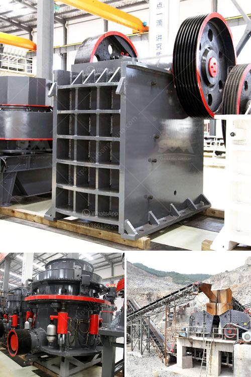

<h3>مطحنة الطحن بالميكرون</h3>
تعد مطحنة الطحن بالميكرون من أهم الأدوات التي يستخدمها العديد من الصناعيين والمصانع في عملية الطحن. تعمل هذه المطحنة على طحن المواد إلى حجم جسيمات صغيرة جدًا تتراوح بين الميكرومترات والميكرونات. تتميز هذه المطحنة بقدرتها على تحقيق درجات عالية من الدقة في الطحن وتحقيق توزيع جيد لحجم الجسيمات.

تعتمد مطاحن الطحن بالميكرون على استخدام تقنية الدوامة المتجهة وذلك لإدخال المواد إلى مكبس المطحنة. يتم استخدام قوة الدوامة للتأثير على المواد وطحنها بين الأسطوانتين الدوارة والثابتة. تدفع المواد المطحونة من خلال فتحة الخروج في الجزء السفلي من المطحنة.

إن المطاحن بالميكرون تتميز بعدة مزايا، بما في ذلك الدقة العالية في الطحن وتوزيع الحجم الجسيمات، والكفاءة العالية في استخدام الطاقة، وسهولة التشغيل والصيانة. كما أن هذه المطاحن تمتاز بقدرتها على طحن مجموعة متنوعة من المواد بما في ذلك المواد الناعمة والمتوسطة والصلبة.

تستخدم مطاحن الطحن بالميكرون في العديد من الصناعات مثل صناعة الأغذية والمشروبات والأدوية. يمكن استخدام هذه المطاحن لطحن المواد الغذائية مثل الحبوب والشوكولاتة والتوابل والمساحيق الأخرى. كما يمكن استخدامها في صناعة الأدوية لطحن المكملات الغذائية والأدوية الصيدلانية والأعشاب الطبية.

بصفة عامة، تعتبر مطاحن الطحن بالميكرون أدوات مهمة في صناعة الطحن، حيث تضمن توزيعًا متساويًا لحجم الجسيمات واستخدامًا فعالًا للمواد الخام. كما أنها تزيد من جودة المنتج النهائي وتحسن من كفاءة العملية الإنتاجية. لذا، يجب أن تؤخذ مطاحن الطحن بالميكرون في الاعتبار عند اختيار معدات الطحن للصناعات المختلفة.
<h3>Contact us</h3><ul><li><strong>Whatsapp:&nbsp;<a href="https://wa.me/8613661969651">+8613661969651</a></strong></li><li><a href="https://swt.shibang-china.com/?git&amp;zhl&amp;مطحنة الطحن بالميكرون"><strong>Online Service(chat now)</strong></a></li></ul><h3>Related</h3><ul><li><a href='الرمل المصنع مقابل الرمل الطبيعي.md'>الرمل المصنع مقابل الرمل الطبيعي</a></li><li><a href='بيع الكسارات في ماليزيا.md'>بيع الكسارات في ماليزيا</a></li><li><a href='كيماويات تعويم تحسين الفحم في الهند.md'>كيماويات تعويم تحسين الفحم في الهند</a></li><li><a href='مطاحن الأسطوانة العليا للبيع.md'>مطاحن الأسطوانة العليا للبيع</a></li><li><a href='كسارة للبيع في جنوب أفريقيا.md'>كسارة للبيع في جنوب أفريقيا</a></li></ul>