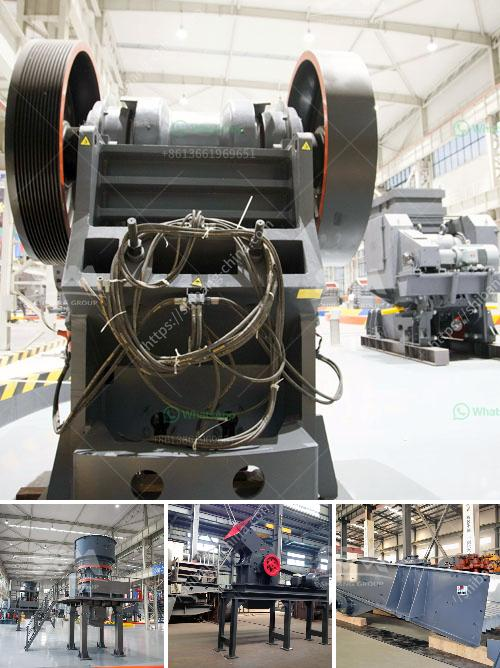

<h3>مطحنة الطحن</h3>
تعتبر مطحنة الطحن من الأدوات الهامة في عملية تحضير الطعام التقليدية، حيث تساعد في طحن المواد الغذائية إلى حبيبات أصغر وأفضل قابلية للاستخدام. تعود أصولها إلى العصور القديمة، حيث كانت تُستخدم بشكل رئيسي لطحن الحبوب والبهارات.

تتكون مطحنة الطحن من جزأين أساسيين: الطاحونة والمحرك الخارجي. يتم وضع المادة الغذائية داخل الطاحونة، ومن ثم يتم تشغيل المحرك لتدوير الأسطوانة الداخلية للطاحونة. توجد عادة فتحات صغيرة في جزء الطاحونة تُمرر من خلالها المادة المطحونة للخارج.

تعتمد فعالية مطحنة الطحن على نوعية المادة التي يتم طحنها وتناسبها مع الطاحونة المستخدمة. على سبيل المثال، يفضل استخدام طاحونة الحبوب لطحن الحبوب، حيث تحتوي على أسطوانات مزودة بشفرات حادة تقوم بطحن الحبوب بفعالية ودقة. بالإضافة إلى ذلك، يوجد أيضًا أنواع مختلفة من المطاحن التي تُستخدم لطحن المواد الغذائية الأخرى مثل البهارات والقهوة والبقوليات.

من الجوانب المهمة لاختيار مطحنة الطحن المناسبة، تتضمن قابلية التنظيف والصيانة، ومستوى الضجيج الناتج، وحجمها وسعتها. قد تكون الطواحين ذات الحجم الكبير مناسبة للاستخدامات التجارية أو الصناعية، في حين يُفضل اعتماد الأفراد على الطواحين الصغيرة القابلة للنقل والمزودة بمحرك كهربائي.

تطوير تكنولوجيا مطحنة الطحن أدى إلى ظهور أنواع جديدة أكثر تطورًا، مثل المطاحن الكهربائية التي تستخدم لطحن مجموعة متنوعة من المواد الغذائية وتتميز بسهولة الاستخدام. وتوفر هذه المطاحن القدرة على ضبط درجة الطحن وفقًا لتفضيلات المستخدم.

بالختام، تعد مطحنة الطحن أداة مهمة في المطبخ لطحن المواد الغذائية بسهولة وفعالية. تأتي بأحجام وأشكال مختلفة لتلبية احتياجات كل فرد، وتمكننا من الاستمتاع بالطعام الطازج والمختلف في منزلنا.
<h3>Contact us</h3><ul><li><strong>Whatsapp:&nbsp;<a href="https://wa.me/8613661969651">+8613661969651</a></strong></li><li><a href="https://swt.shibang-china.com/?git&amp;zhl&amp;مطحنة الطحن"><strong>Online Service(chat now)</strong></a></li></ul><h3>Related</h3><ul><li><a href='كسارة فك محمولة في المملكة العربية السعودية.md'>كسارة فك محمولة في المملكة العربية السعودية</a></li><li><a href='مصنع تكسير في ماليزيا.md'>مصنع تكسير في ماليزيا</a></li><li><a href='تركيبة مواد كسارة الفحم.md'>تركيبة مواد كسارة الفحم</a></li><li><a href='إجمالي الطاقة لكسارة الفك 500 طن في الساعة.md'>إجمالي الطاقة لكسارة الفك 500 طن في الساعة</a></li><li><a href='آلة كسارة البنتونيت.md'>آلة كسارة البنتونيت</a></li></ul>