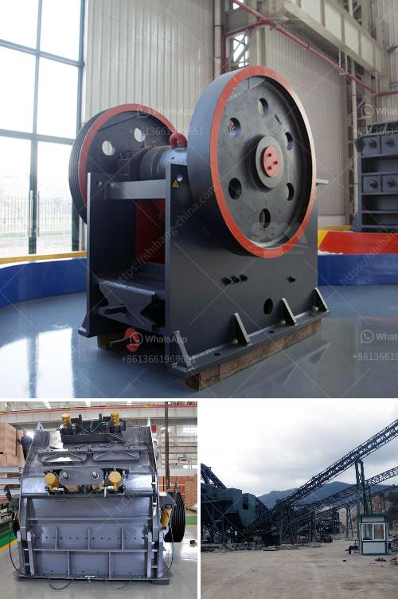

<h3>مطحنة الفحم في محطة توليد الطاقة</h3>
تعتبر مطاحن الفحم من المكونات الرئيسية في محطات توليد الطاقة التي تستخدم الفحم كوقود أساسي. تقوم هذه المطاحن بطحن الفحم الصلب إلى مسحوق ناعم يستخدم في العملية التحويلية لإنتاج البخار اللازم لتوليد الكهرباء.

تتألف مطاحن الفحم من جزأين رئيسيين، وهما المصادر الأساسية للفحم ونظام الطحن. يتم توصيل الفحم إلى مدخل المطحنة عن طريق نظام النقل المناسب، حيث يتم سحق الفحم الكبير إلى أجزاء صغيرة باستخدام الكرات المعدنية الموجودة داخل المطحنة. يتم دفع هذه الكرات بواسطة الهواء المضغوط وتتحرك بنسق مع الفحم لتطحنه إلى مسحوق ناعم.

واحدة من أهم تحديات مطاحن الفحم هي التحكم الدقيق في درجة الطحن، حيث يجب الوصول إلى مستوى صحيح من التجفيف والطحن للحفاظ على جودة الفحم المطحون وزيادة الكفاءة. ولذلك تستخدم أنظمة التحكم الحديثة والمتطورة للتأكد من أن كمية الهواء المضغوط ودرجة الحرارة مضبوطة بشكل صحيح للوصول إلى النتائج المرجوة.

بعد طحن الفحم إلى مسحوق ناعم في المطاحن، يتم توجيهه إلى الأفران لعملية احتراقه وتحويله إلى بخار. يتم تقسيم المسحوق إلى أجزاء صغيرة ويتم خلطها بالهواء لتحقيق احتراق كامل واقتصادي في الفرن. يعمل الفحم المطحون على تسريع عملية احتراق الفحم في الأفران وذلك بسبب توزيعه المتجانس وتحجيمه المنتظم.

يتطلب الحفاظ على مطاحن الفحم في حالة جيدة صيانة دورية ومنتظمة. يتم تنظيف تلك المطاحن وصيانتها للحفاظ على كفاءتها ومنع أي أعطال فنية. إذ يجب تجنب الاهتزازات والثنيات غير الطبيعية في الأجزاء الميكانيكية للمطاحن والتأكد من سلامة الأدوات الكهربائية والتشحيم السليم للمحامل.

في النهاية، تلعب مطاحن الفحم دوراً حاسماً في إنتاج البخار اللازم لتوليد الكهرباء. وتحافظ على جودة الفحم المطحون وتساعد على زيادة كفاءة عملية الاحتراق. علاوة على ذلك، فإن صيانة ورعاية هذه المطاحن تحافظ على تشغيلها بكفاءة عالية وتمد جميع الأجزاء الميكانيكية بالحماية اللازمة.
<h3>Contact us</h3><ul><li><strong>Whatsapp:&nbsp;<a href="https://wa.me/8613661969651">+8613661969651</a></strong></li><li><a href="https://swt.shibang-china.com/?git&amp;zhl&amp;مطحنة الفحم في محطة توليد الطاقة"><strong>Online Service(chat now)</strong></a></li></ul><h3>Related</h3><ul><li><a href='تكلفة تركيب السيور الناقلة.md'>تكلفة تركيب السيور الناقلة</a></li><li><a href='تقرير مشروع مصنع كسارة الحجر بتنسيق PDF.md'>تقرير مشروع مصنع كسارة الحجر بتنسيق PDF</a></li><li><a href='الفارق بين الرمل ومسحوق الحجر المكسر.md'>الفارق بين الرمل ومسحوق الحجر المكسر</a></li><li><a href='مصنعين محطم في جنوب أفريقيا.md'>مصنعين محطم في جنوب أفريقيا</a></li><li><a href='مطحنة محمولة في أستراليا بيرث.md'>مطحنة محمولة في أستراليا بيرث</a></li></ul>