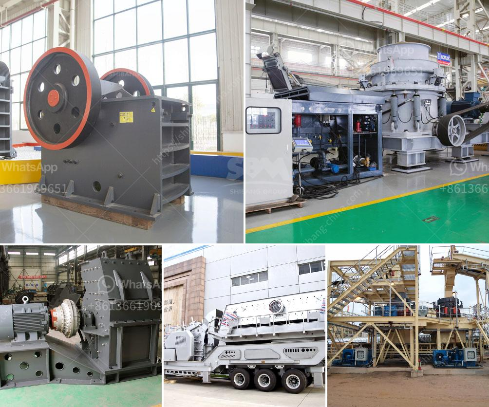

<h3>مطحنة الفحم لطحن الأسطوانة</h3>
تعتبر مطحنة الفحم لطحن الأسطوانة من الآلات الهامة في صناعة الفحم والمعادن، حيث تستخدم لطحن الفحم الخام إلى حجم ناعم. تشتمل مطاحن الفحم على أسطوانتين مدورتين تتزاوجان في جوفهما، وتدور الأسطوانات بسرعة مختلفة تعتمد على حبيبات الفحم المطلوبة.

تعد مطحنة الفحم لطحن الأسطوانة من الأجهزة الضرورية في محطات توليد الطاقة التي تستخدم الفحم كوقود أساسي. فبعد استخراج الفحم من المناجم، يتم طحنه في المطحنة للحصول على حجم الجسيمات المطلوب وزيادة كفاءة احتراقه. وبفضل هذه العملية، يتم تحسين كفاءة استخدام الوقود وتقليل انبعاثات الغازات السامة والضارة.

تتميز مطاحن الفحم بنظام دوران الأسطوانات المستخدم، فعندما يتم إدخال الفحم الخام إلى المطحنة، يتم طحنه بواسطة الضغط والاحتكاك الناتج من دوران الأسطوانات. وعندما تدور الأسطوانات بسرعة، يتم طحن الفحم على سطحهما الداخلي الملساء. وكلما زادت سرعة الدوران، زادت قوة الطحن وتم تحقيق حجم الكسر المرغوب.

تعد مطاحن الفحم لطحن الأسطوانة فعالة في طحن الفحم، حيث أنها تقلل من حجم الحبيبات وتحسن من تركيبة الفحم. وتستخدم هذه الطاقة من قبل الشركات المصنعة للفحم ومحطات الطاقة وبعض الصناعات الأخرى التي تحتاج للفحم في عمليات إنتاجها. كما تسهم في زيادة كفاءة استخدام الوقود وإطالة عمر أفران الاحتراق.

ورغم فوائد مطحنة الفحم لطحن الأسطوانة، إلا أنها تحتاج إلى صيانة مستمرة للحفاظ على سلامة الآلة وتشغيلها بكفاءة عالية. ويشمل ذلك تنظيف المطحنة وتغيير الأجزاء التالفة وفحص سلامة الأسطوانات والتأكد من التزاوج الصحيح بينهما. كما يجب أن تتم عملية التشحيم بشكل منتظم لتجنب الاحتكاك غير المرغوب وأي أضرار قد تحدث.

باختصار، تعد مطحنة الفحم لطحن الأسطوانة أحد الآلات الهامة في صناعة الفحم والمعادن. تقوم بطحن الفحم الخام إلى حجم ناعم لتحسين استخدامه كوقود وزيادة كفاءة الاحتراق. وتستخدم هذه المطاحن في محطات توليد الكهرباء وصناعة الفحم، وتتطلب صيانة منتظمة للحفاظ على سلامة وكفاءة الآلة.
<h3>Contact us</h3><ul><li><strong>Whatsapp:&nbsp;<a href="https://wa.me/8613661969651">+8613661969651</a></strong></li><li><a href="https://swt.shibang-china.com/?git&amp;zhl&amp;مطحنة الفحم لطحن الأسطوانة"><strong>Online Service(chat now)</strong></a></li></ul><h3>Related</h3><ul><li><a href='مصنع كسارة للفحم.md'>مصنع كسارة للفحم</a></li><li><a href='صناعة الحجر الجيري في الفلبين.md'>صناعة الحجر الجيري في الفلبين</a></li><li><a href='تكلفة مشروع إنتاج الرمل في الهند.md'>تكلفة مشروع إنتاج الرمل في الهند</a></li><li><a href='مصنع الحجر الجيري والآلات في تاميل نادو للبيع.md'>مصنع الحجر الجيري والآلات في تاميل نادو للبيع</a></li><li><a href='كسارة محمولة للكوبالت.md'>كسارة محمولة للكوبالت</a></li></ul>