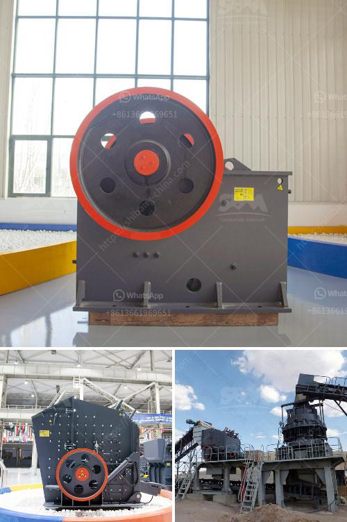

<h3>مطحنة الكرات المطحنة في الهند</h3>
تعتبر مطاحن الكرات من أهم وأكثر المعدات استخداماً في صناعة الأسمنت والتعدين ومعالجة المواد الكيميائية وغيرها من الصناعات. وتُستخدم في طحن المواد إلى حجم جسيمات أصغر، وصقلها، وتكسيرها بفعالية. تعد الهند واحدة من الدول الرائدة في إنتاج وتصنيع مطاحن الكرات.

تتألف مطاحن الكرات من جسم أسطواني يدار حول محوره بواسطة محرك. يحتوي الجسم الأسطواني على مواد طحن (الكرات) المعدنية، وعندما يدار الجسم الأسطواني، تتحرك الكرات بداخله وتكون قادرة على طحن المواد الموضوعة داخل المطحنة.

تتميز مطاحن الكرات في الهند بالدقة والكفاءة العالية. تحتوي على أنظمة تحكم عالية التقنية تساعد في تشغيلها بكفاءة عالية وتقليل الاستهلاك الزائد للطاقة. بالإضافة إلى ذلك، تعتمد معظم المطاحن الهندية على تصميم هندسي متقدم وتقنيات متطورة لضمان قوة التحمل والمتانة.

تطاحن الكرات في الهند تأتي بمختلف الأحجام والقدرات، وبالتالي يمكن تناسبها لمختلف الاحتياجات الصناعية. بغض النظر عن حجم المطحنة، تعد الفعالية والكفاءة هما العاملان الرئيسيان لقيمتها. يتم تحقيق ذلك من خلال التركيز على تحقيق أداء طحن متفوق وتوفير تكاليف التشغيل.

بالإضافة إلى ذلك، تهدف مطاحن الكرات في الهند إلى تحقيق الاستدامة البيئية. فهي تستخدم مواد متينة وصديقة للبيئة في تصنيعها. وتسعى لتقليل انبعاثات الغبار والضوضاء، كما تعتمد على تقنيات تنقية الهواء والماء للحفاظ على البيئة.

تعد صناعة مطاحن الكرات في الهند مجالاً حيوياً يساهم في توفير فرص عمل ودعم الاقتصاد المحلي. كما تسهم في تلبية الاحتياجات المحلية والعالمية للصناعات المختلفة.

وفي الختام، يمكن القول إن مطاحن الكرات في الهند تعتبر جزءًا هامًا في صناعة تحويل المواد، ولها تأثير كبير على الاقتصاد الهندي والعالمي. بفضل التصاميم الهندسية المبتكرة واستخدام التقنيات العالية، يمكن أن تستمر هذه المطاحن في تلبية المتطلبات المتزايدة للصناعة وتعزز التنمية المستدامة.
<h3>Contact us</h3><ul><li><strong>Whatsapp:&nbsp;<a href="https://wa.me/8613661969651">+8613661969651</a></strong></li><li><a href="https://swt.shibang-china.com/?git&amp;zhl&amp;مطحنة الكرات المطحنة في الهند"><strong>Online Service(chat now)</strong></a></li></ul><h3>Related</h3><ul><li><a href='مطحنة الضغط العالي.md'>مطحنة الضغط العالي</a></li><li><a href='تكلفة ناقل الحزام لصناعة التعدين.md'>تكلفة ناقل الحزام لصناعة التعدين</a></li><li><a href='مطاحن الحجر للبيع في كينيا.md'>مطاحن الحجر للبيع في كينيا</a></li><li><a href='وظائف كسارة مخروطية.md'>وظائف كسارة مخروطية</a></li><li><a href='تكلفة كسارة المعدات في ماليزيا.md'>تكلفة كسارة المعدات في ماليزيا</a></li></ul>