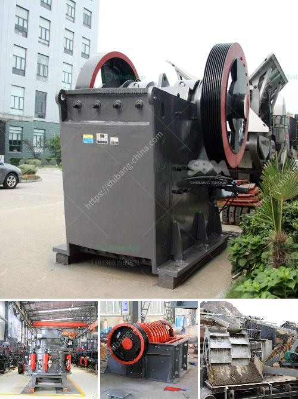

<h3>مطحنة الكرات في تنزانيا</h3>
مطحنة الكرات في تنزانيا: استخدام التكنولوجيا المتقدمة لتعزيز صناعة التعدين

تعتبر مطحنة الكرات واحدة من الآلات الرئيسية في صناعة التعدين، وتقوم بفرز وطحن المواد الخام للحصول على مسحوق أكثر دقة. وفي تنزانيا، تعد مطحنة الكرات من أهم الأدوات المستخدمة في صناعة التعدين المتنامية في البلاد.

تعد تنزانيا واحدة من أكبر منتجي الذهب والماس في أفريقيا، ويقدر أن صناعة التعدين تساهم في نسبة كبيرة من الناتج المحلي الإجمالي في البلاد. وتلعب مطاحن الكرات دورًا هامًا في هذه الصناعة لأنها تقوم بطحن الصخور الصلبة والمعادن الأخرى للحصول على الجسيمات الدقيقة المطلوبة.

تعمل مطاحن الكرات عن طريق وضع الصخور في وعاء كروي يحتوي على كرات فولاذية أو كرات سيراميكية. ثم تتحرك الكرات داخل المطحنة مع دوران الوعاء، مما يؤدي إلى تفتيت وسحق الصخور. ومن خلال ضبط سرعة دوران المطحنة وحجم الكرات، يمكن للمشغلين ضبط حجم الجسيمات المطلوب.

يُعتبر استخدام مطاحن الكرات في تنزانيا أكثر فاعلية وكفاءة مقارنة بالطرق التقليدية للتعدين. فعند استخدام مطاحن الكرات، يمكن تقليل فترات التشغيل والحد من الهدر والتلوث الناتج عن العمليات التقليدية مثل تفجير الصخور واستخدام المواد الكيميائية الضارة لاستخلاص المعادن.

يتم تطبيق تكنولوجيا مطاحن الكرات في تنزانيا بواسطة الشركات المتخصصة في صناعة التعدين والتكنولوجيا الحديثة. وقد استفادت تلك الشركات من الخبرة الدولية وتبنت أحدث المعايير العالمية لتطوير وتحسين استخدام مطاحن الكرات في البلاد.

من الجوانب الإيجابية لاستخدام مطاحن الكرات في تنزانيا أنها تحسن من الجودة والمستوى التكنولوجي لصناعة التعدين، مما يساهم في زيادة الإنتاجية وتحسين نسبة الاسترداد للمعادن الثمينة. ويعني هذا زيادة في الإيرادات وتعزيز الاقتصاد المحلي بشكل عام.

علاوة على ذلك، يعتبر استخدام مطاحن الكرات في تنزانيا بيئيًا مستدامًا، حيث يمكن التحكم في الانبعاثات والتلوث المحتمل الناتج عن عمليات التعدين. وهذا يعزز رؤية تنزانيا لتطوير الصناعة المعدنية بشكل مسؤول واستدامة.

باختصار، تلعب مطاحن الكرات دورًا حاسمًا في تعزيز صناعة التعدين في تنزانيا. بفضل التكنولوجيا المتقدمة والاستخدام المستدام، يمكن لتلك المطاحن تحسين الإنتاجية وجودة المنتجات، وزيادة الإيرادات المحلية وتعزيز التنمية الاقتصادية في البلاد. بالإضافة إلى ذلك، فإن استخدام مطاحن الكرات يؤدي إلى تقليل الآثار البيئية السلبية لصناعة التعدين وتعزيز التنمية المستدامة في تنزانيا.
<h3>Contact us</h3><ul><li><strong>Whatsapp:&nbsp;<a href="https://wa.me/8613661969651">+8613661969651</a></strong></li><li><a href="https://swt.shibang-china.com/?git&amp;zhl&amp;مطحنة الكرات في تنزانيا"><strong>Online Service(chat now)</strong></a></li></ul><h3>Related</h3><ul><li><a href='مواد مطحنة الهامر.md'>مواد مطحنة الهامر</a></li><li><a href='شركات بيع معدات التعدين في جنوب أفريقيا.md'>شركات بيع معدات التعدين في جنوب أفريقيا</a></li><li><a href='معدات تنظيف الرمال في الصغيرة.md'>معدات تنظيف الرمال في الصغيرة</a></li><li><a href='مورد معدات كسارة الفك.md'>مورد معدات كسارة الفك</a></li><li><a href='خط إنتاج مواد الجص الخام مع التعبئة.md'>خط إنتاج مواد الجص الخام مع التعبئة</a></li></ul>