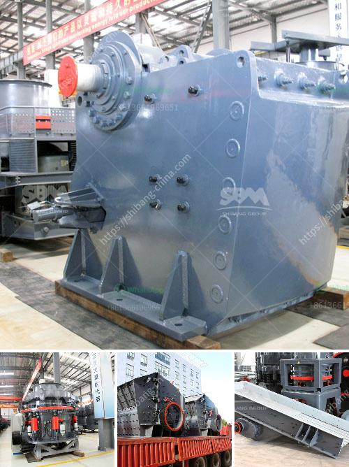

<h3>مطحنة الكرات لكربونات الكالسيوم</h3>
تُستخدم الكربونات الكالسيوم في العديد من التطبيقات الصناعية، مثل صناعة الورق، والمطاط، والمبيدات الحشرية، ومضافات الأغذية، والصناعات الصيدلانية. ولإنتاج الكربونات الكالسيوم عالية الجودة، تحتاج الشركات إلى مطاحن الكرات ذات الفعالية العالية.

تعتبر مطحنة الكرات عبارة عن أداة فعالة لطحن الكربونات الكالسيوم. تتكون المطحنة من برميل يحوي على الكرات المعدنية الصلبة المصنوعة من الصلب المقاوم للصدأ. تتحرك الكرات داخل المطحنة بفعل الجاذبية والاحتكاك، وتسحق الكربونات الكالسيوم إلى حجم الجسيمات المطلوب.

توفر مطاحن الكرات نتائج عالية الدقة والاستقرار. فتقنية الكرات المتحركة تسمح بتوزيع أكثر اتساقًا للجسيمات وتقليل الاحتكاك والتكتل. بالإضافة إلى ذلك، تستخدم مطاحن الكرات أيضًا تقنية الهواء المضغوط لتهوية المطحنة ومنع ارتفاع درجة الحرارة الزائدة. هذا يساعد على تجنب تجاوز درجة الحرارة المثلى في عملية الطحن التي قد تؤدي إلى تدهور جودة المنتج النهائي.

يتطلب استخدام مطحنة الكرات لكربونات الكالسيوم مراعاة بعض العوامل المهمة. يجب ضبط سرعة الدوران وحجم الكرات وكمية المسحوق بعناية لضمان تحقيق النتائج المرجوة. يجب أيضًا مراقبة درجة الحرارة وضغط الهواء المستخدم في المطحنة.

بصفة عامة، تعتبر مطاحن الكرات لكربونات الكالسيوم أداة أساسية في عمليات الطحن الصناعية. وبفضل قدرتها على تحقيق جودة عالية وفعالية في عمليات الطحن، تساهم مطاحن الكرات في تحقيق أهداف الشركات في تنتج الكربونات الكالسيوم عالية الجودة وذات القيمة العالية.
<h3>Contact us</h3><ul><li><strong>Whatsapp:&nbsp;<a href="https://wa.me/8613661969651">+8613661969651</a></strong></li><li><a href="https://swt.shibang-china.com/?git&amp;zhl&amp;مطحنة الكرات لكربونات الكالسيوم"><strong>Online Service(chat now)</strong></a></li></ul><h3>Related</h3><ul><li><a href='سعر مطحنة الكرات.md'>سعر مطحنة الكرات</a></li><li><a href='آلة كسارة لصنع الرمل من الحجر.md'>آلة كسارة لصنع الرمل من الحجر</a></li><li><a href='كسارة الصدم من نوع مانسبرجر.md'>كسارة الصدم من نوع مانسبرجر</a></li><li><a href='آلة عملية مطحنة الأسطوانة.md'>آلة عملية مطحنة الأسطوانة</a></li><li><a href='سعر الطحن بالكرات.md'>سعر الطحن بالكرات</a></li></ul>