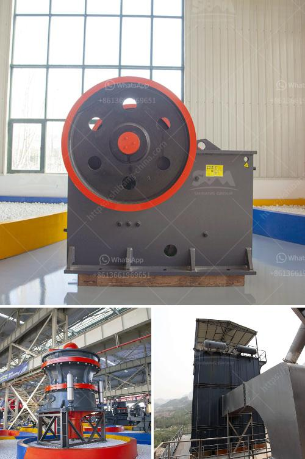

<h3>مطحنة الكرات للحجر الجيري</h3>
مصانع تصنيع الأسمنت والكاشطات عالية الجودة تستخدم ما يعرف بمطحنة الكرات لطحن المواد الخام، ومن بين هذه المواد الخام يأتي الحجر الجيري. تقع العملية الأساسية لمطحنة الكرات في تقطيع وطحن المواد الخام إلى أجزاء صغيرة. تتألف مطحنة الكرات من أسطوانة كبيرة تدور بواسطة محرك، وعدد من الكرات المعدنية داخلها تعمل على طحن المواد الخام.

تعد مطحنة الكرات للحجر الجيري من أحدث التكنولوجيات المعتمدة في صناعة الأسمنت، حيث تقدم كفاءة عالية في الطحن وتوفير الوقت والجهد. تساهم مطاحن الكرات في تقليل حجم الحجر الجيري الخام إلى حصص صغيرة، مما يجعلها أكثر قابلية للاندماج في عملية الإنتاج لاحقًا.

يعمل مطحنة الكرات بطريقة بسيطة، حيث يتم تحميل الحجر الجيري في المطحنة من الجهة العلوية، ثم يتمدد داخل الأسطوانة حيث تقع الكرات المعدنية. تدور الأسطوانة وتسحق الحجر الجيري بفعل تأثير الاصطدام بين الكرات والحجر. تتحرك الكرات حركة دائرية داخل الأسطوانة، مما يؤدي إلى تحطيم الحجر الجيري إلى أجزاء صغيرة.

تعد مطاحن الكرات مثالية لطحن الحجر الجيري، حيث تسمح بحدوث عملية الطحن بشكل أكثر فعالية وتكون أقل تكلفةً. تتوفر مطاحن الكرات بمختلف الأحجام والقدرات لتناسب الاحتياجات المتنوعة للشركات المصنعة. كما تعمل هذه المطاحن بشكل مستمر، مما يساهم في توفير الوقت والجهد لعملية الإنتاج.

بالإضافة إلى ذلك، تقدم مطاحن الكرات أيضًا ميزة توفير الطاقة، حيث تعتمد على تقنيات حديثة تسمح بانخفاض استهلاك الطاقة وزيادة الكفاءة الإنتاجية. تعمل مطاحن الكرات على تحسين جودة الإنتاج وتقليل التكاليف الإنتاجية، مما يجعلها اختيارًا مفضلًا لصناعة الأسمنت.

في الختام، تعتبر مطاحن الكرات للحجر الجيري من التكنولوجيات الحديثة التي تحسنت في صناعة الأسمنت. توفر مطاحن الكرات كفاءة عالية وتوفير وقت وجهد في طحن الحجر الجيري. بفضل تكنولوجياتها المبتكرة، تعتبر مطاحن الكرات خيارًا فعالًا واقتصاديًا لاستخدامها في صناعة الأسمنت.
<h3>Contact us</h3><ul><li><strong>Whatsapp:&nbsp;<a href="https://wa.me/8613661969651">+8613661969651</a></strong></li><li><a href="https://swt.shibang-china.com/?git&amp;zhl&amp;مطحنة الكرات للحجر الجيري"><strong>Online Service(chat now)</strong></a></li></ul><h3>Related</h3><ul><li><a href='معدات معالجة الحجر الكاملة محطم 100 طن.md'>معدات معالجة الحجر الكاملة محطم 100 طن</a></li><li><a href='أنواع الجبس.md'>أنواع الجبس</a></li><li><a href='كسارة محمولة في المملكة العربية السعودية.md'>كسارة محمولة في المملكة العربية السعودية</a></li><li><a href='دراسة جدوى مشروع مصنع الإسمنت pdf.md'>دراسة جدوى مشروع مصنع الإسمنت pdf</a></li><li><a href='مواصفات مطحنة الكرة.md'>مواصفات مطحنة الكرة</a></li></ul>