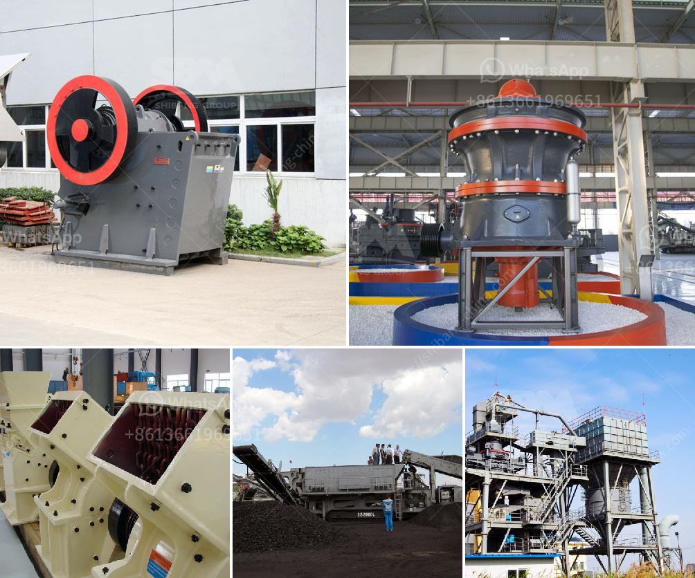

<h3>مطحنة الكرة التجارية للمبيعات</h3>
تُعتبر مطاحن الكرة التجارية أداة أساسية في صناعة الطحن والتكسير في العديد من الصناعات مثل صناعة الأسمنت والمواد الكيميائية والحبوب. تستخدم لطحن المواد الخام وتكسيرها إلى حجم صغير يمكن تعامله بسهولة في المراحل التالية من العملية الإنتاجية.

تتطلب هذه الصناعات مطاحن كرة قادرة على معالجة كميات كبيرة من المواد بكفاءة عالية وجودة ممتازة. تتوفر مطاحن الكرة التجارية بمختلف الأحجام والقدرات لتلبية احتياجات العملاء المختلفة.

تتميز مطاحن الكرة التجارية بتصميم قوي ودقيق لتحمل أحمال العمل الثقيلة وظروف التشغيل الصعبة. تتكون من جزئين رئيسيين، وهما الغلاف الخارجي والكرة الداخلية. يتم تحميل المواد الخام في الكرة الداخلية وتدور الكرة بسرعة عالية، مما يؤدي إلى طحن المواد الخام بفعالية. تتميز هذه المطاحن بتقنية التحميل الكرة-إلى-كرة، حيث يتم استخدام الكرات المعدنية لطحن المواد.

بفضل تقنية التشغيل السلسة والفعالة، توفر مطاحن الكرة التجارية أداء ممتازًا ونتائج عالية الجودة. تتميز بقدرتها على طحن المواد الخام بشكل متسق ودقيق، مما يؤدي إلى تحقيق نتائج متميزة في المرحلة التالية من العملية الإنتاجية.

توفر مطاحن الكرة التجارية أيضًا مرونة عالية للعملاء، حيث يمكن تعديل إعدادات العمل وحجم الكرات لتحقيق أداء مثالي وفقًا لمتطلبات العملاء المحددة. بالإضافة إلى ذلك، فإنها توفر أيضًا خيارات تحكم متقدمة تمكن العملاء من ضبط سرعة الدوران والزمن وحجم الطحن بدقة لتلبية احتياجاتهم الفردية.

مع مطاحن الكرة التجارية، يمكن للشركات تحقيق الإنتاجية المرتفعة والكفاءة في تكسير المواد الخام بشكل سلس واقتصادي. من خلال الاستثمار في مطاحن كرة تجارية ذات جودة عالية، يمكن للشركات تحقيق تحسينات كبيرة في جودة المنتج وزيادة الإنتاجية، مما يعزز تنافسيتها في السوق ويساهم في نموها ونجاحها.
<h3>Contact us</h3><ul><li><strong>Whatsapp:&nbsp;<a href="https://wa.me/8613661969651">+8613661969651</a></strong></li><li><a href="https://swt.shibang-china.com/?git&amp;zhl&amp;مطحنة الكرة التجارية للمبيعات"><strong>Online Service(chat now)</strong></a></li></ul><h3>Related</h3><ul><li><a href='قطع غيار كسارة مخروطية hp 500.md'>قطع غيار كسارة مخروطية hp 500</a></li><li><a href='طحن الفلدسبار بواسطة مطحنة الكرة في الفلبين.md'>طحن الفلدسبار بواسطة مطحنة الكرة في الفلبين</a></li><li><a href='صورة خط إنتاج الكلنكر الاسمنتي.md'>صورة خط إنتاج الكلنكر الاسمنتي</a></li><li><a href='آلة كسارة الحجر 250 400.md'>آلة كسارة الحجر 250 400</a></li><li><a href='تكلفة عمليات مصنع الرمل والحصى.md'>تكلفة عمليات مصنع الرمل والحصى</a></li></ul>