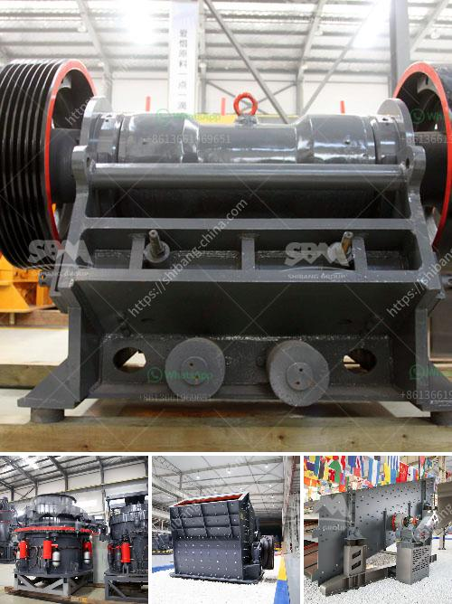

<h3>مطحنة الكرة الثقيلة الوزن في الهند</h3>
تُعد مطحنة الكرة الثقيلة الوزن واحدة من أهم المعدات المستخدمة في صناعة التعدين في الهند وحول العالم. تعد الهند واحدة من أكبر دول العالم في إنتاج المعادن، وتعتبر هذه المطاحن أداة حاسمة في عملية طحن المواد الصلبة. في هذه المقالة، سنستكشف مزايا استخدام مطحنة الكرة الثقيلة الوزن في الهند وأهميتها في صناعة التعدين.

تتكون مطاحن الكرة الثقيلة الوزن من جزء رئيسي يحتوي على أسطوانة معدنية تدور حول محورها الأفقي. يتم تحميل المواد الصلبة داخل المطحنة، وتتم طحنها وسحقها بواسطة الكرات المعدنية الموجودة داخل الأسطوانة. تعتبر الكرات المعدنية عنصرًا هامًا في عملية الطحن حيث تؤثر في سحق المواد الصلبة وطحنها إلى حجم أصغر.

تمتاز مطاحن الكرة الثقيلة الوزن بعدة مزايا. أحد أهم هذه المزايا هو حجم الإنتاج الكبير الذي توفره. تعد هذه المطاحن قادرة على طحن كميات كبيرة من المواد الصلبة في وقت قصير، مما يعزز من إنتاجية صناعة التعدين في الهند. بفضل وجود الكرات المعدنية، تساهم تلك المطاحن في تحطيم المادة من أجل الحصول على نسب تشتت عالية وحجم جسيمات أصغر، مما يعزز من كفاءة العمليات اللاحقة في الإنتاج.

تُعد مطاحن الكرة الثقيلة الوزن قوية ومتينة، مما يجعلها قادرة على التعامل مع المواد الصلبة ذات الصلابة العالية. يتم استخدام المطاحن بشكل واسع في صناعة التعدين في الهند لطحن المواد مثل البوكسيت، الفحم، الفوسفات، والحجر الجيري. تستخدم هذه الآلات أيضًا في مصانع الأسمنت والسيراميك لطحن المواد الخام وتحضيرها لعمليات التصنيع اللاحقة.

بالإضافة إلى ذلك، تُعد مطاحن الكرة الثقيلة الوزن سهلة التشغيل والصيانة. تتطلب هذه المطاحن وقتًا وجهدًا أقل في عمليات التشغيل والصيانة والتنظيف. كما أنها تسمح بتنظيف سهل لأجزائها واستبدال الأجزاء المتهالكة بسرعة، مما يقلل من وقت التوقف غير المخطط ويزيد من كفاءة الإنتاج.

في الختام، تُعد مطاحن الكرة الثقيلة الوزن من المعدات الأساسية في صناعة التعدين في الهند. تعزز هذه المطاحن من إنتاجية وكفاءة عمليات الطحن والسحق في المناجم والمصانع. بفضل مزاياها الفريدة من حيث الحجم الكبير للإنتاج والخصائص الميكانيكية القوية، تُعد مطاحن الكرة الثقيلة الوزن مفتاحًا لتحقيق النجاح والتطور في صناعة التعدين في الهند.
<h3>Contact us</h3><ul><li><strong>Whatsapp:&nbsp;<a href="https://wa.me/8613661969651">+8613661969651</a></strong></li><li><a href="https://swt.shibang-china.com/?git&amp;zhl&amp;مطحنة الكرة الثقيلة الوزن في الهند"><strong>Online Service(chat now)</strong></a></li></ul><h3>Related</h3><ul><li><a href='كسارة مخروطية للبيع.md'>كسارة مخروطية للبيع</a></li><li><a href='شركة تصنيع كسارات الحجر.md'>شركة تصنيع كسارات الحجر</a></li><li><a href='كيفية غسل الرمل للبناء.md'>كيفية غسل الرمل للبناء</a></li><li><a href='مصنع لوحات الجبس الجديد في الهند.md'>مصنع لوحات الجبس الجديد في الهند</a></li><li><a href='كسارة محمولة كليمان.md'>كسارة محمولة كليمان.</a></li></ul>