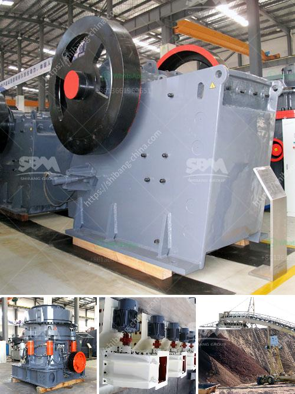

<h3>مطحنة الكرة الرطبة والجافة</h3>
تعتبر مطحنة الكرة واحدة من الطرق الشائعة لطحن المواد الصلبة، وتشمل نوعين رئيسيين: المطحنة الرطبة والمطحنة الجافة. تختلف المطاحن الكروية بشكل عام عن طريقة عملها، وكذلك عن الخصائص التي تتضمنها كل منها في عملية الطحن.

تعتمد المطاحن الكروية الرطبة على تغطية الكريات الصلبة داخل الجهاز بطبقة من الماء أو المذيبات الأخرى. تحدث أثناء الطحن تفاعلات كيميائية وفيزيائية بين المذيب والمواد الصلبة الموجودة في الجهاز. ويسمح وجود المذيب بتكسير المواد الصلبة بشكل سريع وفعال، وبذلك يمكن الحصول على حجم جسيمات أصغر بسهولة.

من ناحية أخرى، تعمل المطاحن الكروية الجافة بطريقة مختلفة. حيث يتم وضع المواد الصلبة داخل الجهاز بلا وجود أي سائل، وتكون عملية الطحن بالفعل بالجفاف. تحدث عملية الطحن عن طريق تحطيم الجزيئات الصلبة باستخدام الكرات الصلبة التي تتحرك في الجهاز. ويتم ضبط حجم الكرات وسرعة الدوران بطريقة تتناسب مع خصائص المادة المراد طحنها للحصول على الحجم المطلوب للجسيمات.

قد تكون للمطاحن الكروية الرطبة والجافة العديد من التطبيقات المختلفة. فمن الناحية العملية، فإن المطاحن الكروية الرطبة غالباً ما تستخدم في عمليات تحبيب المواد الصلبة لتحسين القابلية للتشكيل والاجترار. بدلاً من ذلك، فإن المطاحن الكروية الجافة عادة ما تستخدم لطحن المواد الصلبة الهشة، حيث يمكن أن يؤدي وجود الماء إلى تفاعلات غير مرغوب فيها.

بشكل عام، يمكن القول إن المطحنة الكروية، سواء الرطبة أو الجافة، تعتبر أحد أنواع المطاحن القوية والفعالة في صناعة الطحن. وتلعب دورًا هامًا في تحسين جودة المركبات الكيميائية والمواد الصلبة وتطويرها في مختلف الصناعات. ومع تطور التكنولوجيا، يتم تطوير المزيد من التصاميم والتقنيات لتحسين كفاءة المطاحن الكروية والتكيف مع احتياجات الأسواق المختلفة.
<h3>Contact us</h3><ul><li><strong>Whatsapp:&nbsp;<a href="https://wa.me/8613661969651">+8613661969651</a></strong></li><li><a href="https://swt.shibang-china.com/?git&amp;zhl&amp;مطحنة الكرة الرطبة والجافة"><strong>Online Service(chat now)</strong></a></li></ul><h3>Related</h3><ul><li><a href='تقرير مشروع وحدات كسارة الحجر.md'>تقرير مشروع وحدات كسارة الحجر</a></li><li><a href='كسارة الحجر الجيري المتنقلة.md'>كسارة الحجر الجيري المتنقلة</a></li><li><a href='سعر الكسارة 30 طن.md'>سعر الكسارة 30 طن</a></li><li><a href='أنظمة التحكم في كسارة الحجر المحمولة.md'>أنظمة التحكم في كسارة الحجر المحمولة</a></li><li><a href='جهاز كسر الكوارتز الصغير.md'>جهاز كسر الكوارتز الصغير</a></li></ul>