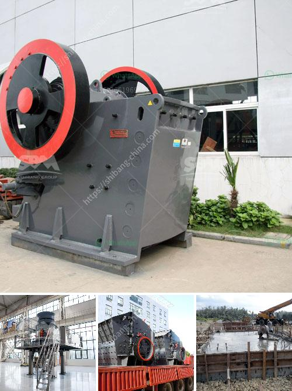

<h3>مطحنة الكرة الطين</h3>
تُعتبر مطحنة الكرة الطين إحدى المعدات الهامة في صناعة التعدين والتصنيع. تُستخدم هذه المطاحن لطحن وسحق المواد الخام ذات القوام الطيني، مثل الطين والفلسبار والكاولين والسليكا، لتحويلها إلى مسحوق ناعم. وتُستخدم عمومًا في إنتاج السيراميك والطوب والألواح الخزفية.

تتكون مطاحن الكرة الطين من براميل معدنية تحتوي على كرات من الفولاذ المقاوم للصدأ. تدور هذه الكرات داخل البرميل وتقوم بطحن المواد الخام عن طريق الاحتكاك والتصادم. يتم تحميل المواد الخام داخل البراميل، ثم يتم تشغيل المطحنة لبدء عملية الطحن.

تتميز مطاحن الكرة الطين بعدة فوائد. أولًا، فإنها تقوم بطحن المواد الخام بشكل أكثر فعالية وسرعة مقارنة بالمطاحن الأخرى، مما يؤدي إلى زيادة الإنتاجية. ثانيًا، فإنها تنتج مسحوقًا ناعمًا ومتجانسًا، مما يزيد من جودة المنتجات النهائية. ثالثًا، فإنها تعمل بطريقة آلية تقلل من الجهد البشري المطلوب لتشغيلها وتحسين كفاءة العمل.

وتُستخدم مطاحن الكرة الطين في العديد من الصناعات، بما في ذلك صناعة السيراميك. ففي عملية تصنيع السيراميك، يتم خلط المواد الخام مع الماء لخلق معجون. ثم يتم وضع هذا المعجون داخل مطحنة الكرة الطين حيث يتم طحنه حتى يتحول إلى مسحوق ناعم. يتم بعد ذلك استخدام هذا المسحوق لإنتاج البلاط والأواني السيراميكية والألواح الخزفية.

بالاعتماد على المتطلبات الخاصة لكل صناعة، يُمكن تخصيص مطاحن الكرة الطين لتتناسب مع الاحتياجات الدقيقة لكل مشروع. يمكن ضبط عوامل مثل سرعة الدوران وحجم الكرات المستخدمة لتحقيق النتائج المطلوبة.

الاهتمام بجودة عملية طحن المواد الخام ضروري للحصول على منتجات عالية الجودة في الصناعات المختلفة. لذلك، تُعتبر مطاحن الكرة الطين أدوات حيوية في صناعة التعدين والتصنيع، حيث تسهم في تحويل المواد الخام إلى منتجات نهائية متميزة وقيمة.
<h3>Contact us</h3><ul><li><strong>Whatsapp:&nbsp;<a href="https://wa.me/8613661969651">+8613661969651</a></strong></li><li><a href="https://swt.shibang-china.com/?git&amp;zhl&amp;مطحنة الكرة الطين"><strong>Online Service(chat now)</strong></a></li></ul><h3>Related</h3><ul><li><a href='كسارة الحجر بالمطرقة.md'>كسارة الحجر بالمطرقة</a></li><li><a href='مصنع الأسمنت في تركيا.md'>مصنع الأسمنت في تركيا</a></li><li><a href='شركة تصنيع كسارات صغيرة في الصين.md'>شركة تصنيع كسارات صغيرة في الصين</a></li><li><a href='سعر آلة الكسارة في كينيا.md'>سعر آلة الكسارة في كينيا</a></li><li><a href='مصنع سحق في ماليزيا.md'>مصنع سحق في ماليزيا</a></li></ul>