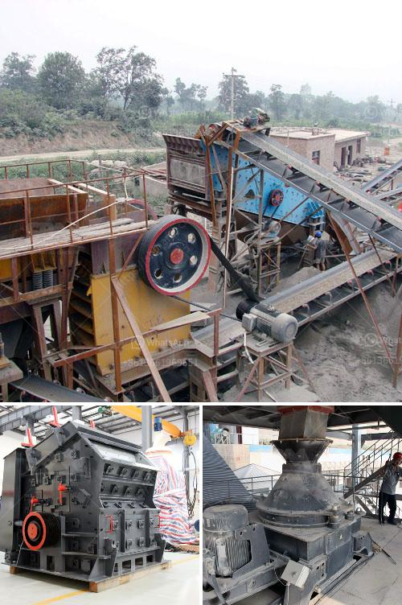

<h3>مطحنة الكرة القديمة للبيع في الهند</h3>
تعد مطحنة الكرة من الأجهزة القديمة التي تم استخدامها في صناعة الطحن في الهند. وتعود جذورها إلى العصور القديمة عندما كانت تستخدم لطحن المواد الصلبة إلى مسحوق ناعم في الصناعات المختلفة.

يمتاز مطحنة الكرة بتصميمها الفريد، حيث تتكون من إطار معدني يتم تركيبه على ساسة من الإسمنت يتضمن عجلات دوارة تعمل بالتوازي مع اسطوانة معدنية داخلية تحتوي على كرات حديدية صغيرة. عند تشغيل المطحنة، تدور الأسطوانة الداخلية بشكل مستقل، مما يتيح للكرات الحديدية داخلها الطحن وسحق أي مادة تم وضعها داخل المطحنة.

يوجد العديد من الأنواع المختلفة من مطاحن الكرة المستخدمة في الهند، وتتفاوت حجمها وسعتها وقدرتها على طحن المواد المختلفة. يعتبر استخدام مطحنة الكرة في العمليات الصناعية مهم جدًا، حيث يتم استخدامها في صناعات مثل الأسمنت والكيماويات والسيراميك.

وفي الأونة الأخيرة، بدأت مطاحن الكرة القديمة تُعرض للبيع في الهند. وتعتبر هذه المطاحن أحد الروائع التاريخية التي تعود إلى عهود ماضية. يتم عرضها للبيع بأسعار معقولة وفي متناول الجميع، مما يجعلها فرصة مثالية للمهتمين بجمع الآثار التاريخية أو الذين يرغبون في إضافة جمال وتاريخ إلى مساحتهم الخاصة.

يمكن أيضًا استخدام مطحنة الكرة القديمة المعروضة للبيع في الهند في أغراض تزيينية. يمكن وضعها كقطعة مركزية في حديقة أو ساحة منزلك، حيث ستضفي لمسة من الأصالة والفخامة على المكان.

عند شراء مطحنة الكرة القديمة، يجب الاهتمام بحالتها العامة والتحقق من وظائفها وموثوقيتها. من الأفضل شراءها من مصدر موثوق والتأكد من مصدرها التاريخي.

بشكل عام، مطحنة الكرة القديمة للبيع في الهند تعتبر فرصة رائعة للحصول على قطعة تاريخية جميلة ومفيدة. ستكون إضافة مثالية إلى أي مساحة داخل منزلك أو حديقتك، وستشكل محطة جذب فريدة للأعين وتجعلك تستمتع بجمال وفن العصور القديمة.
<h3>Contact us</h3><ul><li><strong>Whatsapp:&nbsp;<a href="https://wa.me/8613661969651">+8613661969651</a></strong></li><li><a href="https://swt.shibang-china.com/?git&amp;zhl&amp;مطحنة الكرة القديمة للبيع في الهند"><strong>Online Service(chat now)</strong></a></li></ul><h3>Related</h3><ul><li><a href='تكلفة فتح مصنع للأسمنت الصغير.md'>تكلفة فتح مصنع للأسمنت الصغير</a></li><li><a href='كسارة الحجر للبيع في الإمارات.md'>كسارة الحجر للبيع في الإمارات</a></li><li><a href='الهيدروليك في مطحنة الكرة الرأسية.md'>الهيدروليك في مطحنة الكرة الرأسية</a></li><li><a href='وكيل كسارة الفحم في إندونيسيا.md'>وكيل كسارة الفحم في إندونيسيا</a></li><li><a href='سعر كسارة الصخور.md'>سعر كسارة الصخور</a></li></ul>