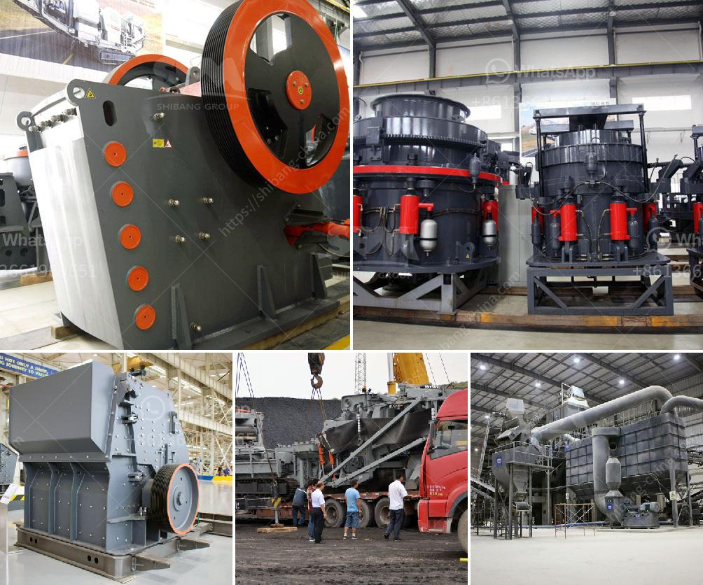

<h3>مطحنة الكرة المستخدمة للبيع في الهند</h3>
تعتبر مطحنة الكرة من أهم الأجهزة المستخدمة في صناعة الطحن في الهند وفي جميع أنحاء العالم. وتستخدم هذه المطاحن في طحن العديد من المواد المختلفة مثل الفحم، الخامات المعدنية، والأسمنت.

تتألف مطاحن الكرة من أسطوانة جرمية تحتوي على كرات فولاذية صغيرة تستخدم للطحن. يتم تحميل المواد في الأسطوانة وتبدأ الكرات في الدوران مسببة خلط المواد وسحقها.

تتميز مطاحن الكرة بعدة مزايا. فهي قادرة على طحن المواد بكفاءة عالية وسرعة كبيرة، مما يساعد في زيادة إنتاجية العملية. كما تسهل مطاحن الكرة عملية الطحن لأنها تحتاج إلى صيانة بسيطة مقارنة بالأجهزة الأخرى المستخدمة في عملية الطحن. بالإضافة إلى ذلك، فإن مطاحن الكرة تتميز بقدرتها على طحن المواد الصلبة والهشة على حد سواء.

تعتبر الهند واحدة من أهم البلدان المصنعة والمصدرة لمطاحن الكرة في العالم. تتميز مطاحن الكرة المستخدمة للبيع في الهند بجودتها العالية وتكلفتها المناسبة، مما يجعلها محط اهتمام العديد من الصناعات في البلاد وخارجها.

تستخدم مطاحن الكرة في صناعة الأسمنت بشكل خاص في الهند. حيث تستخدم هذه الطواحين لطحن الكلنكر ومواد أخرى مضافة لإنتاج الأسمنت. وتعتبر الهند واحدة من أكبر المنتجين والمستهلكين للأسمنت في العالم، مما يجعل الطلب على مطاحن الكرة مرتفعًا في البلاد.

بالإضافة إلى صناعة الأسمنت، تستخدم مطاحن الكرة أيضًا في صناعة الفحم وصناعة الخامات المعدنية في الهند. وتساعد هذه الطواحين في طحن الفحم بشكل فعال لإنتاج الفحم المطحون الذي يستخدم في مجالات مختلفة، مثل توليد الطاقة وتصنيع المنتجات الكيميائية. كما تستخدم مطاحن الكرة في طحن المعادن المختلفة لإنتاج المساحيق النهائية المستخدمة في صناعات مثل صناعة المعادن والتعدين.

باختصار، تُعتبر مطاحن الكرة المستخدمة للبيع في الهند من الأجهزة الأساسية في صناعة الطحن. وتتميز بقدرتها على طحن المواد بكفاءة عالية وسهولة الصيانة والتكلفة المناسبة. وتستخدم هذه الطواحين في صناعة الأسمنت وصناعات أخرى مثل صناعة الفحم وصناعة المعادن في الهند وفي بقية دول العالم.
<h3>Contact us</h3><ul><li><strong>Whatsapp:&nbsp;<a href="https://wa.me/8613661969651">+8613661969651</a></strong></li><li><a href="https://swt.shibang-china.com/?git&amp;zhl&amp;مطحنة الكرة المستخدمة للبيع في الهند"><strong>Online Service(chat now)</strong></a></li></ul><h3>Related</h3><ul><li><a href='كسارات متنقلة مجنزرة.md'>كسارات متنقلة مجنزرة</a></li><li><a href='استيراد كسارة الفك الصين في باكستان.md'>استيراد كسارة الفك الصين في باكستان</a></li><li><a href='سعر مصنع كسارة الحجر في الهند.md'>سعر مصنع كسارة الحجر في الهند</a></li><li><a href='شركة معالجة الذهب في الصين.md'>شركة معالجة الذهب في الصين</a></li><li><a href='كسارات الحجر الجيري المستخدمة للبيع في تكساس.md'>كسارات الحجر الجيري المستخدمة للبيع في تكساس</a></li></ul>