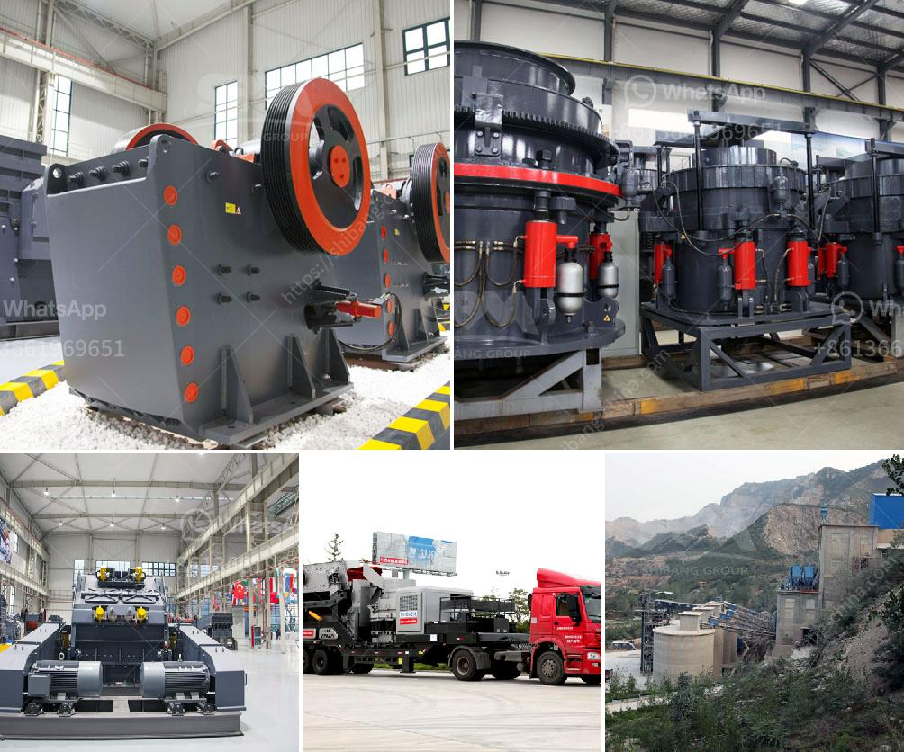

<h3>مطحنة الكرة في التعدين</h3>
تُعد مطحنة الكرة واحدة من المعدات الهامة في صناعة التعدين حيث تُستخدم لطحن المواد الخام إلى حجم جسيمات أصغر. تعتمد هذه المطاحن على آلية دوران الكرة داخل الجهاز لتحطيم المواد بفعل الاحتكاك والصدمات المتكررة بين الكرة والمادة.

يتكون جسم المطحنة الكرة عادةً من أسطوانة معدنية تدور حول محورها الطولي. يتم تحميل المواد الخام في الأسطوانة ومن ثم يتم تشغيل المطحنة لتبدأ في طحن المواد. يتم تفريغ المنتج النهائي من الجهاز بعد أن تصل إلى الحجم المطلوب.

تتوفر مطاحن الكرة بمختلف الأحجام والموديلات حسب احتياجات التعدين المختلفة. يتم تحديد حجم المطحنة بناءً على كمية المواد التي يجب طحنها وحجم الجسيمات المطلوب الحصول عليه. تُستخدم المطاحن الصغيرة لعمليات الاستخلاص المختلفة وفحص العينات، في حين تستخدم المطاحن الكبيرة لعمليات الإنتاج الصناعي.

تعتبر مطاحن الكرة من أكثر المعدات اقتصادية في مجال التعدين، فهي تتميز بكفاءة عالية وتوفر طحنًا دقيقًا للمواد الخام. بالإضافة إلى ذلك، فإنها تعمل على توفير الوقت والموارد، حيث يمكنها طحن كميات كبيرة من المواد في وقت قصير.

تستخدم مطاحن الكرة أيضًا في صناعة معالجة المعادن المختلفة مثل التعدين، والإسمنت، والكيماويات، وصناعة السيراميك. كما تُستخدم في إنتاج الطاقة الحرارية والكهربائية.

باختصار، تعد مطاحن الكرة من الأدوات الحاسمة في عمليات التعدين ومعالجة المعادن. حيث تتيح للصناعات المختلفة طحن المواد الخام بسرعة وكفاءة، مما يساهم في زيادة إنتاجية العمل وتوفير الوقت والطاقة. وتظل مطاحن الكرة محط اهتمام الشركات المتخصصة في حقل التعدين لدورها الفعال في تحسين العملية الإنتاجية وتحقيق الأرباح.
<h3>Contact us</h3><ul><li><strong>Whatsapp:&nbsp;<a href="https://wa.me/8613661969651">+8613661969651</a></strong></li><li><a href="https://swt.shibang-china.com/?git&amp;zhl&amp;مطحنة الكرة في التعدين"><strong>Online Service(chat now)</strong></a></li></ul><h3>Related</h3><ul><li><a href='تكلفة بناء مصنع كربونات الكالسيوم.md'>تكلفة بناء مصنع كربونات الكالسيوم</a></li><li><a href='مطحنة أسمنت صغيرة مستعملة في الإمارات.md'>مطحنة أسمنت صغيرة مستعملة في الإمارات</a></li><li><a href='تقرير المشروع حول وحدة تكسير الحجر.md'>تقرير المشروع حول وحدة تكسير الحجر</a></li><li><a href='للحصول على تصريح كسارة في الفلبين.md'>للحصول على تصريح كسارة في الفلبين</a></li><li><a href='كسارة الحجر المصنوعة في إيطاليا.md'>كسارة الحجر المصنوعة في إيطاليا</a></li></ul>