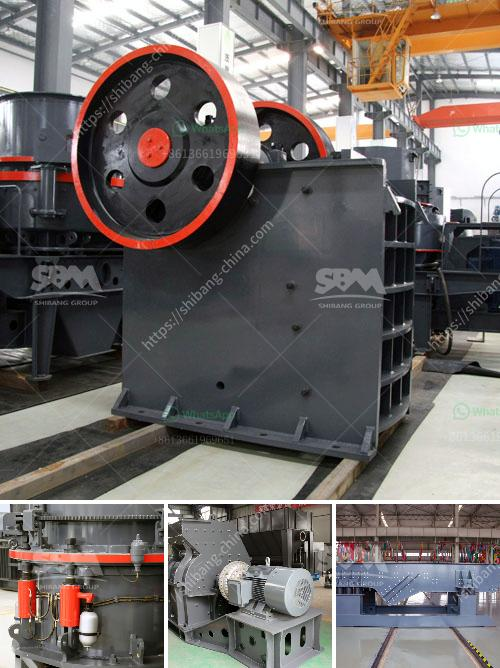

<h3>مطحنة الكرة في الصناعة</h3>
تعد مطحنة الكرة أحد الأدوات الأساسية في صناعة التعدين والمعادن. تستخدم هذه المطاحن لطحن المواد الخام بطريقة فعالة وفعّالة لإنتاج مسحوق الكرة. تعتبر المطاحن الكروية من أشهر وأكثر الأجهزة استخدامًا في معالجة المواد في العديد من الصناعات.

تتكون مطاحن الكرة من برميل هو مزود بالكرات المعدنية. عندما يتم تشغيل المطحنة، تبدأ الكرات في الدوران داخل البرميل وفقًا لحركة الدوران. يتم طحن المواد الخام المضافة في المطحنة بواسطة تأثير الكرات المعدنية بفعل الجاذبية والطاقة الحركية لها. وبصورة تدريجية، تتحول المواد الخام إلى مسحوق دقيق.

تعتبر مطاحن الكرة مفيدة جدًا في تكسير المواد الصلبة. فهي قادرة على طحن مواد مثل الفحم والمعادن والأسمنت والمواد الكيميائية والخامات الأخرى. تساهم هذه المطاحن في إنتاج مساحيق دقيقة من المواد الخام، والتي يمكن استخدامها في العديد من عمليات الإنتاج الصناعي.

بالإضافة إلى طحن المواد، تتميز مطاحن الكرة بقدرتها على خلط المواد بشكل فعال. يمكن استخدام المطاحن الكروية لخلط المواد الخام بعد طحنها، وهذا يساعد في تحسين جودة المنتج النهائي وتعزيز أداء العملية الصناعية ككل.

بعض التطورات الحديثة في مطاحن الكرة تشمل تصميمات أكثر تقدمًا وتقنيات طحن أكثر دقة. تستخدم بعض المطاحن الكروية أنظمة هوائية لنقل المواد وطحنها، مما يعزز كفاءة العملية ويقلل من استهلاك الطاقة. بالإضافة إلى ذلك، تأتي بعض مطاحن الكرة الحديثة مع نظام تبريد يضمن استقرار درجة حرارة العملية.

لخلاصة القول، تعد مطاحن الكرة جزءًا أساسيًا في صناعة التعدين والمعادن ومعالجة المواد الصلبة. تساهم هذه المطاحن في تحويل المواد الخام إلى مسحوق دقيق وتعزيز جودة المنتج النهائي. من خلال التطوير المستمر في تصميمات وتقنيات طحن المطاحن الكروية، يمكن تعزيز أداء العملية الصناعية وتحسين كفاءتها.
<h3>Contact us</h3><ul><li><strong>Whatsapp:&nbsp;<a href="https://wa.me/8613661969651">+8613661969651</a></strong></li><li><a href="https://swt.shibang-china.com/?git&amp;zhl&amp;مطحنة الكرة في الصناعة"><strong>Online Service(chat now)</strong></a></li></ul><h3>Related</h3><ul><li><a href='قائمة مصنع الكسارة.md'>قائمة مصنع الكسارة</a></li><li><a href='موردين استفادة خام الحديد.md'>موردين استفادة خام الحديد</a></li><li><a href='أسعار مطاحن الهامر.md'>أسعار مطاحن الهامر</a></li><li><a href='تكلفة مصنع الأسمنت.md'>تكلفة مصنع الأسمنت</a></li><li><a href='آلات إنتاج الجبس.md'>آلات إنتاج الجبس</a></li></ul>