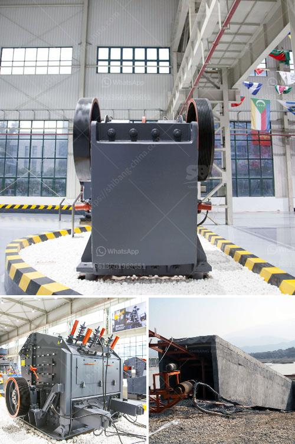

<h3>مطحنة الكرة في كازاخستان</h3>
تعتبر مطحنة الكرة في كازاخستان واحدة من أهم المنشآت الصناعية في البلاد. تقع هذه المطحنة في مدينة كاراغندي في جنوب شرق كازاخستان.

تعد مطحنة الكرة منشأة متطورة تستخدم في عملية طحن المواد الخام وتحويلها إلى مسحوق ناعم. تعتبر هذه العملية أساسية في صناعة الأسمنت والكيماويات والزجاج وغيرها من الصناعات الأخرى.

تتكون مطحنة الكرة من جزئين رئيسيين. الجزء الأول هو الجسم الدوار المعبأ بكرات صلبة من الصلب أو السيراميك. يعمل الجسم الدوار عن طريق الدوران حول نفسه مما يسبب حدوث قوة الطحن. يتم تحميل المواد الخام في المطحنة من خلال فتحة الإدخال وتتم عملية الطحن عن طريق اصطدام المواد الخام مع الكرات الصلبة أو السيراميك. يتم ضبط سرعة الطحن وحجم الكرات ووقت الطحن تبعًا لنوع المواد الخام وطبيعتها.

الجزء الثاني هو نظام التفريغ حيث يتم جمع المسحوق الناتج من عملية الطحن. ومن ثم يتم فرز المسحوق بحيث يتم الحصول على المقاس المطلوب. يتم تفريغ الجسم الدوار عند نهاية عملية الطحن واستخدام آلية خاصة للتحكم في عملية التفريغ.

تعد مطحنة الكرة في كازاخستان من أحدث التقنيات في مجال الطحن. توفر هذه المطحنة قدرة إنتاجية عالية وجودة ممتازة للمسحوق الناتج. بالإضافة إلى ذلك، تستخدم أحدث التقنيات الصديقة للبيئة لتقليل التلوث واستهلاك الطاقة.

تعتبر مطحنة الكرة في كازاخستان مثالًا مشرفًا على التطور الصناعي في البلاد. تلعب هذه المطحنة دورًا حيويًا في تلبية الاحتياجات المحلية وزيادة إنتاجية الصناعات المختلفة. تعكس هذه المنشأة الروح العلمية والتكنولوجية لكازاخستان وتعزز مكانتها في الساحة العالمية.

باختصار، تعد مطحنة الكرة في كازاخستان أحد أهم الأنظمة الصناعية في البلاد. تقدم هذه المطحنة مسحوق ناعم ذو نوعية ممتازة وتعتبر حلاً مثاليًا لتحويل المواد الخام إلى منتجات نهائية ذات قيمة مضافة.
<h3>Contact us</h3><ul><li><strong>Whatsapp:&nbsp;<a href="https://wa.me/8613661969651">+8613661969651</a></strong></li><li><a href="https://swt.shibang-china.com/?git&amp;zhl&amp;مطحنة الكرة في كازاخستان"><strong>Online Service(chat now)</strong></a></li></ul><h3>Related</h3><ul><li><a href='كيفية تحديد سعة سير الناقل.md'>كيفية تحديد سعة سير الناقل</a></li><li><a href='آلة تعدين النحاس.md'>آلة تعدين النحاس</a></li><li><a href='كسارة الفحم 10 مم.md'>كسارة الفحم 10 مم</a></li><li><a href='تكلفة كسارة الرمل.md'>تكلفة كسارة الرمل</a></li><li><a href='تكسير صخور صغيرة في لاس فيغاس.md'>تكسير صخور صغيرة في لاس فيغاس</a></li></ul>