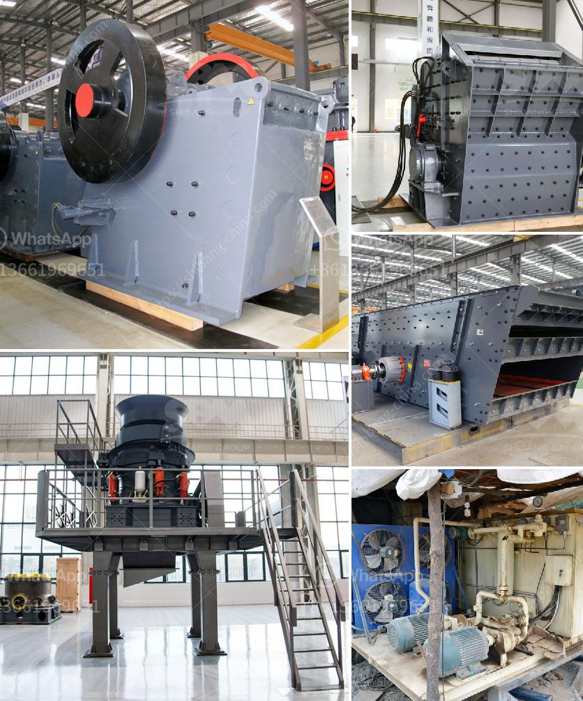

<h3>مطحنة الكرة في معالجة المعادن</h3>
تعد مطحنة الكرة واحدة من الأدوات الرئيسية المستخدمة في معالجة المعادن. تستخدم المطاحن الكروية لسحق المواد ، وطحنها ، ومزجها ، وتشكيلها ، وتنقيتها من المواد السائبة ، وتحسين تفاعل السطح ، وصقل الرواسب المعدنية. وهي تستخدم على نطاق واسع في مجالات مثل صناعة التعدين ، والصناعات الكيماوية ، وصناعة البناء ، وإعادة تدوير المواد.

تتكون مطاحن الكرة من جسم دوار يحتوي على كرويات من الصلب الثقيل في الداخل. عند تشغيل المطحنة ، يتم تدوير الجسم الدوار بفضل المحرك ، مما يؤدي إلى تدوير الكرات الصلبة. وتؤدي حركة الكرات الدوارة إلى سحق وطحن المواد الموجودة داخل المطحنة.

يتم سحق المواد داخل المطحنة باستخدام الصدمة والاحتكاك بين الكرات الصلبة والمواد الخام. يتم سحق المواد إلى قطع صغيرة عند تعرضها للضغط والاحتكاك ، الأمر الذي يزيد من تفاعل السطح ويقلل من حجم الجسيمات. هذا يسمح بتحسين أداء المواد وبالتالي زيادة قيمتها.

بجانب السحق ، تعد المطاحن الكروية أيضًا مناسبة للطحن المباشر. عند تشغيل المطحنة ، يتم وضع المواد الخام وجزء من الكرات الصلبة داخل المطحنة. تتداخل المواد وتعمل الكرات كوسط طحن ، مما يسمح بتحقيق التفاعلات الكيميائية بين المواد الخام.

تعتبر مطاحن الكرة مناسبة أيضًا للمزج والتلبيد والتشكيل. عند إجراء هذه العمليات ، يتم إضافة مواد أخرى إلى المطحنة لتلبيد المواد الخام معًا أو للحصول على خليط متجانس. يعمل حركة الكرات الصلبة على توزيع المواد جيدًا ، مما يؤدي إلى حصول على نقاوة عالية وموحدة للمزيج أو الخليط.

بصفة عامة ، تتميز مطاحن الكرة في معالجة المعادن بعدة مزايا. فهي توفر كفاءة عالية في سحق وطحن المواد ، مما يتيح توفير الطاقة والوقت. تتيح القدرة على تعديل سرعة المطحنة وحجم الكرات إمكانية التحكم في حجم الجسيمات الناتجة. بالإضافة إلى ذلك ، تعد مطاحن الكرة عملية وسهلة التشغيل وصيانتها.

باختصار ، تعتبر مطاحن الكرة أدوات حيوية في معالجة المعادن. تساهم في سحق وطحن المواد ، وتلبيد المواد الخام ، وتشكيلها ، وتعزيز تفاعل السطح ، وصقل الرواسب المعدنية بفعالية. يمكن استخدامها في العديد من الصناعات ويتمتعون بمزايا عديدة مثل الكفاءة العالية والتحكم الدقيق والسهولة في الاستخدام.
<h3>Contact us</h3><ul><li><strong>Whatsapp:&nbsp;<a href="https://wa.me/8613661969651">+8613661969651</a></strong></li><li><a href="https://swt.shibang-china.com/?git&amp;zhl&amp;مطحنة الكرة في معالجة المعادن"><strong>Online Service(chat now)</strong></a></li></ul><h3>Related</h3><ul><li><a href='كسارات أسطوانية وشاشات محمولة مستعملة.md'>كسارات أسطوانية وشاشات محمولة مستعملة</a></li><li><a href='سعة مطحنة الكرة للطين.md'>سعة مطحنة الكرة للطين</a></li><li><a href='سعر آلة صنع الرمل الاصطناعي.md'>سعر آلة صنع الرمل الاصطناعي</a></li><li><a href='مطحنة الكرة للبيع.md'>مطحنة الكرة للبيع</a></li><li><a href='مصنع طحن الذهب في زيمبابوي.md'>مصنع طحن الذهب في زيمبابوي</a></li></ul>