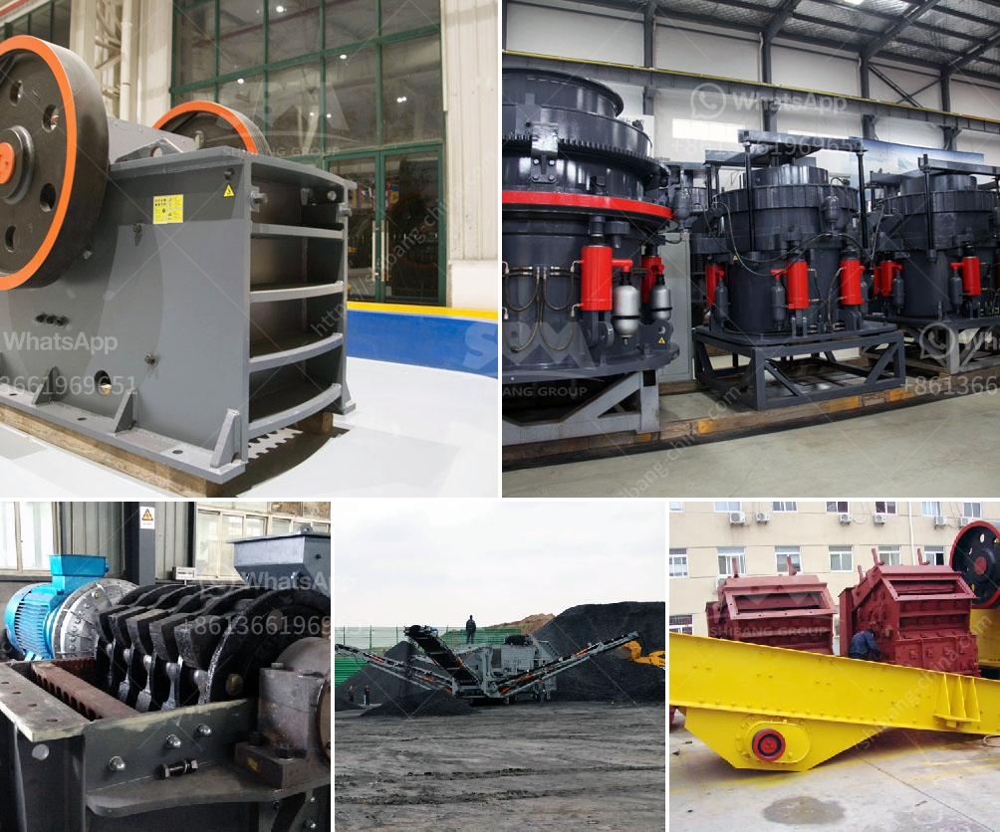

<h3>مطحنة الكرة لأضرار النشا</h3>
مطحنة الكرة هي أداة تستخدم في عملية طحن وسحق المواد الصلبة، وغالبًا ما تُستخدم في صناعة الأسمنت والصناعات الكيميائية وصناعة التعدين.

ومع ذلك، قد تسبب مطاحن الكرة أضرارًا للنشا في عمليات الطحن والسحق. يعتمد سبب هذه الأضرار على الظروف وطريقة التشغيل للمطحنة. هنا بعض الأضرار الشائعة التي يمكن أن تحدث:

1. تكسير النشا: يجب الانتباه إلى أن مطاحن الكرة قد تسبب تكسيرًا لجزيئات النشا الحساسة وتقليل حجمها إلى قطع صغيرة وغير مرغوب فيها. هذا قد يتسبب في فقدان خصائص النشا وتأثير على أدائه التكنولوجي.

2. تأثير على خصائص الريولوجيا: قد يؤدي طحن النشا داخل مطحنة الكرة إلى تغيير في خصائص الريولوجيا مثل لزوجة المحلول، معدل التدفق، واستقرار الشحوم. هذا الأمر لا يرغب فيه في بعض الصناعات مثل صناعة الدهانات والمستحضرات الطبية.

3. تأثير على التوزيع الحبيبي: يمكن أيضًا أن يؤثر طحن النشا في مطحنة الكرة على التوزيع الحبيبي للجسيمات. قد يحدث تجمع أو تفكك في جسيمات النشا، مما قد يؤثر على خواصه التقنية.

4. تغير في أداء النشا: إذا لم يتم ضبط عملية المطحنة بشكل صحيح، فقد يحدث تغير في خصائص النشا. قد يحدث تحطم للبنية الجزيئية للنشا أو تغير في قدرته على امتصاص الماء وعملية الترطيب.

لتقليل الأضرار التي قد يسببها طحن النشا في مطحنة الكرة، يجب اتباع بعض الإجراءات الوقائية. منها التحكم في سرعة الدوران وحجم الكرات المستخدمة في المطحنة، لضمان عدم تحطم الجزيئات النشا وتخريبها. كما يجب ضبط وتحكم في درجة الحرارة والرطوبة في العملية حتى لا تتأثر خصائص النشا.

بشكل عام، يمكن اعتبار مطحنة الكرة أداة فعالة في عملية طحن العديد من المواد الصلبة، ولكن يجب اتخاذ الاحتياطات اللازمة لتقليل الأضرار المحتملة للنشا.
<h3>Contact us</h3><ul><li><strong>Whatsapp:&nbsp;<a href="https://wa.me/8613661969651">+8613661969651</a></strong></li><li><a href="https://swt.shibang-china.com/?git&amp;zhl&amp;مطحنة الكرة لأضرار النشا"><strong>Online Service(chat now)</strong></a></li></ul><h3>Related</h3><ul><li><a href='سعر كسارة الحجر في الساعة.md'>سعر كسارة الحجر في الساعة</a></li><li><a href='معدات تعدين الصغيرة مصنعين في جنوب أفريقيا.md'>معدات تعدين الصغيرة مصنعين في جنوب أفريقيا</a></li><li><a href='طحن الكرة للأدوية.md'>طحن الكرة للأدوية</a></li><li><a href='آلة كسارة الطين في راجكوت.md'>آلة كسارة الطين في راجكوت</a></li><li><a href='تكلفة ناقل الحزام لصناعة التعدين.md'>تكلفة ناقل الحزام لصناعة التعدين</a></li></ul>