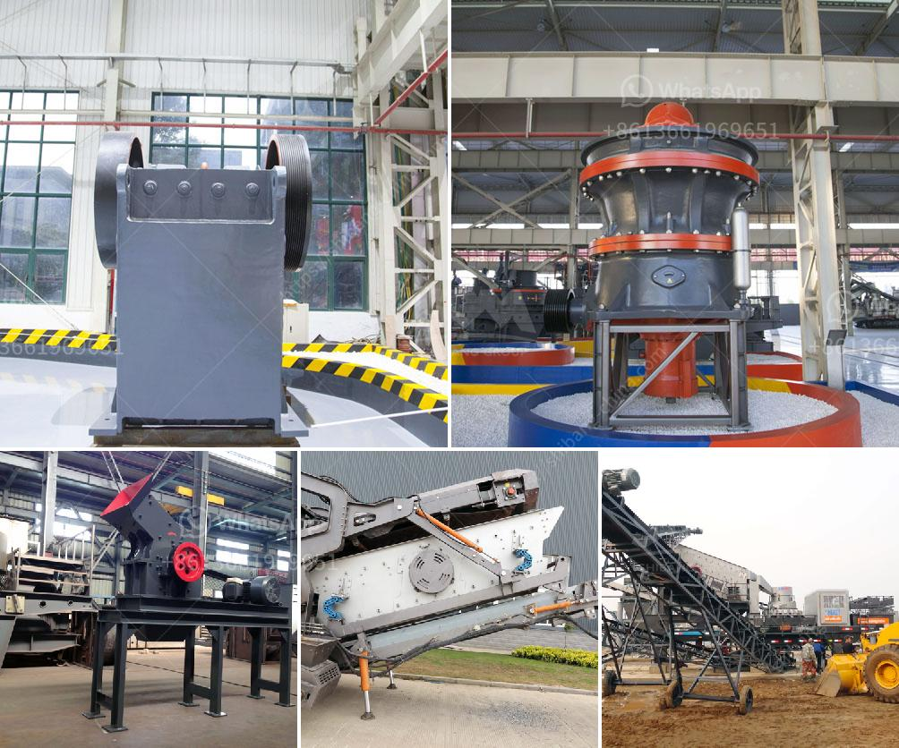

<h3>مطحنة الكرة لتعدين الذهب على نطاق صغير</h3>
تعتبر مطحنة الكرة واحدة من أهم الأدوات المستخدمة في عملية تعدين الذهب على نطاق صغير. تتميز هذه المطاحن بقدرتها على طحن خام الذهب إلى حجم أصغر وتحويله إلى مادة صلبة تتبدل فيها الذهب عن طريق عملية الاستخلاص.

تعمل مطاحن الكرة على مبدأ التدوير المستمر، حيث يتم وضع خام الذهب والكرات الفولاذية في الجهاز. ثم يتم تشغيل المطحنة وتدور الكرات داخل الجهاز بشكل مستمر، مما يؤدي إلى تكسير خام الذهب وتحويله إلى مسحوق ناعم.

تتكون مطاحن الكرة لتعدين الذهب على نطاق صغير من هيكل خارجي قوي يحوي على جهاز التروس وتروس التحكم في السرعة. في الجزء الداخلي من المطحنة، يتم وضع الكرات الفولاذية والخامات. يتم تدوير المطحنة عن طريق المحرك، وهذا يؤدي إلى تكسير الخامات وتحويلها إلى مسحوق ناعم. تتم عملية الفصل بعد ذلك لاستخلاص الذهب.

يمكن القول إن مطاحن الكرة تعتبر أداة فعالة جداً في عملية تعدين الذهب على نطاق صغير، حيث تتميز بالقدرة على تكسير الخامات بسرعة وتحويلها إلى مسحوق ناعم. وبفضل هذه العملية الفعالة، يمكن للمنقبين عن الذهب تحقيق إنتاج أعلى وزيادة فرص الاستخلاص.

علاوة على ذلك، تستخدم مطاحن الكرة أيضًا للتعامل مع خامات أخرى غير الذهب، كما يمكن استخدامها في صناعة السيراميك والأسمدة والصناعات الكيميائية الأخرى. إن تلك المطاحن تتميز بمرونتها وقدرتها على التعامل مع مجموعة متنوعة من المواد، مما يجعلها عالمية ومفيدة في العديد من الصناعات.

بشكل عام، تعتبر مطاحن الكرة مهمة لعملية تعدين الذهب على نطاق صغير. تسهم هذه المطاحن في تحسين عمليات الاستخلاص وزيادة الإنتاجية، كما أنها تستخدم في العديد من الصناعات الأخرى. إن استخدام مطاحن الكرة في تعدين الذهب له تأثير إيجابي على الصناعة ويساهم في تحقيق نتائج أفضل وأكثر كفاءة.
<h3>Contact us</h3><ul><li><strong>Whatsapp:&nbsp;<a href="https://wa.me/8613661969651">+8613661969651</a></strong></li><li><a href="https://swt.shibang-china.com/?git&amp;zhl&amp;مطحنة الكرة لتعدين الذهب على نطاق صغير"><strong>Online Service(chat now)</strong></a></li></ul><h3>Related</h3><ul><li><a href='سعر آلة كسارة الفك.md'>سعر آلة كسارة الفك</a></li><li><a href='مصنعون لفاصل المغناطيسي في تركيا.md'>مصنعون لفاصل المغناطيسي في تركيا</a></li><li><a href='مورد معدات كسارة الفك.md'>مورد معدات كسارة الفك</a></li><li><a href='أسعار مطاحن المطرقة في الرأس الشرقي.md'>أسعار مطاحن المطرقة في الرأس الشرقي</a></li><li><a href='كتلة الآلات وكسارة في AutoCAD.md'>كتلة الآلات وكسارة في AutoCAD</a></li></ul>