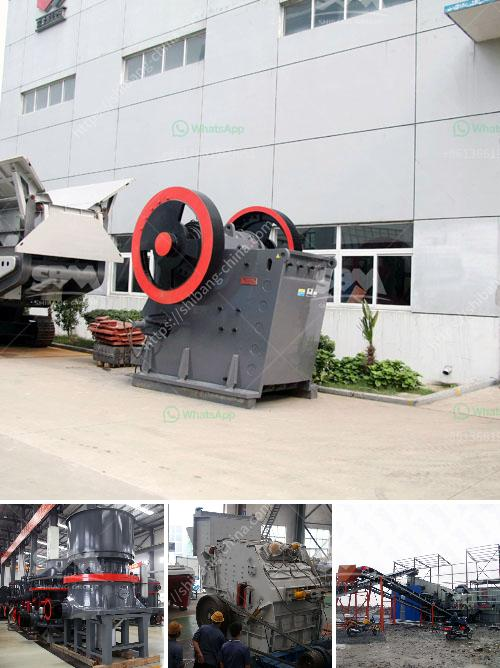

<h3>مطحنة الكرة لخام الذهب للبيع في زيمبابوي</h3>
تعد مطحنة الكرة من أهم المعدات المستخدمة في صناعة التعدين، وتستخدم على نطاق واسع في طحن وتكسير الخامات المعدنية. واحدة من المعادن الأكثر شيوعاً التي تتم معالجتها في مطحنة الكرة هي خام الذهب.

يعتبر زيمبابوي من بين أكبر منتجي الذهب في أفريقيا، حيث يحتوي على مصادر كبيرة من هذا المعدن الثمين. وبالتالي، فإن مطاحن الكرة لخام الذهب تمتلك قيمة كبيرة في البلاد. لذا، تعد مطاحن الكرة لخام الذهب للبيع في زيمبابوي فرصة مثالية للمستثمرين الذين يرغبون في دخول صناعة التعدين والاستفادة من الطفرة الاقتصادية التي تعيشها البلاد.

تتميز مطحنة الكرة بأنها تعمل بواسطة دوران الاسطوانة الموجودة فيها ووسط التكسير الموجود داخلها. يتم وضع خام الذهب داخل المطحنة، وتكون الكرات المعدنية في حركة دوران مستمرة. عندما تصطدم الكرات بالخام، تحطمه وتطحنه ليتم تحويله إلى جسيمات أصغر. ويتم ذلك بفضل قوة الاحتكاك والصدمة المتكررة بين الخام والكرات المعدنية.

يعتبر استخلاص الذهب من الخامات عملية تتطلب خبرة ومهارة. وبالتالي، فإن وجود مطاحن الكرة للبيع في زيمبابوي يوفر للمستثمرين الفرصة للاستفادة من الخبرة المحلية والعملاء المستهدفين لهذه العملية. كما أن توفر هذه المطاحن يعتبر مؤشرًا قويًا على الاستقرار الاقتصادي للبلاد، وهو عامل جذب للمستثمرين.

تعمل مطاحن الكرة للبيع في زيمبابوي كجزء من سلسلة العمليات التي يجب أن تتم لاستخلاص الذهب من الخامات. يتم استخدام هذه المطاحن لطحن الخامات الخشنة بعد سحقها بواسطة الكسارات الأولية. وتتنوع قدرات المطاحن حسب حجم الإنتاج المطلوب، ويتراوح نطاقها عادة بين 200 إلى 400 طن يوميًا.

لحسن الحظ، يتوفر حاليًا عدد كبير من مطاحن الكرة للبيع في زيمبابوي. يمكن للمستثمرين العثور على المطاحن التي تتناسب مع احتياجاتهم ومتطلباتهم. ومن المهم أيضًا أن يأخذ المستثمرون في الاعتبار تكلفة الصيانة والتشغيل وكفاءة الطاقة عند اختيار مطحنة الكرة المناسبة.

في النهاية، يعتبر امتلاك مطاحن الكرة للبيع في زيمبابوي فرصة رائعة للمستثمرين الذين يرغبون في استثمار في صناعة التعدين وتحقيق أرباح كبيرة من استخلاص الذهب. توفر هذه المطاحن مزايا كبيرة مثل استغلال الموارد الطبيعية المتاحة واستخدام الخبرة المحلية. وباعتبارها صناعة ناجحة في زيمبابوي، تعد مطاحن الكرة لخام الذهب للبيع فرصة حقيقية لتحقيق النجاح والاستدامة في هذا القطاع.
<h3>Contact us</h3><ul><li><strong>Whatsapp:&nbsp;<a href="https://wa.me/8613661969651">+8613661969651</a></strong></li><li><a href="https://swt.shibang-china.com/?git&amp;zhl&amp;مطحنة الكرة لخام الذهب للبيع في زيمبابوي"><strong>Online Service(chat now)</strong></a></li></ul><h3>Related</h3><ul><li><a href='مصنع كسارة للبيع في جنوب أفريقيا.md'>مصنع كسارة للبيع في جنوب أفريقيا</a></li><li><a href='مطاحن رايموند في المكسيك.md'>مطاحن رايموند في المكسيك</a></li><li><a href='كسارة الفك 150 250 للبيع.md'>كسارة الفك 150 250 للبيع</a></li><li><a href='مطحنة البنتونيت المستعملة من اليد الثانية.md'>مطحنة البنتونيت المستعملة من اليد الثانية</a></li><li><a href='سعر كسارة مخروطية هيدروليكية بتغذية 20 مم.md'>سعر كسارة مخروطية هيدروليكية بتغذية 20 مم</a></li></ul>