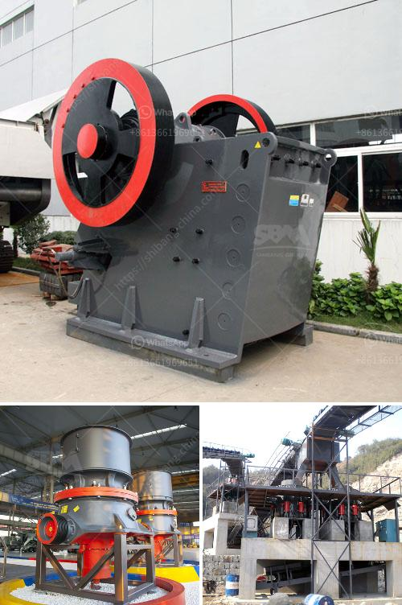

<h3>مطحنة الكرة لطحن الأسمنت</h3>
تعتبر مطحنة الكرة واحدة من أهم الأجهزة المستخدمة في صناعة الأسمنت. فهي تستخدم لطحن المواد الخام المستخدمة في إنتاج الأسمنت، مثل الحجر الجيري والسيليكات.

تعمل مطحنة الكرة عن طريق دوران الأسطوانة الموجودة فيها بسرعة عالية، وبداخلها كرات صغيرة معدنية تستخدم لطحن المواد الخام الموضوعة داخل المطحنة. وتؤثر حركة الأسطوانة والكرات المعدنية على المواد الخام، مما يؤدي إلى تفتيتها وطحنها إلى جسيمات أصغر.

تستخدم مطحنة الكرة في مصانع الأسمنت لعدة أسباب. أولاً، تساهم في خلط المواد الخام بشكل أكثر تجانساً وتسهيل عملية التفتيت. ثانياً، تسمح بتحويل المواد الخام إلى مسحوق دقيق يسمى الكلنكر، وهو مادة أساسية لإنتاج الأسمنت. وأخيراً، تساعد في زيادة كفاءة المواد الخام المستخدمة، مما يقلل من استهلاك الطاقة ويزيد من إنتاجية مصنع الأسمنت.

عند اختيار مطحنة الكرة لمصنع الأسمنت، هناك عدة عوامل يجب مراعاتها. أهمها هو اختيار الحجم المناسب للمطحنة وسعتها الإنتاجية، حسب حجم وإنتاجية المصنع. كما يجب مراعاة كفاءة المطحنة واستهلاكها للطاقة، وكذلك استخدامها لأي تقنيات جديدة تساهم في تحسين جودة الطحن وتقليل التآكل وزيادة عمر المطحنة.

في النهاية، مطحنة الكرة تلعب دوراً حيوياً في تصنيع الأسمنت، حيث تساهم في طحن المواد الخام وتحويلها إلى كلنكر. وبفضل تطور التكنولوجيا، تم تحسين مطاحن الكرة لتصبح أكثر كفاءة واستدامة، مما يساهم في تحسين جودة الأسمنت وزيادة إنتاجيتها.
<h3>Contact us</h3><ul><li><strong>Whatsapp:&nbsp;<a href="https://wa.me/8613661969651">+8613661969651</a></strong></li><li><a href="https://swt.shibang-china.com/?git&amp;zhl&amp;مطحنة الكرة لطحن الأسمنت"><strong>Online Service(chat now)</strong></a></li></ul><h3>Related</h3><ul><li><a href='كسارة الحجر في ماليزيا.md'>كسارة الحجر في ماليزيا</a></li><li><a href='أنواع الكسارات المستخدمة في التعدين pdf.md'>أنواع الكسارات المستخدمة في التعدين pdf</a></li><li><a href='مبدأ عمل مطحنة الهامر.md'>مبدأ عمل مطحنة الهامر</a></li><li><a href='مصنع معدات التعدين للذهب.md'>مصنع معدات التعدين للذهب</a></li><li><a href='تقرير مشروع التعدين الكاولين المصغر.md'>تقرير مشروع التعدين الكاولين المصغر</a></li></ul>