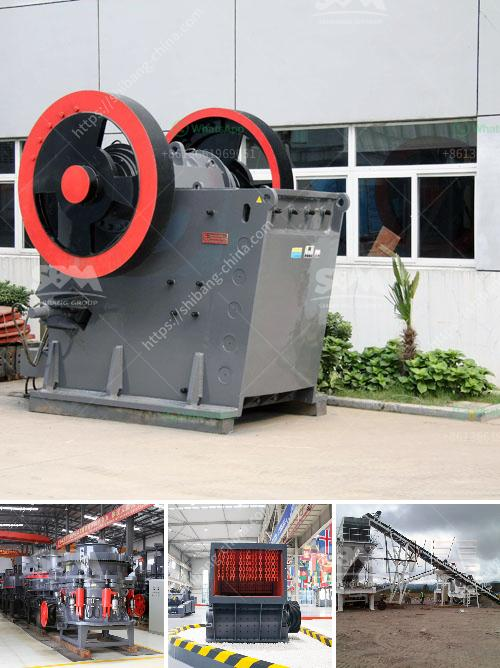

<h3>مطحنة الكرة لطحن الفلبين</h3>
تُعد مطحنة الكرة أحد الأدوات الرئيسية المستخدمة في صناعة الفلبين لطحن المواد الخام المستخدمة في عمليات التصنيع. وتُستخدم المطحنة الكروية لطحن مجموعة واسعة من المواد، بما في ذلك الخامات المعدنية والخامات اللافلزية والأسمنت والمواد الكيميائية والدهانات ومواد المطاط. تُعد عملية الطحن أحد الخطوات المهمة في تجهيز المواد للاستخدام الصناعي.

تتكون مطحنة الكرة من جسم أسطواني معدني طويل، يحتوي على مجموعة من الكرات المعدنية. ويتم دوران الجسم الأسطواني بسرعة محددة، مما يتسبب في اصطدام الكرات بالمادة الخام الموجودة داخل المطحنة، وتعدينها وتكسيرها إلى حجم أصغر.

تعتمد كفاءة مطحنة الكرة على العديد من العوامل المختلفة، مثل سرعة الدوران وحجم الكرات ونسبة مواد الطحن إلى الخام، وقوة الاحتكاك بين المواد. يجب تحقيق توازن مناسب بين هذه العوامل للحصول على أداء مثالي للمطحنة.

يستخدم مطحنة الكرة في العديد من الصناعات، بدءًا من صناعة الأسمنت حيث تستخدم لطحن الكلنكر والمواد البادئة المستخدمة لإنتاج الأسمنت. كما تستخدم في صناعة الألومنيوم لطحن خام البوكسيت للحصول على مسحوق الألومنيوم. وتستخدم أيضًا في صناعة الكيماويات لطحن المواد الكيميائية والصباغ والدهانات والملدنات. ولا يتوقف دور المطحنة على هذه الصناعات فقط، بل تستخدم أيضًا في صناعات أخرى مثل صناعة المطاط والزجاج والسيراميك، حيث تستخدم لطحن المواد قبل التشكيل والتصلب.

من الواضح أن مطحنة الكرة تلعب دورًا حاسمًا في تجهيز المواد الخام وتحضيرها للاستخدام في الصناعة. تقدم المطاحن الكروية كفاءة عالية وتوفر وقت وجهدًا كبيرًا في عمليات التصنيع. وبفضل التطور التكنولوجي، يتم تحسين تصميم المطاحن الكروية باستمرار لتحسين كفاءتها وزيادة إنتاجيتها.

في النهاية، فإن مطحنة الكرة تمثل جزءًا أساسيًا من الصناعات المختلفة في الفلبين. تساهم في تحويل المواد الخام إلى منتجات نهائية عالية الجودة، وتلبية احتياجات السوق المتزايدة. تعد مطاحن الكرة واحدة من الابتكارات التكنولوجية الرائدة في صناعة الطحن وستظل لعبة مهمة للغاية في تطور الصناعات في المستقبل.
<h3>Contact us</h3><ul><li><strong>Whatsapp:&nbsp;<a href="https://wa.me/8613661969651">+8613661969651</a></strong></li><li><a href="https://swt.shibang-china.com/?git&amp;zhl&amp;مطحنة الكرة لطحن الفلبين"><strong>Online Service(chat now)</strong></a></li></ul><h3>Related</h3><ul><li><a href='مطحنة ريموند في باكستان.md'>مطحنة ريموند في باكستان</a></li><li><a href='مطاحن فائقة الدقة في الصين.md'>مطاحن فائقة الدقة في الصين</a></li><li><a href='حساب تكلفة سحق الركام.md'>حساب تكلفة سحق الركام</a></li><li><a href='شركة كسارة الحجر.md'>شركة كسارة الحجر</a></li><li><a href='مورد سير ناقل في الصين.md'>مورد سير ناقل في الصين</a></li></ul>