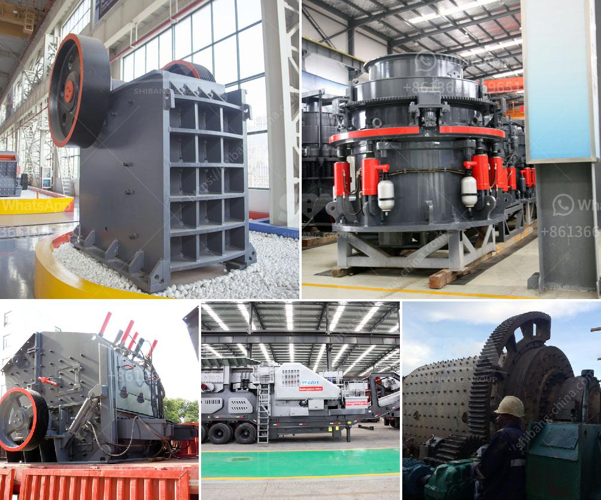

<h3>مطحنة الكرة لطحن الفلسبار</h3>
تعد مطحنة الكرة واحدة من المعدات الأساسية في صناعة طحن الفلسبار. تستخدم هذه المطحنة لسحق وطحن خام الفلسبار إلى حجم جسيمات أصغر، وهي تستخدم على نطاق واسع في مجموعة متنوعة من الصناعات مثل صناعة السيراميك والزجاج وصناعة الكيماويات والطلاء والصناعات الأخرى.

تتكون مطحنة الكرة من هيكل رئيسي يتكون من جسم الطحن وغرفة الطحن والعتاد والمحرك وغيرها. تعتمد عملية الطحن في هذه المطحنة على تأثير الكرة الموجودة في الطاحونة على المواد الخام وسحقها. يتم إدخال الفلسبار في الطاحونة من خلال فتحة التغذية على الجانب الأيسر من الجسم الرئيسي للطحن.

تتحرك الكرات في الطاحونة بتأثير قوة الاحتكاك والجاذبية الناتجة عن الدوران. تصطدم الكرات بالفلسبار الموجود في الطاحونة وتبدأ عملية السحق والطحن. يمر الفلسبار المسحوق من خلال فتحات الغربال في غرفة الطحن ويتم جمع المواد ذات الحجم المطلوب في صوامع التجميع. يتم تفريغ المواد بواسطة مضخة الحبيبات إلى مكانها المقصود.

مطحنة الكرة لطحن الفلسبار تتميز بعدة مزايا. أولاً، فهي تقوم بطحن الفلسبار إلى أحجام جسيمية صغيرة تتراوح بين ما بين 20 إلى 75 ميكرون، مما يسهل عملية استخلاص المعادن من الخام. كما أنها تعتبر آلة سهلة التشغيل والصيانة، ويمكن أن تكون لها عمر خدمة طويل في حال الاعتناء بها بشكل مناسب. بالإضافة إلى ذلك، فهي قادرة على طحن مجموعة واسعة من المواد الأخرى بالإضافة إلى الفلسبار.

عند استخدام مطحنة الكرة لطحن الفلسبار ، يجب اتباع بعض الإجراءات الوقائية للحفاظ على سلامة العاملين والحفاظ على الجهاز. من الضروري استخدام القفازات ونظارات السلامة أثناء التشغيل وتجنب لمس الأجزاء المتحركة للآلة. علاوة على ذلك، يجب تنظيف المطحنة بانتظام وإصلاح أي أعطال فوراً لضمان أداء مستدام وفعال للجهاز.

في الختام، فإن مطحنة الكرة تلعب دوراً هاماً في طحن الفلسبار وتحويله إلى مسحوق. يمكن استخدام هذه المساحيق في العديد من الصناعات المختلفة، وتعتبر المطحنة سهلة التشغيل والصيانة. يمكن الحصول من خلالها على فلسبار مطحون ذو جودة عالية، مما يساهم في تطوير الصناعات المختلفة وتلبية متطلبات السوق.
<h3>Contact us</h3><ul><li><strong>Whatsapp:&nbsp;<a href="https://wa.me/8613661969651">+8613661969651</a></strong></li><li><a href="https://swt.shibang-china.com/?git&amp;zhl&amp;مطحنة الكرة لطحن الفلسبار"><strong>Online Service(chat now)</strong></a></li></ul><h3>Related</h3><ul><li><a href='جوال محطم الحجر الجيري.md'>جوال محطم الحجر الجيري</a></li><li><a href='معدات جص صنع الجدار الخرساني في ألمانيا.md'>معدات جص صنع الجدار الخرساني في ألمانيا</a></li><li><a href='بيع كسارة الحجر للبيع.md'>بيع كسارة الحجر للبيع</a></li><li><a href='مصنع كسارة الكسارات للبيع في جنوب أفريقيا.md'>مصنع كسارة الكسارات للبيع في جنوب أفريقيا</a></li><li><a href='معدات طحن فائقة الدقة.md'>معدات طحن فائقة الدقة</a></li></ul>