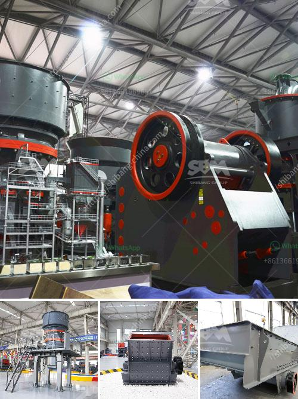

<h3>مطحنة الكرة لكلنكر الأسمنت</h3>
تُعد مطحنة الكرة أحد الأجهزة الرئيسية في صناعة الأسمنت، وتستخدم أساسًا لطحن الكلنكر الناتج من عملية الحرق الأولية. تعتبر الكلنكر مادة خام أساسية في إنتاج الأسمنت حيث يتم طحنها إلى مسحوق ناعم لاستخدامه في صناعة الخرسانة والأعمال الإنشائية الأخرى.

تتكون مطحنة الكرة من جهاز تدوير أفقي يحتوي على أسطوانة كبيرة وكرات فولاذية داخلها. يتم وضع الكلنكر داخل الأسطوانة بالإضافة إلى الكرات الفولاذية. عند تشغيل المطحنة ، يتم دوران الأسطوانة بسرعة عالية ، وبالتالي يتم طحن الكلنكر بفضل تحرك الكرات الفولاذية داخل الأسطوانة.

تعتبر مطحنة الكرة ضرورية لتحقيق الطحن النهائي للكلنكر ، حيث يتم ضبط حجم الجسيمات وتوزيعها. يؤثر حجم الجسيمات على خواص الأسمنت مثل قوتها ومقاومتها للضغط والتشوه. عندما يكون حجم الجسيمات أكبر ، يتم زيادة سطح التفاعل بين الكلنكر ومياه الأسمنت ، مما يعزز القوة النهائية والمتانة للخرسانة.

بالإضافة إلى ذلك ، يتم تحسين توزيع الجسيمات وتجنب التجمعات والمناطق الفارغة بفضل عملية الطحن في مطحنة الكرة. يتم ضبط وقت الطحن وسرعة الدوران وحجم الكرات الفولاذية لتحقيق الهدف المطلوب من حجم الجسيمات. يتم ضبط معاملات هذه العوامل بناءً على نوع الكلنكر واستخدامات الأسمنت.

نظرًا لدورها الحاسم في إنتاج الأسمنت ، يجب على المطاحن الكروية للكلنكر أن تكون مجهزة بتقنيات حديثة ومتقدمة لضمان أفضل أداء. يتم استخدام أنظمة التحكم التلقائي والمتقدمة لضبط عملية الطحن وضمان التشغيل السلس والفعّال. أيضًا ، يجب عليها أن تكون قابلة للصيانة بسهولة لتجنب الانقطاعات غير المخطط لها وتقديم الدعم الفني والصيانة الفورية عند الحاجة.

في النهاية ، يمكن القول إن مطحنة الكرة للكلنكر الأسمنت تلعب دورًا حاسمًا في تحقيق جودة الأسمنت وخواصه الميكانيكية. إنها تساهم في تحقيق الطحن النهائي الذي يتطلبه الكلنكر لتعزيز خواص الأسمنت وجعلها ملائمة للاستخدام في العديد من التطبيقات الإنشائية المختلفة.
<h3>Contact us</h3><ul><li><strong>Whatsapp:&nbsp;<a href="https://wa.me/8613661969651">+8613661969651</a></strong></li><li><a href="https://swt.shibang-china.com/?git&amp;zhl&amp;مطحنة الكرة لكلنكر الأسمنت"><strong>Online Service(chat now)</strong></a></li></ul><h3>Related</h3><ul><li><a href='الشاشات الاهتزازية في إيطاليا.md'>الشاشات الاهتزازية في إيطاليا</a></li><li><a href='شركات آلات مصانع الحجر في سالم تاميل نادو.md'>شركات آلات مصانع الحجر في سالم تاميل نادو</a></li><li><a href='مشروع كلنكر الإسمنت في الهند.md'>مشروع كلنكر الإسمنت في الهند</a></li><li><a href='سعر مركز تركيز خام النحاس.md'>سعر مركز تركيز خام النحاس</a></li><li><a href='كسارة الفك ميم FR.md'>كسارة الفك ميم FR</a></li></ul>