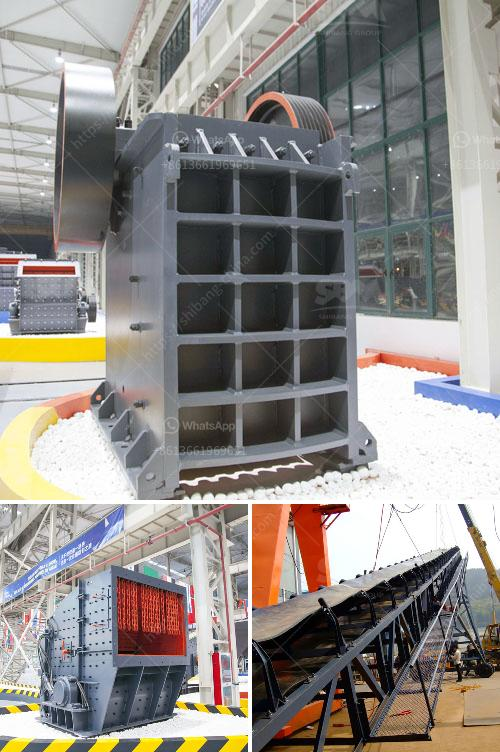

<h3>مطحنة الكرة للبيع</h3>
يعتبر الكرة مطحنة أداة هامة في صناعة التكسير وطحن المواد الصلبة. تم تصميمها لطحن المواد الخام المختلفة بشكل فعال وسريع. وتستخدم على نطاق واسع في العديد من الصناعات مثل صناعة الأسمنت والسيراميك والمعادن والزجاج وصناعة الكيماويات.

يتكون مطحنة الكرة من جزئين رئيسيين: جزء الاستكشاف وجزء الطحن. يحتوي جزء الاستكشاف على الكرات المعدنية الصغيرة التي تدور داخل الجهاز، وتعمل على طحن المواد الخام. بينما يحتوي جزء الطحن على المخرجات والمخارج المختلفة للمواد المطحونة والعوامل الأخرى.

تتميز مطاحن الكرة بالعديد من المزايا التي تجعلها خيارًا شائعًا للعديد من الشركات في صناعة التعدين والتكسير. فهي توفر عملية مستقرة وفعالة للغاية. تضمن أسلوب التكسير الدقيق والسريع أن المواد الخام تضخم بشكل مناسب وتطحن بشكل متساوٍ للحصول على نتائج مرضية.

بالإضافة إلى ذلك، تتميز مطاحن الكرة بكفاءة الطحن العالية وقدرتها على طحن مواد مختلفة بشكل فعال. يمكن استخدامها لطحن المواد الصلبة الهشة والناعمة والرطبة والجافة. تقدم نتائج ممتازة في إنتاج الأسمنت وتصنيع المواد المقاومة للحرارة والزجاج والمنسوجات وغيرها.

واحدة من المزايا الأساسية لمطاحن الكرة هي القدرة على طحن المواد بحجم مختلف. يمكن ضبط حجم الكرات المعدنية وسرعة الدوران وزمن الطحن بحسب الاحتياجات والمتطلبات المحددة. بالإضافة إلى ذلك، فإن المطاحن الكروية متوفرة بأحجام مختلفة، مما يتيح للمشترين تحديد الحجم المناسب وفقًا لقدرتهم الإنتاجية المطلوبة.

وفي النهاية، فإن سعر مطاحن الكرة معقول ومناسب للعديد من الشركات والمشترين. يتوفر هذا النوع من المعدات بأسعار تتراوح بين 200-400 دولار، والتي تعد معقولة بالنسبة للعديد من المشترين وتعكس أدائها وجودتها الممتازة.

لاشك أن مطحنة الكرة هي أداة هامة في صناعة التكسير وطحن المواد الصلبة. تقدم عملية سريعة وفعالة ونتائج ممتازة. بالإضافة إلى ذلك، فإنها تتمتع بالعديد من المزايا مثل القدرة على طحن مواد مختلفة وتعديل حجم الكرات المعدنية والتكلفة المناسبة. لذا، فإن شراء مطحنة الكرة هو خيار مثالي للشركات والمستخدمين الذين يبحثون عن حلول فعالة وعالية الجودة في صناعة التعدين.
<h3>Contact us</h3><ul><li><strong>Whatsapp:&nbsp;<a href="https://wa.me/8613661969651">+8613661969651</a></strong></li><li><a href="https://swt.shibang-china.com/?git&amp;zhl&amp;مطحنة الكرة للبيع"><strong>Online Service(chat now)</strong></a></li></ul><h3>Related</h3><ul><li><a href='تأجير كسارة تأجير في غانا.md'>تأجير كسارة تأجير في غانا</a></li><li><a href='مصانع الإسمنت للبيع في باكستان.md'>مصانع الإسمنت للبيع في باكستان</a></li><li><a href='مورد آلة كسارة الأسطوانة.md'>مورد آلة كسارة الأسطوانة</a></li><li><a href='أفضل كسارة لمسحوق الكوارتز.md'>أفضل كسارة لمسحوق الكوارتز</a></li><li><a href='أسعار كسارات الفك في جنوب أفريقيا.md'>أسعار كسارات الفك في جنوب أفريقيا</a></li></ul>