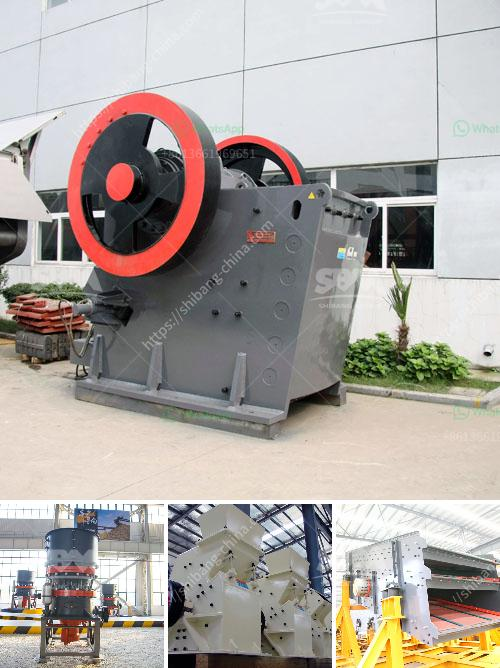

<h3>مطحنة الكرة للجبس</h3>
تُعد مطحنة الكرة للجبس أحد المعدات الرئيسية المستخدمة في صناعة الجبس. تهدف هذه المطاحن إلى سحق الجبس إلى حجم صغير وخلطه مع الماء لإنتاج مجموعة متنوعة من المنتجات المستخدمة في الصناعات المختلفة.

تتكون مطاحن الكرة الخاصة بالجبس من جسم معدني أسطواني متوسط الحجم يحتوي على عدد من الكرات المعدنية الثقيلة في الداخل. تتحرك الكرات داخل المطحنة وتسحق الجبس بفعل القوة الاحتكاكية والصدمات المتكررة بين الكرات والجبس.

تتميز مطاحن الكرة للجبس بعدة مزايا. أولاً، تعتبر عملية السحق في المطحنة سريعة وفعالة، وتحتاج إلى وقت أقل مقارنة بالطرق التقليدية لسحق الجبس. ثانياً، فإن المطاحن توفر طاقة كبيرة وتقلل من تكاليف التشغيل العامة. ثالثاً، تضمن مطاحن الكرة جودة عالية للجبس المسحوق، مما يجعلها مناسبة للاستخدام في صناعة الجبس.

تستخدم مطاحن الكرة للجبس في صناعة البناء والديكور. فعلى سبيل المثال، يتم استخدامها لإنتاج الألواح الجصية التي تستخدم كمادة أساسية للحوائط والأسقف في البناء. يتم سحق الجبس في المطحنة ومن ثم يتم مزجه بالماء لتكوين عجينة جصية. يتم بعد ذلك صب العجينة في قوالب وتهليكها للحصول على ألواح جصية جاهزة للتركيب.

بالإضافة إلى ذلك، يُنتج الجبس المكسر في المطاحن بجودة ممتازة وقوام مثالي للاستخدام في صناعة الديكور. فالجبس المكسر يمكن استخدامه لتشكيل المجلس التزييني والقوالب الجصية المثقبة والزخرفة الجصية الأخرى.

باختصار، تعتبر مطاحن الكرة للجبس أدوات مهمة في صناعة الجبس. تعمل على سحق الجبس بكفاءة وتوفر جودة عالية للمنتجات النهائية. تستخدم في إنتاج الألواح الجصية ومواد الديكور، وتقدم تكلفة منخفضة للتشغيل وفوائد اقتصادية عديدة.
<h3>Contact us</h3><ul><li><strong>Whatsapp:&nbsp;<a href="https://wa.me/8613661969651">+8613661969651</a></strong></li><li><a href="https://swt.shibang-china.com/?git&amp;zhl&amp;مطحنة الكرة للجبس"><strong>Online Service(chat now)</strong></a></li></ul><h3>Related</h3><ul><li><a href='أسعار مطاحن الهامر.md'>أسعار مطاحن الهامر</a></li><li><a href='مواصفات مصنع سحق الحجر الجيري 450 طن في الساعة.md'>مواصفات مصنع سحق الحجر الجيري 450 طن في الساعة</a></li><li><a href='سعر آلة تكسير الصخور.md'>سعر آلة تكسير الصخور</a></li><li><a href='سحق وفحص روستنبرج.md'>سحق وفحص روستنبرج</a></li><li><a href='كسارة الحجر المصنوعة في إيطاليا.md'>كسارة الحجر المصنوعة في إيطاليا</a></li></ul>