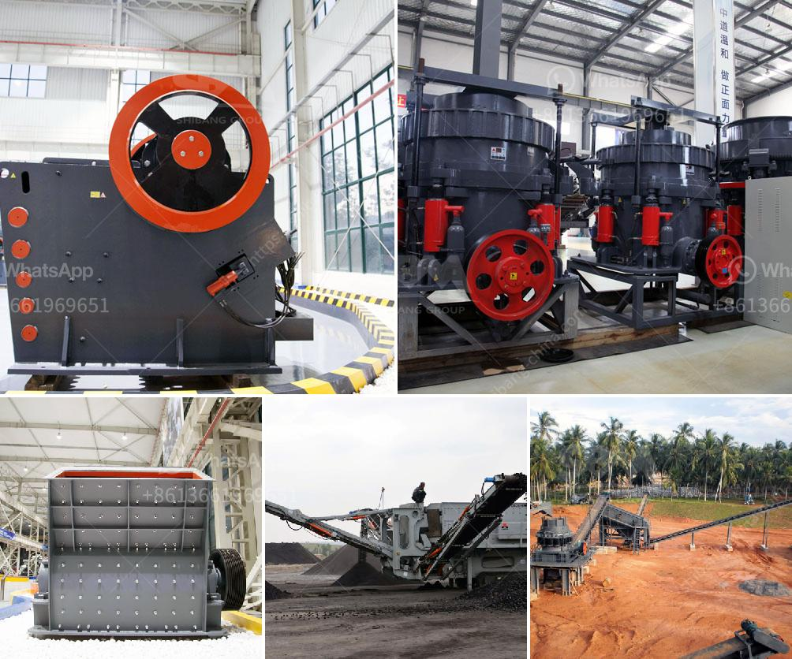

<h3>مطحنة الكرة للذهب في إندونيسيا</h3>
تعتبر مطحنة الكرة لاستخلاص الذهب من الصخور من أهم المعدات في صناعة التعدين. وتتراوح الكرات الصلبة في هذه المطاحن بين 30 و 130 مم في القطر، وتستخدم لطحن الصخور الخام وتفتتها إلى حجم أصغر، مما يسهل إزالة الذهب الموجود فيها.

في إندونيسيا، توجد العديد من مطاحن الكرات المختلفة التي تستخدم في استخلاص الذهب من الصخور الصلبة. وتعد مطحنة الكرة للذهب مناسبة لاستخراج الذهب من المنجنيز والنحاس والرصاص والزنك والفضة والخ، فضلاً عن الذهب.

تتكون مطاحن الكرة للذهب في إندونيسيا من جزئين رئيسيين: الجزء الداخلي والجزء الخارجي. يتم وضع الصخور المحتوية على الذهب في الجزء الداخلي من المطحنة، ويتم تحميل الكرات الصلبة في الداخل أيضًا.

يتم تشغيل المطحنة لفترة زمنية محددة عند درجة سرعة محددة. وباستخدام الحركة الدورانية للمطحنة وتأثير الكرات الصلبة، يتم طحن وتفتيت الصخور الصلبة، مما يتسبب في إطلاق الجسيمات الرملية الموجودة في الصخور ويسهل استخلاص الذهب الموجود في هذه الجسيمات.

يُعبر الجزء الخارجي من المطحنة عن فتحة التفريغ، حيث يتم إزالة الصخور المطحونة والتي تحتوي على الذهب، وتذهب إلى الأنابيب الخاصة بعملية استخراج الذهب.

تحتاج مطحنة الكرة للذهب في إندونيسيا إلى صيانة دورية وعناية للحفاظ على كفاءتها وزيادة عمرها الافتراضي. يجب تنظيفها بانتظام وفحص المحامل والسير والتروس والأجزاء الأخرى للتأكد من سلامتها، وتغيير أي جزء متضرر قبل وقوع أي حادث أو انخفاض في الكفاءة.

باستخدام مطحنة الكرة لاستخلاص الذهب في إندونيسيا، يمكن الحصول على كميات كبيرة من الذهب من الصخور الصلبة بكفاءة عالية. تساهم هذه المعدات في تسهيل عملية التعدين وزيادة الإنتاجية وتقليل التكاليف. كما أنها تسهم في استدامة صناعة التعدين في إندونيسيا وتحقيق الازدهار الاقتصادي.
<h3>Contact us</h3><ul><li><strong>Whatsapp:&nbsp;<a href="https://wa.me/8613661969651">+8613661969651</a></strong></li><li><a href="https://swt.shibang-china.com/?git&amp;zhl&amp;مطحنة الكرة للذهب في إندونيسيا"><strong>Online Service(chat now)</strong></a></li></ul><h3>Related</h3><ul><li><a href='سعر مطحنة طاحونة عمودية.md'>سعر مطحنة طاحونة عمودية</a></li><li><a href='مصانع الفرز للبيع.md'>مصانع الفرز للبيع</a></li><li><a href='كسارات الحجر للتأجير في شمال ويلز.md'>كسارات الحجر للتأجير في شمال ويلز</a></li><li><a href='سعر أحزمة الناقلات.md'>سعر أحزمة الناقلات</a></li><li><a href='كسارة فكية بمقدار 100 طن في الساعة.md'>كسارة فكية بمقدار 100 طن في الساعة</a></li></ul>