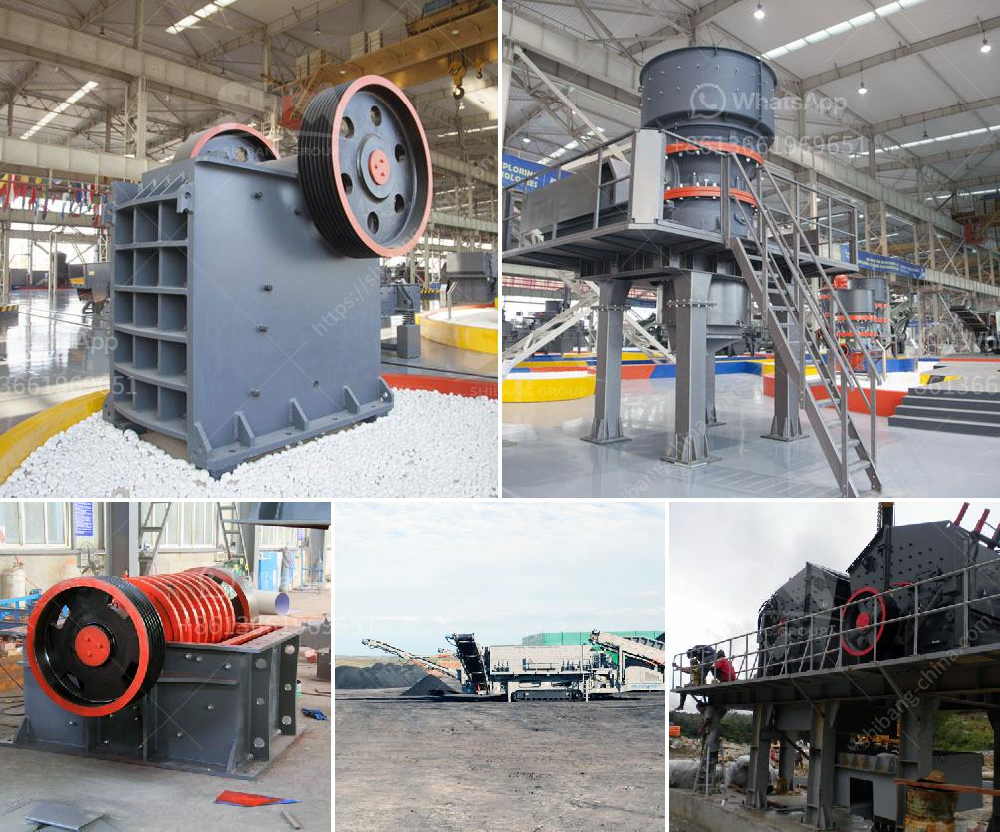

<h3>مطحنة الكرة للصبغة</h3>
مطحنة الكرة هي أداة تُستخدم في صناعة الصبغة والصباغة لطحن المواد الصلبة إلى حجم صغير جدًا. تعتبر هذه المطاحن أحد التقنيات الرئيسية في عمليات التصنيع والتحضير في صناعة الصبغة.

تعمل مطاحن الكرة عن طريق وضع المادة التي ترغب في طحنها داخل الجهاز، وذلك في وعاء معدني مع كرات صغيرة من الفولاذ. عند تشغيل المطحنة، تتحرك هذه الكرات في دوامة حول الوعاء، وتصطدم بالمواد الصلبة وتطحنها إلى أجزاء أصغر. يتم طحن المواد الصلبة في المطحنة بفضل قوة الاحتكاك والصدمة التي تولدها الكرات أثناء حركتها.

تتميز مطاحن الكرة بعدة مزايا. فأولاً، فهي فعالة من حيث الطاقة، وتستهلك كمية قليلة من الطاقة الكهربائية مقارنةً بالطاقة التي تنتجها. كما أنها سهلة الاستخدام وتحتاج إلى صيانة بسيطة جدًا. بالإضافة إلى ذلك، فإن مطاحن الكرة قادرة على طحن مواد صلبة مختلفة، وتتوفر بأحجام متنوعة لتلبية احتياجات العملاء.

تتم استخدام مطاحن الكرة في صناعة الصبغة، حيث يتم طحن المواد الصبغية الصلبة إلى حجم جسيمات صغير للغاية. وتُضاف إلى المطاحن بعض المواد الكيميائية لتحسين عملية الطحن وتحقيق النتائج المرجوة. يعتبر استخدام مطاحن الكرة في صناعة الصبغة حلاً فعالًا وموثوقًا لتحقيق دقة وتجانس في تصنيع الصبغة.

باختصار، تعد مطاحن الكرة أداة مهمة في صناعة الصبغة والصباغة، حيث تقوم بطحن المواد الصلبة إلى حجم صغير جدًا. وبفضل مزاياها العديدة، تعتبر هذه المطاحن خيارًا مثاليًا لتحقيق النتائج المرجوة في صناعة الصبغة.
<h3>Contact us</h3><ul><li><strong>Whatsapp:&nbsp;<a href="https://wa.me/8613661969651">+8613661969651</a></strong></li><li><a href="https://swt.shibang-china.com/?git&amp;zhl&amp;مطحنة الكرة للصبغة"><strong>Online Service(chat now)</strong></a></li></ul><h3>Related</h3><ul><li><a href='مورد آلة كسارة النفايات الفلبين.md'>مورد آلة كسارة النفايات الفلبين</a></li><li><a href='معدات تكسير خام الكروم المستخدمة.md'>معدات تكسير خام الكروم المستخدمة</a></li><li><a href='كسارات فك متنقلة للبيع في المملكة المتحدة.md'>كسارات فك متنقلة للبيع في المملكة المتحدة</a></li><li><a href='مصنع الأسمنت في تركيا.md'>مصنع الأسمنت في تركيا</a></li><li><a href='خطة المشروع حول آلة تحطيم الحجر.md'>خطة المشروع حول آلة تحطيم الحجر</a></li></ul>