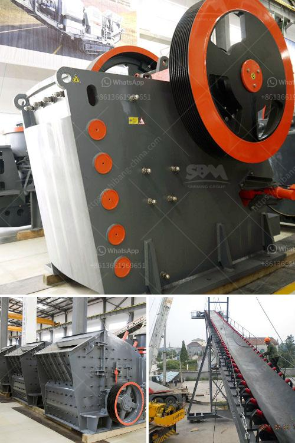

<h3>مطحنة الكرة لمسحوق الألمنيوم</h3>
تُعد مطحنة الكرة لمسحوق الألمنيوم أحد الأدوات الهامة في عملية تصنيع الألمنيوم النقي. فهي تستخدم لطحن الألمنيوم بشكل دقيق لإنتاج مسحوق الألمنيوم، الذي يستخدم في العديد من التطبيقات المختلفة.

تتألف مطحنة الكرة لمسحوق الألمنيوم من جسم أسطواني مع مجموعة من الكرات المعدنية داخلها. عند تشغيل المطحنة، تدور الكرات بسرعة عالية مع المنتج الذي يتم طحنه، وتتعامل معه بشكل مستمر. ينتج هذا عن تكسير القطع الكبيرة من الألمنيوم إلى قطع أصغر، وفي نهاية المطاف يتم تحويلها إلى مساحيق دقيقة.

يتم استخدام مطحنة الكرة لمسحوق الألمنيوم بشكل واسع في صناعة الألواح الألمنيومية والمنتجات الأخرى التي تتطلب مساحيق الألمنيوم النقي. يعتبر الألمنيوم مادة خفيفة الوزن ومتينة، مما يجعله مثاليًا للاستخدام في صناعات الطيران والسيارات والبناء والتكنولوجيا الحديثة.

يتم إنتاج مسحوق الألمنيوم باستخدام مطحنة الكرة باستمرار لتحقيق جودة عالية وحجم جسيمات دقيق. يتم تنظيم سرعة دوران المطحنة وحجم الكرات المستخدمة ووقت الطحن لتحقيق النتائج المرغوبة. يعتمد اختيار حجم الجسيمات على الاحتياجات الدقيقة للتطبيق النهائي.

تعد مطاحن الكرة لمسحوق الألمنيوم أداة فعالة لإنتاج مساحيق الألمنيوم عالية الجودة. تعمل باستخدام تقنية المطاحن الكروية الشهيرة، التي تُستخدم في الصناعات المختلفة لطحن المواد إلى مساحيق دقيقة.

في الختام، فإن مطحنة الكرة لمسحوق الألمنيوم تلعب دورًا حاسمًا في إنتاج مساحيق الألمنيوم عالية الجودة. تستخدم في العديد من التطبيقات المختلفة وتعد أداة فعالة وفعالة في إنتاج المواد النهائية. يجب الاهتمام بتعديل جميع المعلمات المختلفة لضمان جودة المنتج ومواصفاته المطلوبة.

إذا كنت ترغب في تناسبها في 200-400 كلمة، يمكن أن تقوم بإضافة التفاصيل الفنية الإضافية والمعايير المتبعة في عمليات الطحن والتحكم وغيرها لإثراء المقالة. هذه الأفكار العامة يمكن أن تكون نقطة انطلاق لإضافة التفاصيل المحددة.
<h3>Contact us</h3><ul><li><strong>Whatsapp:&nbsp;<a href="https://wa.me/8613661969651">+8613661969651</a></strong></li><li><a href="https://swt.shibang-china.com/?git&amp;zhl&amp;مطحنة الكرة لمسحوق الألمنيوم"><strong>Online Service(chat now)</strong></a></li></ul><h3>Related</h3><ul><li><a href='معدات كسارة الحجر للبيع.md'>معدات كسارة الحجر للبيع</a></li><li><a href='صيغة حساب قدرة كسارة الفك.md'>صيغة حساب قدرة كسارة الفك</a></li><li><a href='كسارة النحاس للبيع في ماليزيا.md'>كسارة النحاس للبيع في ماليزيا</a></li><li><a href='مصنع تكسير في مالي.md'>مصنع تكسير في مالي</a></li><li><a href='كيفية صنع مطحنة الكرة pdf.md'>كيفية صنع مطحنة الكرة pdf</a></li></ul>