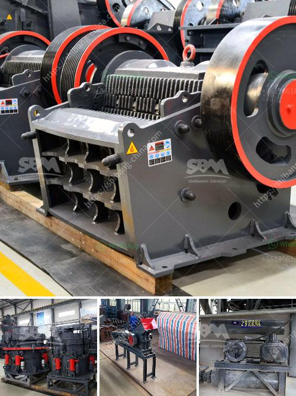

<h3>مطحنة الكرة ماركاسيت</h3>
تعتبر مطحنة الكرة ماركاسيت أحد الأدوات الهامة في صناعة الطحن والتكسير في مجال التعدين والبناء، فهي تستخدم لطحن وتكسير المواد الخام إلى قطع صغيرة ومتجانسة. تعتبر مطحنة الكرة ماركاسيت من أنواع مطاحن الاسطوانة، حيث تتكون من أسطوانة تدور حول محورها الأفقي، وتحتوي على كرات ضخمة معدنية في الداخل.

تتكون مطحنة الكرة ماركاسيت من العديد من الأجزاء الهامة، مثل العتلة الأفقية والمحور وفتحة التغذية وجهاز التفريغ. كي تعمل المطحنة بشكل صحيح، يجب أن يكون هناك محرك يدور على نسق محدد لتدوير الأسطوانة. وتعمل الكرات المعدنية على طحن المواد الخام عن طريق الاحتكاك والتصادم معها.

تستخدم مطاحن الكرة في مجالات متعددة من صناعة التعدين والبناء. ففي صناعة التعدين، تستخدم مطاحن الكرة لطحن المواد الخام المعدنية أو غير المعدنية، مثل الحديد والذهب والنحاس والزنك. وفي صناعة البناء، تستخدم لطحن وتكسير المواد الخام المستخدمة في إنتاج الأسمنت والزجاج والسيراميك والمواد العازلة.

من مزايا مطحنة الكرة ماركاسيت، سهولة الاستخدام والتشغيل، حيث يمكن تشغيلها بسهولة من قبل العمالة الماهرة بدون الحاجة إلى تدريب مكلف. كما أن هناك قدرة كبيرة على التكسير والطحن، حيث يمكن لمطحنة الكرة ماركاسيت تحقيق معدلات إنتاج عالية، مما يعني زيادة الإنتاجية وتحقيق أرباح أكبر للشركات.

ومع ذلك، هناك بعض العيوب التي يجب أخذها في الاعتبار عند استخدام مطحنة الكرة ماركاسيت. فمن أبرزها تكاليف الصيانة، فتحتاج المطاحن إلى صيانة دورية وتبديل الأجزاء التالفة ومعايرتها للحفاظ على أداء المطحنة على أفضل وجه. كما أنه من الصعب تحديد حجم الجسيمات المنتجة، فبعض المواد قد تحتاج إلى طحن إضافي للوصول إلى الحجم المرغوب.

وفي الختام، تعتبر مطحنة الكرة ماركاسيت أداة فعالة وضرورية في صناعة التعدين والبناء. فهي تساهم في طحن المواد الخام وتكسيرها للحجم المطلوب، مما يسهم في تحقيق ربحية وكفاءة إنتاجية عالية للشركات.
<h3>Contact us</h3><ul><li><strong>Whatsapp:&nbsp;<a href="https://wa.me/8613661969651">+8613661969651</a></strong></li><li><a href="https://swt.shibang-china.com/?git&amp;zhl&amp;مطحنة الكرة ماركاسيت"><strong>Online Service(chat now)</strong></a></li></ul><h3>Related</h3><ul><li><a href='مصنعي معدات تعدين الذهب في الدنمارك.md'>مصنعي معدات تعدين الذهب في الدنمارك</a></li><li><a href='آلة مطحنة المعادن.md'>آلة مطحنة المعادن</a></li><li><a href='تقرير مشروع مصنع كسارة الحجر.md'>تقرير مشروع مصنع كسارة الحجر</a></li><li><a href='سعر كسارة الفك المحمولة.md'>سعر كسارة الفك المحمولة</a></li><li><a href='سعر الشاشة الاهتزازية في الهند.md'>سعر الشاشة الاهتزازية في الهند</a></li></ul>