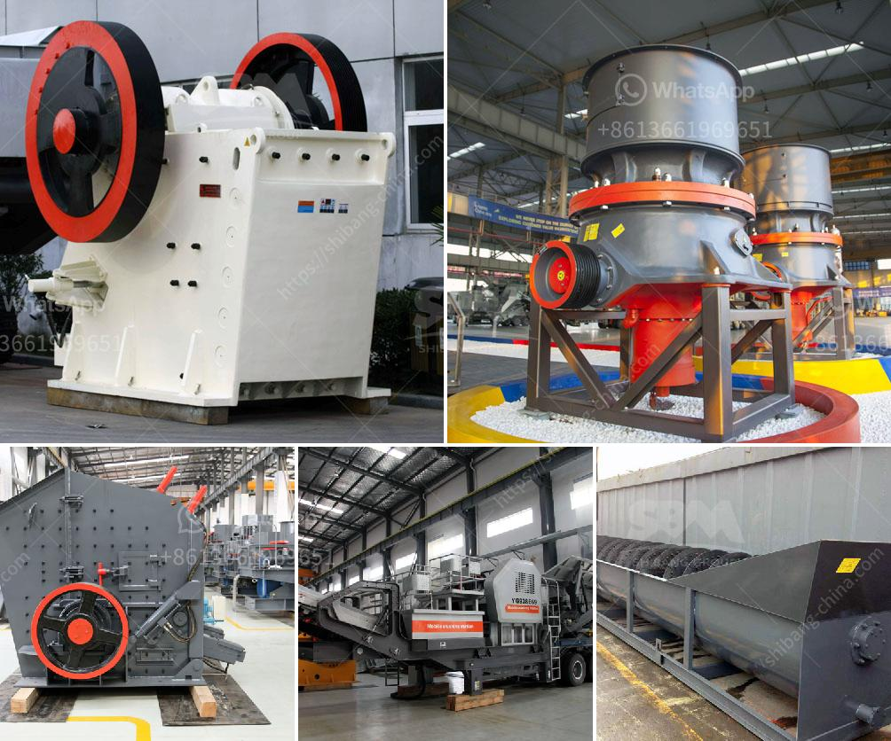

<h3>مطحنة الكرة مطرقة مطحنة مطحنة أسطوانية آلة</h3>
مطحنة الكرة، مطرقة مطحنة، ومطحنة أسطوانية هي آلات تستخدم في صناعة المواد الخام، وهي جزء هام في عملية الطحن. تتميز هذه الآلات بقدرتها على سحق المواد الصلبة إلى قطع صغيرة بشكل فعال، مما يسهل عملية معالجتها للمراحل التالية في عملية الإنتاج.

مطحنة الكرة هي آلة تستخدم لسحق المواد الخام عن طريق الاحتكاك والضغط. تتألف المطحنة من جسم أسطواني يحتوي على كرات فولاذية تدور على محورها الأفقي. عندما يتم وضع المواد الخام داخل المطحنة، تبدأ الكرات بسحق المواد الخام وتحويلها إلى جزيئات صغيرة. تستخدم مطحنة الكرة في العديد من الصناعات مثل صناعة الأسمنت، والزجاج، وصناعة الألوان، حيث يتم استخدامها لطحن المواد إلى مسحوق ناعم لتسهيل عملية الخلط والتشكيل.

أما المطرقة مطحنة، فهي آلة تستخدم لسحق المواد الصلبة من خلال ضربات قوية من المطارق الثقيلة. تتألف المطرقة مطحنة من غرفة طحن مع فجوة في أسفلها، حيث يتم وضع المواد الصلبة داخل الغرفة وتعمل المطارق على ضرب المواد بقوة عالية مما يؤدي إلى تكسيرها وتحويلها إلى جزيئات أصغر. يتم استخدام المطرقة مطحنة في عمليات الصناعات المتنوعة مثل صناعة الأعلاف المحببة، وطحن المواد الصلبة للاستخدام في صناعة الأسمنت أو السيراميك.

بالنسبة لمطحنة الأسطوانة، فإنها تستخدم لسحق المواد الصلبة بطريقة شبيهة بمطحنة الكرة. تتألف المطاحن الأسطوانية من أسطوانتين أفقيتين متوازيتين تقوم بالدوران على محورهما في اتجاه واحد. عندما يتم وضع المواد الصلبة بين الأسطوانتين، تتم سحق المواد من خلال الاحتكاك والضغط بينهما. مطاحن الأسطوانة تستخدم على نطاق واسع في صناعة المواد الكيميائية، والأدوية، وصناعة الدهانات.

تعتبر هذه الآلات من الآلات الهامة في صناعة المواد الخام وتجهيزها. فهي تسهم في تحويل المواد الصلبة إلى قطع صغيرة مناسبة للاستخدام في العديد من الصناعات المختلفة. كما تتيح للشركات زيادة كفاءة الإنتاج وتقليل تكلفة المواد الخام عن طريق تحسين عملية الطحن وتقليل الفاقد. في النهاية، تلعب مطحنة الكرة، مطرقة مطحنة، ومطحنة أسطوانية دورًا حاسمًا في صناعة التحويل وتجهيز المواد الصلبة.
<h3>Contact us</h3><ul><li><strong>Whatsapp:&nbsp;<a href="https://wa.me/8613661969651">+8613661969651</a></strong></li><li><a href="https://swt.shibang-china.com/?git&amp;zhl&amp;مطحنة الكرة مطرقة مطحنة مطحنة أسطوانية آلة"><strong>Online Service(chat now)</strong></a></li></ul><h3>Related</h3><ul><li><a href='آلة صنع مسحوق الرخام.md'>آلة صنع مسحوق الرخام</a></li><li><a href='مصنع تكسير السلاغ في تاميل نادو.md'>مصنع تكسير السلاغ في تاميل نادو</a></li><li><a href='كسارة تأثير كبيرة بسعة ١٠٠٠ طن في الساعة.md'>كسارة تأثير كبيرة بسعة ١٠٠٠ طن في الساعة</a></li><li><a href='كسارة مخروطية غير مستخدمة في إثيوبيا للبيع.md'>كسارة مخروطية غير مستخدمة في إثيوبيا للبيع</a></li><li><a href='منجم فحم للبيع في ميدلبرغ.md'>منجم فحم للبيع في ميدلبرغ</a></li></ul>