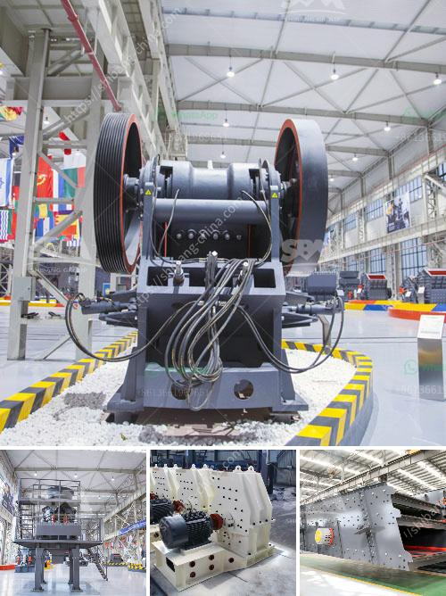

<h3>مطحنة الكرة مع محول mercadolibre</h3>
تعتبر مطحنة الكرة من الأجهزة الأساسية التي تستخدم في صناعة الطحن والتصنيع. فهي تستخدم لطحن وسحق المواد الصلبة، وتحويلها إلى مسحوق ناعم يمكن استخدامه في العديد من الصناعات مثل صناعة الأسمنت والمعادن.

تتألف مطحنة الكرة من جسم أسطواني معبأ بالكرات المعدنية الثقيلة التي تدور داخلها بسرعة محددة. عندما يتم تشغيل المطحنة، تدفع الكرات المادة الصلبة بقوة لتتم طحنها وسحقها. يحدث طحن المواد عن طريق الاحتكاك والضربات بين الكرات والمواد الصلبة وجدران المطحنة. تتحرك الكرات باتجاهات مختلفة وبسرعات مختلفة، وهذا يساعد في تحقيق طحن متساوٍ للمواد وإنتاج الجسيمات المطلوبة.

واحدة من العوامل المهمة في عملية الطحن هي الطاقة اللازمة لتشغيل المطحنة. وهنا يأتي دور محول Mercadolibre، حيث يقوم بتحويل الطاقة الكهربائية إلى الطاقة الميكانيكية اللازمة لتشغيل المطحنة. يعتبر محول Mercadolibre اختيارًا رائعًا لمطحنة الكرة، حيث يتميز بالعديد من المزايا.

أولاً، فإن محول Mercadolibre مصمم لتوفير الطاقة وتقليل التكلفة. يتميز بكفاءة عالية في تحويل الطاقة ليقلل من الفاقد في عملية التشغيل. يعني ذلك أنه يساعد في توفير الطاقة الكهربائية وبالتالي يقلل من تكلفة التشغيل.

ثانيًا، فإن محول Mercadolibre يتميز بالموثوقية والاستقرار. يمكنه التكيف والتعامل مع الحمل الثقيل والصعب بسهولة، مما يزيد من عمر المطحنة ويقلل من تكاليف الصيانة.

ثالثًا، يوفر محول Mercadolibre أداءًا ممتازًا ودقة في التحكم. يتميز بسرعة استجابة عالية وتوزيع القدرة بشكل مثالي، مما يساعد في تحقيق طحن دقيق وفعالية في استخدام الطاقة.

باختصار، فإن مطحنة الكرة مع محول Mercadolibre هي اختيار جيد لأي صناعة تحتاج إلى عملية طحن فعالة واقتصادية. يساهم المحول في تحسين كفاءة الطاقة وتقليل التكاليف، مما يجعلها خيارًا رائعًا للشركات والمصانع المهتمة بتحسين عملياتها وتقليل تكاليف الإنتاج.
<h3>Contact us</h3><ul><li><strong>Whatsapp:&nbsp;<a href="https://wa.me/8613661969651">+8613661969651</a></strong></li><li><a href="https://swt.shibang-china.com/?git&amp;zhl&amp;مطحنة الكرة مع محول mercadolibre"><strong>Online Service(chat now)</strong></a></li></ul><h3>Related</h3><ul><li><a href='كسارات الحجر المهجورة.md'>كسارات الحجر المهجورة</a></li><li><a href='سعر كسارة الحجر في نيجيريا.md'>سعر كسارة الحجر في نيجيريا</a></li><li><a href='قائمة مصانع حبيبات خام الحديد في الهند.md'>قائمة مصانع حبيبات خام الحديد في الهند</a></li><li><a href='آلة نقل حجر الكوارتز.md'>آلة نقل حجر الكوارتز</a></li><li><a href='كسارات الحجر من السويد.md'>كسارات الحجر من السويد</a></li></ul>