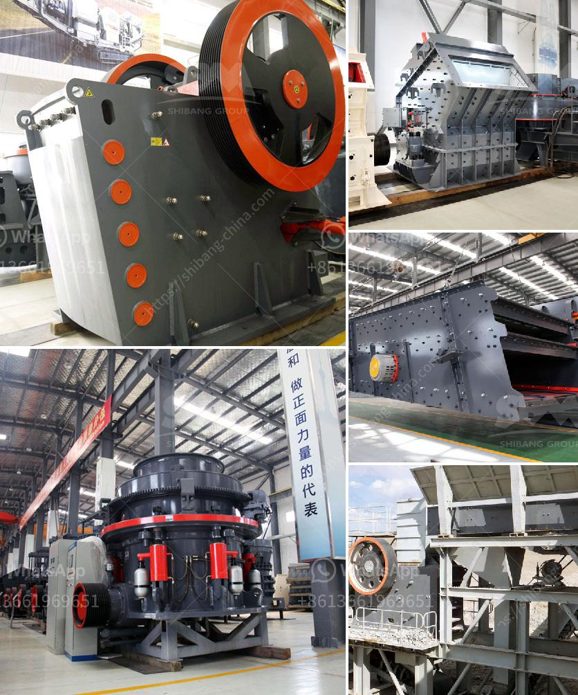

<h3>مطحنة الكرة مواد الاسمنت والطاقة</h3>
مطحنة الكرة هي واحدة من أدوات الطحن الأكثر استخدامًا في صناعة الاسمنت. تستخدم في طحن وسحق المواد الخام لإنتاج مسحوق الاسمنت. تعتبر مطحنة الكرة جزءًا أساسيًا من عملية تصنيع الأسمنت وتسهم في تحقيق الجودة والكفاءة في إنتاج المواد النهائية.

تتكون مطحنة الكرة من جسم أسطواني يحتوي على العديد من الكرات الفولاذية الصغيرة المتداولة داخله. عملية الطحن تتم عن طريق دوران الأسطوانة والكرات، حيث يتم سحق المادة الخام إلى حجم أصغر. تستخدم تلك الكرات لتطحين المواد الخام بوتيرة عالية ولتوليد الحركة التصادمية اللازمة لتحطيم الجزيئات وتحويلها إلى مسحوق رقيق.

تعتبر مطاحن الكرة مهمة جداً في صناعة الأسمنت، فهي تساهم في تحسين جودة المنتج النهائي وخفض تكاليف الإنتاج. واحدة من أهم الفوائد هي قدرتها على طحن المواد الخام بفعالية وسرعة. كما أنها قادرة على إنتاج مسحوق الاسمنت بحجم الجسيمات المطلوب وفقًا للمعايير الفنية.

بالإضافة إلى ذلك، تساهم مطاحن الكرة في توفير الطاقة في عملية إنتاج الأسمنت. فهي تعتبر أحد أجهزة التكسير الأكثر كفاءة، حيث يتم استخدام الطاقة المطلوبة بشكل فعال لسحق المواد الخام وتحطيمها. بالتالي، يمكن تقليل استهلاك الطاقة وتحسين كفاءة العملية بأكملها.

باختصار، تعد مطحنة الكرة أداة حاسمة في صناعة الأسمنت. تساهم في طحن المواد الخام بفعالية وتوفير الطاقة. بالاستفادة من فوائدها، يمكن للشركات المصنعة للأسمنت تحقيق أداء محسن وجودة أفضل للمنتج النهائي، مما يساهم في تلبية احتياجات السوق والمستهلكين بشكل أفضل.
<h3>Contact us</h3><ul><li><strong>Whatsapp:&nbsp;<a href="https://wa.me/8613661969651">+8613661969651</a></strong></li><li><a href="https://swt.shibang-china.com/?git&amp;zhl&amp;مطحنة الكرة مواد الاسمنت والطاقة"><strong>Online Service(chat now)</strong></a></li></ul><h3>Related</h3><ul><li><a href='إنتاج الكاولين في إثيوبيا بتنسيق PDF.md'>إنتاج الكاولين في إثيوبيا بتنسيق PDF</a></li><li><a href='خط إنتاج سحق الجرانيت.md'>خط إنتاج سحق الجرانيت</a></li><li><a href='اقتباسات مطحنة الكرة.md'>اقتباسات مطحنة الكرة</a></li><li><a href='كسارة الحجر كسارة الحجر.md'>كسارة الحجر كسارة الحجر</a></li><li><a href='كسارة الحجر والمضافة.md'>كسارة الحجر والمضافة</a></li></ul>