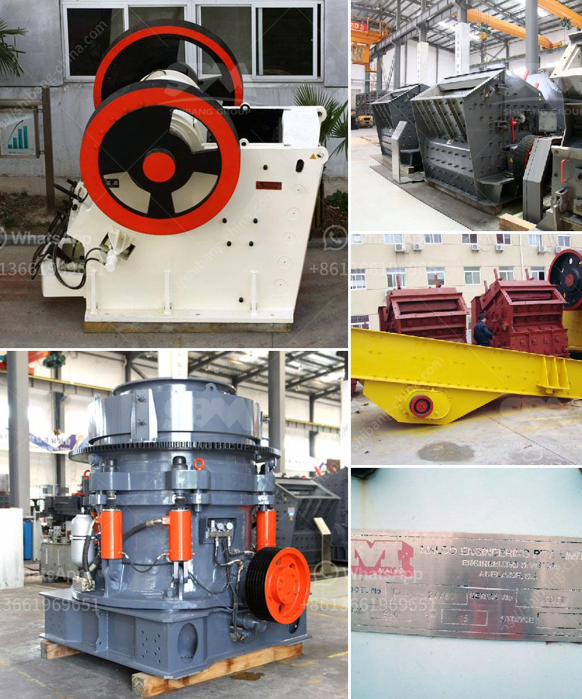

<h3>مطحنة المطرقة ستال ميستر للبيع</h3>
تعد مطحنة المطرقة ستال ميستر واحدة من أكثر أنواع المطاحن شيوعًا واستخدامًا في صناعة الأعلاف والحبوب. تتميز هذه المطاحن بقدرتها العالية على طحن الحبوب إلى جسيمات صغيرة ومتجانسة، وتعتبر الخيار المثالي للمزارعين والمربين الذين يسعون لتوفير أعلاف عالية الجودة لحيواناتهم.

تتكون مطاحن المطرقة من ثلاثة أجزاء رئيسية: الأسطوانة الدوارة، والشبكة المعدنية، والمحرك. تعمل الأسطوانة الدوارة عن طريق القوة الحركية الناجمة عن المحرك، وتقوم بسحق الحبوب بواسطة الصواميل التي تخترق الأسطوانة من الداخل. يتم تحديد حجم الحبوب المطحونة من خلال الشبكة المعدنية التي يتم تركيبها على نهاية المطحنة. يمكن للمستخدم تغيير الشبكة حسب الحجم المطلوب للحبيبات النهائية.

تتوفر مطاحن المطرقة ستال ميستر بمجموعة متنوعة من الأحجام والقدرات، مما يسمح للمسلتخدم بالاختيار الملائم حسب احتياجاته الخاصة. بالإضافة إلى ذلك، تتميز هذه المطاحن بسهولة الصيانة والتشغيل، وتوفير استخدام الطاقة الكهربائية بشكل فعال، وهو أمر مهم للمزارعين والمربين الذين يبحثون عن خفض تكاليفهم العملية.

طوال عقود التطوير والتحسين، اكتسبت مطاحن المطرقة ستال ميستر سمعة ممتازة في صناعة الأعلاف في جميع أنحاء العالم. تستخدم هذه المطاحن بشكل واسع في طحن الحبوب المختلفة مثل الذرة والشعير والقمح والشوفان والفول السوداني والفاصولياء، وتساهم في تحسين توفر الأعلاف وقيمتها الغذائية للحيوانات. بالإضافة إلى ذلك، يمكن استخدامها أيضًا في الصناعات الأخرى مثل تحضير الأعشاب الطبية وطحن المنتجات المعدنية.

في الختام، إذا كنت تبحث عن مطحنة فعالة وذات جودة عالية لصناعة الأعلاف، فإن مطاحن المطرقة ستال ميستر تعد اختيارًا ممتازًا. مع تصميمها المتين وإمكانياتها الهائلة، توفر هذه المطاحن أداءًا ممتازًا وجودة عالية للحبوب المطحونة. وبفضل مجموعة الأحجام المتنوعة المتاحة، يمكنك العثور بسهولة على المطحنة التي تلبي احتياجاتك مع الحفاظ على ميزانيتك المحدودة.
<h3>Contact us</h3><ul><li><strong>Whatsapp:&nbsp;<a href="https://wa.me/8613661969651">+8613661969651</a></strong></li><li><a href="https://swt.shibang-china.com/?git&amp;zhl&amp;مطحنة المطرقة ستال ميستر للبيع"><strong>Online Service(chat now)</strong></a></li></ul><h3>Related</h3><ul><li><a href='سعر تكسير الخرسانة في جنوب أفريقيا.md'>سعر تكسير الخرسانة في جنوب أفريقيا</a></li><li><a href='مورد كسارة الفك.md'>مورد كسارة الفك</a></li><li><a href='كسارة متنقلة في فيجي.md'>كسارة متنقلة في فيجي</a></li><li><a href='كسارة متنقلة لخام الحديد.md'>كسارة متنقلة لخام الحديد</a></li><li><a href='معدات جص صنع الجدار الخرساني في ألمانيا.md'>معدات جص صنع الجدار الخرساني في ألمانيا</a></li></ul>