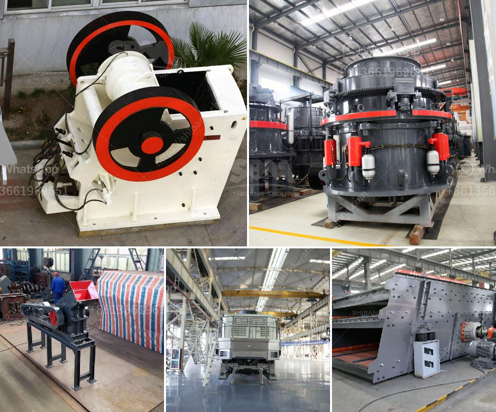

<h3>مطحنة المطرقة في نيجيريا</h3>
تعتبر مطحنة المطرقة واحدة من أكثر الآلات استخدامًا في صناعة الجلال في نيجيريا. تعمل هذه المطاحن على طحن الحبوب والبذور والتوابل والأعشاب الجافة وغيرها من المواد النباتية بواسطة ضربها بالمطرقة الدائرية المعدنية التي تدور بسرعة عالية داخل الآلة.

تعتبر مطاحن المطرقة في نيجيريا حلاً تقنيًا مبتكرًا في مجال طحن الحبوب وسحقها. يستخدم فيها المحرك الكهربائي لتشغيل المطرقة، مما يسمح بعملية طحن فعالة وسريعة للمواد النباتية المختلفة. وعلى الرغم من بساطتها، فإنها تقدم أداءً عالي المستوى ونتائج ممتازة في إنتاج البودرة النباتية المستخدمة في العديد من الصناعات مثل الأعلاف والأدوية وصناعة التوابل.

تعد مطاحن المطرقة في نيجيريا خيارًا اقتصاديًا وفعالًا للمزارعين والمشغلين الصغار والمتوسطين. فهي تساعدهم في زيادة الإنتاجية وتحسين جودة المنتج النهائي. كما أنها توفر وقتًا وجهدًا ملحوظين بفضل إمكانية طحن الحبوب وسحقها بكفاءة عالية وبسرعة. بالإضافة إلى ذلك، فإنها تساهم في تقليل الهدر الناتج عن طحن الحبوب يدويًا، وتقليل التكاليف العامة لصناعة الغلال.

ينبغي أيضًا الإشارة إلى أن مطاحن المطرقة في نيجيريا قابلة للتخصيص وفقًا لاحتياجات العميل. فهي تأتي بأحجام وسعات مختلفة لتتناسب مع حجم الإنتاج والمواد المراد طحنها. كما يمكن تجهيزها بشاشات مختلفة لتختلف حجم الجسيمات المراد الحصول عليها في النهاية.

بالنظر إلى فوائد مطاحن المطرقة في نيجيريا، فإنه من المهم دعم وتعزيز هذا القطاع الصناعي في البلاد. يمكن للحكومة أن توفر التسهيلات والدعم المالي للمزارعين والشركات المحلية المنتجة لمطاحن المطرقة، بالإضافة إلى تطوير البحث العلمي والتكنولوجي لتحسين هذه الآلات وتطويرها.

في الختام، مطاحن المطرقة في نيجيريا تمثل حلاً فعالً واقتصاديًا في صناعة الجلال. تساعد في تحقيق زيادة الإنتاجية وتحسين جودة المنتج النهائي، مما يسهم في تعزيز القطاع الزراعي وتحسين قدرة المزارعين والشركات المحلية على المنافسة في السوق.
<h3>Contact us</h3><ul><li><strong>Whatsapp:&nbsp;<a href="https://wa.me/8613661969651">+8613661969651</a></strong></li><li><a href="https://swt.shibang-china.com/?git&amp;zhl&amp;مطحنة المطرقة في نيجيريا"><strong>Online Service(chat now)</strong></a></li></ul><h3>Related</h3><ul><li><a href='أهداف مطحنة الكرة.md'>أهداف مطحنة الكرة</a></li><li><a href='كسارة معدنية للإيجار.md'>كسارة معدنية للإيجار</a></li><li><a href='كسارة تأثير من الصين.md'>كسارة تأثير من الصين</a></li><li><a href='معدات تعدين مستعملة للبيع في غانا.md'>معدات تعدين مستعملة للبيع في غانا</a></li><li><a href='كسارة حجر لصنع رمل البناء.md'>كسارة حجر لصنع رمل البناء</a></li></ul>